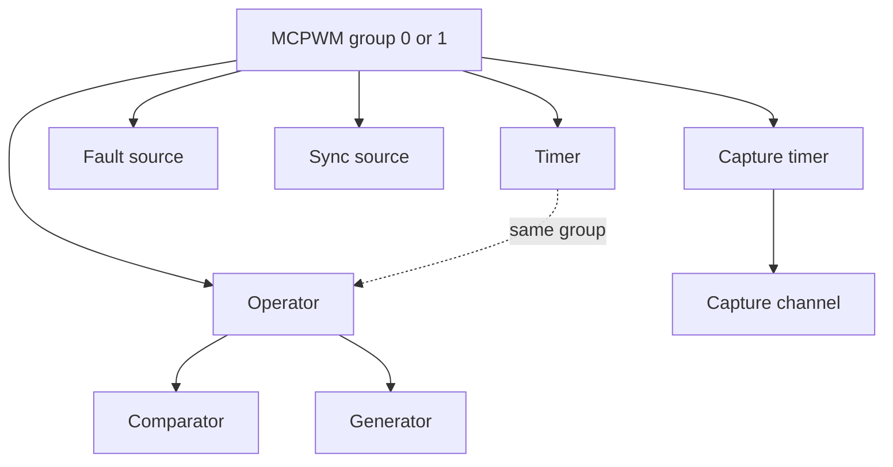

# Cornell Notes

## Topic: Resource Allocation and Initialization

## Date: 22/06/2026

---

<strong><em>"DO NOT JUST TALK ABOUT IT — SHOW IT"</em></strong>

---

### Cue Column (Questions, Keywords, or Prompts)

- Which MCPWM objects are allocated from a group, operator, or capture timer?
- What ownership and deletion order does the driver enforce?
- What errors identify invalid configuration, exhausted hardware, or memory failure?

---

### Notes Section (Main Notes)

#### Resource Allocation and Initialization

As displayed in the diagram, the MCPWM peripheral consists of several submodules. Each submodule has its own resource allocation, which is described in the following sections.

- MCPWM Timers
- MCPWM Operators
- MCPWM Comparators
- MCPWM Generators
- MCPWM Faults
- MCPWM Syncs Sources
- MCPWM Capture Timer and Channels
- MCPWM Interrupt Priority

Every `mcpwm_new_*()` validates configuration and output pointers, allocates a software object, claims a free hardware slot under a critical section, and returns an opaque handle. `ESP_ERR_INVALID_ARG` means validation failed, `ESP_ERR_NO_MEM` means allocation failed, and `ESP_ERR_NOT_FOUND` normally means that the selected parent has no free hardware slot. A child keeps a parent resource busy; delete children before the parent. GPIO, interrupt allocation, power-management locks, and clock-tree calls are external dependencies managed by ESP-IDF rather than MCPWM registers.

Stable sources: [public MCPWM headers](https://github.com/espressif/esp-idf/tree/v6.0.1/components/esp_driver_mcpwm/include/driver) and [private driver sources](https://github.com/espressif/esp-idf/tree/v6.0.1/components/esp_driver_mcpwm/src).

---

#### Related Use Cases

- [MCPWM Lifecycle and Common API Flow](../03_use_cases/02_mcpwm_lifecycle_and_common_api_flow.md)
- [Operator, Comparator, and Generator Pipeline](../03_use_cases/04_operator_comparator_and_generator.md)
- [MCPWM Debugging and Common Failures](../03_use_cases/14_debugging_and_common_failures.md)

### Summary Section (Summary of Notes)

Select the group first, allocate from parent to child, connect timer and operator only within the same group, and delete in reverse order. Distinguish invalid input, memory exhaustion, and exhausted hardware by their returned error codes.
