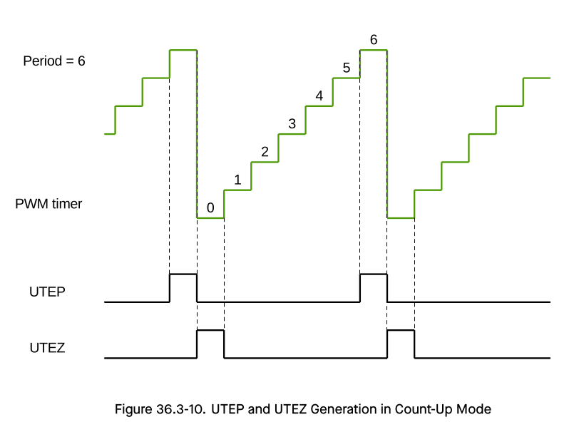

# Cornell Notes

## Topic: RAI - MCPWM Timers

## Date: 22/06/2026

---

<p align="center"><strong><em>"DO NOT JUST TALK ABOUT IT — SHOW IT"</em></strong></p>

---

### Cue Column (Questions, Keywords, or Prompts)

- [Insert question or keyword]
- [Insert question or keyword]
- [Insert question or keyword]

---

### Notes Section (Main Notes)

#### MCPWM Timers - Specification

You can allocate a MCPWM timer object by calling `mcpwm_new_timer()` function, with a configuration structure `mcpwm_timer_config_t`) as the parameter. The configuration structure is defined as:

- `mcpwm_timer_config_t::group_id` specifies the MCPWM group ID. The ID should belong to `[0, MCPWM_GROUP_NUM - 1]` range, where `MCPWM_GROUP_NUM` is the number of MCPWM groups available on the chip. Please note, timers located in different groups are totally independent.

> **Note**:
> For the number of MCPWM groups available on the chip, please refer to ESP32-S3 Technical Reference Manual > Motor Control PWM (MCPWM) or [Overview](../01_technical_reference_manual/01_overview_and_features.md#overview).

- `mcpwm_timer_config_t::intr_priority` sets the priority of - the interrupt. If it is set to `0`, the driver will allocate - an interrupt with a default priority. Otherwise, the driver - will use the given priority.
- `mcpwm_timer_config_t::clk_src` sets the clock source of - the timer.
- `mcpwm_timer_config_t::resolution_hz` sets the expected - resolution of the timer. The driver internally sets a - proper divider based on the clock source and the resolution.
- `mcpwm_timer_config_t::count_mode` sets the count mode of - the timer.
- `mcpwm_timer_config_t::period_ticks` sets the period of the - timer, in ticks (the tick resolution is set in the - `mcpwm_timer_config_t::resolution_hz`).
- `mcpwm_timer_config_t::update_period_on_empty` sets whether - to update the period value when the timer counts to zero.
- `mcpwm_timer_config_t::update_period_on_sync` sets whether to update the period value when the timer takes a sync signal.

The `mcpwm_new_timer()` will return a pointer to the allocated timer object if the allocation succeeds. Otherwise, it will return an error code. Specifically, when there are no more free timers in the MCPWM group, this function will return the `ESP_ERR_NOT_FOUND` error.

On the contrary, calling the `mcpwm_del_timer()` function will free the allocated timer object.

> **Note**:
> The prescale for the MCPWM group will be calculated with the resolution of the first timer, and the driver will find the appropriate prescale from low to high. If there is a prescale conflict when allocating multiple timers, allocate timers in order of their target resolution, either from highest to lowest or lowest to highest. For more information, please refer to **Resolution Configuration**.

#### API Reference

##### Header File

- `components/esp_driver_mcpwm/include/driver/mcpwm_timer.h`
- This header file can be included with:
```c
#include "driver/mcpwm_timer.h"
```
- This header file is a part of the API provided by the esp_driver_mcpwm component. To declare that your component depends on esp_driver_mcpwm, add the following to your CMakeLists.txt:
```cmake
REQUIRES esp_driver_mcpwm
```
or
```
PRIV_REQUIRES esp_driver_mcpwm
```

##### Functions

##### `mcpwm_new_timer()`

```c
esp_err_t mcpwm_new_timer(const mcpwm_timer_config_t *config, mcpwm_timer_handle_t *ret_timer)
```

Create MCPWM timer.

**Parameters:** 
- `config` **-- [in]** MCPWM timer configuration
- `ret_timer` **-- [out]** Returned MCPWM timer handle

**Returns:**
- `ESP_OK`: Create MCPWM timer successfully
- `ESP_ERR_INVALID_ARG`: Create MCPWM timer failed because of invalid argument
- `ESP_ERR_NO_MEM`: Create MCPWM timer failed because out of memory
- `ESP_ERR_NOT_FOUND`: Create MCPWM timer failed because all hardware timers are used - up and no more free one
- `ESP_FAIL`: Create MCPWM timer failed because of other error

---

##### `mcpwm_set_prescale()`

```c
esp_err_t mcpwm_set_prescale(mcpwm_group_t *group, uint32_t expect_module_resolution_hz, uint32_t module_prescale_max, uint32_t *ret_module_prescale)
```

`mcpwm_set_prescale` computes and applies the MCPWM group and module prescalers needed to achieve a requested module resolution from the peripheral source clock. It validates inputs, searches for a valid prescale combination when the default does not fit, updates the shared group prescale atomically, returns the chosen module prescale if requested, and reports errors for invalid arguments, impossible clock resolution, or prescale conflicts.

**Parameters:**
- `group` **-- [in]** MCPWM group handle
- `expect_module_resolution_hz` **-- [in]** Expected module resolution in Hz
- `module_prescale_max` **-- [in]** Maximum allowed module prescale
- `ret_module_prescale` **-- [out]** Returned module prescale

**Returns:**
- `ESP_OK`: Set prescale successfully
- `ESP_RETURN_ON_FALSE`: Invalid argument | Set group prescale failed, group clock cannot match the resolution | Group prescale conflict
- `ESP_RETURN_ON_ERROR`: Get clock source freq failed

---

##### `mcpwm_timer_register_to_group()`

```c
static esp_err_t mcpwm_timer_register_to_group(mcpwm_timer_t *timer, int group_id)
```
`mcpwm_timer_register_to_group` registers a timer to a specific MCPWM group. This function is used internally by the driver to manage timer allocation and ensure that timers are correctly associated with their respective groups.

**Parameters:**
- `mcpwm_timer_t *timer` is considered to be the timer object to be used
- `int group_id` is the group ID to be used as user will configure this. There are 2 options mentioned earlier for esp32-s3:
  - `0` - MCPWM group 0
  - `1` - MCPWM group 1

**Returns:**
- `ESP_OK`: Register timer to group successfully
- `ESP_ERR_NO_MEM`: Register timer to group failed because out of memory for the selected group

---

##### `mcpwm_acquire_group_handle()`

```c
mcpwm_group_t *mcpwm_acquire_group_handle(int group_id)
```

`mcpwm_acquire_group_handle` acquires a handle to a specific MCPWM group. This function is used internally by the driver to manage group allocation for the heap memory and then enable the bus clock also reset the register for the pwm reset pin by toggling the reset bit for the selected group_id. Then, initialize the hardware abstraction layer (HAL) for shadow mode and flush shadow registers to active registers by toggling `global_force_up` to trigger a forced update of all active registers in MCPWM. Finally, disable all interrupts and clear pending status.

**Parameters:**
- `int group_id` is the group ID to be used as user will configure this. There are 2 options mentioned earlier for esp32-s3:
  - `0` - MCPWM group 0
  - `1` - MCPWM group 1

**Returns:**
- `mcpwm_group_t *` - Pointer to the acquired MCPWM group handle.
- NULL - If the group ID is invalid or if the group cannot be acquired.

---

##### `mcpwm_ll_enable_bus_clock()`

```c
static inline void mcpwm_ll_enable_bus_clock(int group_id, bool enable)
```

`mcpwm_ll_enable_bus_clock` enables or disables the bus clock for a specific MCPWM group. This function is used internally by the driver to manage the clock source for the MCPWM hardware. This will be set via the parameter contained in the struct `SYSTEM`

**Parameters:**
- `int group_id` is the group ID to be used as user will configure this. There are 2 options mentioned earlier for esp32-s3:
  - `0` - MCPWM group 0
  - `1` - MCPWM group 1
- `bool enable` is a boolean value indicating whether to enable (true) or disable (false) the bus clock.

---

##### `mcpwm_ll_reset_register()`

```c
static inline void mcpwm_ll_reset_register(int group_id)
```

`mcpwm_ll_reset_register` resets the registers for a specific MCPWM group. This function is used internally by the driver to ensure that the MCPWM hardware is in a known state before configuration. This will be set via the parameter contained in the struct `SYSTEM`

**Parameters:**
- `int group_id` is the group ID to be used as user will configure this. There are 2 options mentioned earlier for esp32-s3:
  - `0` - MCPWM group 0
  - `1` - MCPWM group 1

##### `mcpwm_hal_init()`

```c
void mcpwm_hal_init(mcpwm_hal_context_t *hal, const mcpwm_hal_init_config_t *init_config)
```

`mcpwm_hal_init` initializes the hardware abstraction layer (HAL) for the MCPWM module. This function is used internally by the driver to set up the necessary configurations for the MCPWM hardware, including enabling shadow mode and flushing shadow registers to active registers.

**Parameters:**
- `mcpwm_hal_context_t *hal` is a pointer to the HAL context structure. 
- `const mcpwm_hal_init_config_t *init_config` is a pointer to the initialization configuration structure.

```c
mcpwm_hal_init_config_t hal_config = {.group_id = group_id};
mcpwm_hal_context_t *hal = &group->hal;
```

---

##### `mcpwm_ll_group_enable_shadow_mode()`

```c
static inline void mcpwm_ll_group_enable_shadow_mode(mcpwm_dev_t *mcpwm)
```

`mcpwm_ll_group_enable_shadow_mode`: Enable update MCPWM active registers from shadow registers. For detail information, please refer to **Technical Reference Manual** > Motor Control PWM (MCPWM) > Shadow Registers.

**Parameters:**
- `mcpwm_dev_t *mcpwm` is a pointer to the peripheral instance address

---

##### `mcpwm_ll_group_flush_shadow()`

```c
static inline void mcpwm_ll_group_flush_shadow(mcpwm_dev_t *mcpwm)
```

`mcpwm_ll_group_flush_shadow`: Flush the shadow registers to the active registers. For detail information, please refer to **Technical Reference Manual** > Motor Control PWM (MCPWM) > Shadow Registers.

**Parameters:**
- `mcpwm_dev_t *mcpwm` is a pointer to the peripheral instance address

---

##### `mcpwm_ll_intr_enable()`

```c
static inline void mcpwm_ll_intr_enable(mcpwm_dev_t *mcpwm, uint32_t mask, bool enable)
```

`mcpwm_ll_intr_enable` Enable MCPWM interrupt for specific event mask

**Parameters:**
- `mcpwm_dev_t *mcpwm` is a pointer to the peripheral instance address
- `uint32_t mask` is the Event mask
- `bool enable` specifies whether to enable or disable the interrupt

---

##### `mcpwm_ll_intr_clear_status()`

```c
static inline void mcpwm_ll_intr_clear_status(mcpwm_dev_t *mcpwm, uint32_t mask)
```

`mcpwm_ll_intr_clear_status` Clear MCPWM interrupt status for specific event mask

**Parameters:**
- `mcpwm_dev_t *mcpwm` is a pointer to the peripheral instance address
- `uint32_t mask` is the Interrupt status mask

---

##### Structures

`mcpwm_timer_config_t`: MCPWM timer configuration.
```c
/**
 * @brief MCPWM timer configuration
 */
typedef struct {
    int group_id;                        /*!< Specify from which group to allocate the MCPWM timer */
    mcpwm_timer_clock_source_t clk_src;  /*!< MCPWM timer clock source. There is only 
                                              one actual hardware clock source available for the MCPWM timer on that target (SOC_MOD_CLK_PLL_F160M) */
    uint32_t resolution_hz;              /*!< Counter resolution in Hz
                                              The step size of each count tick equals to (1 / resolution_hz) seconds. */
    mcpwm_timer_count_mode_t count_mode; /*!< Count mode */
    uint32_t period_ticks;               /*!< Number of count ticks within a period. For up-down mode, the timer peak value is half of the period_ticks */
    int intr_priority;                   /*!< MCPWM timer interrupt priority,
                                              if set to 0, the driver will try to allocate an interrupt with a relative low priority (1,2,3) */
    struct {
        uint32_t update_period_on_empty: 1; /*!< Whether to update period when timer counts to zero */
        uint32_t update_period_on_sync: 1;  /*!< Whether to update period on sync event */
        uint32_t allow_pd: 1;               /*!< Set to allow power down. When this flag set, the driver will backup/restore the MCPWM registers before/after entering/exist sleep mode.
                                              By this approach, the system can power off MCPWM's power domain.
                                              This can save power, but at the expense of more RAM being consumed. */
    } flags;                                /*!< Extra configuration flags for timer */
} mcpwm_timer_config_t;
```
- **Public Members**
  - `int group_id` - Specify from which group to allocate the MCPWM timer
  - `mcpwm_timer_clock_source_t clk_src` - MCPWM timer clock source
  - `uint32_t resolution_hz` - Counter resolution in Hz. The step size of each count tick equals to (1 / resolution_hz) seconds. This value is also used with the prescale to calculate the actual timer clock via a low level function `mcpwm_set_prescale`
  - `mcpwm_timer_count_mode_t count_mode` - Count mode
  - `uint32_t period_ticks` - Number of count ticks within a period. For up-down mode, the timer peak value is half of the period_ticks. This is desribe as `Period` mentioned in **Technical Reference Manual**  and the `period_ticks` is not allowed to be zero or greater than `MCPWM_LL_MAX_COUNT_VALUE` in `mcpwm_ll.h`, which is defined as:
    ```c
    #define MCPWM_LL_MAX_COUNT_VALUE 65536
    ```
  - `int intr_priority` - MCPWM timer interrupt priority, if set to 0, the driver will try to allocate an interrupt with a relative low priority (1,2,3)
  - `struct flags` - Extra configuration flags for timer
    - `uint32_t update_period_on_empty: 1` - Whether to update period when timer counts to zero
    - `uint32_t update_period_on_sync: 1` - Whether to update period on sync event
    - `uint32_t allow_pd: 1` - Set to allow power down. When this flag set, the driver will backup/restore the MCPWM registers before/after entering/exist sleep mode. By this approach, the system can power off MCPWM's power domain. This can save power, but at the expense of more RAM being consumed.

##### Detailed information

**`int group_id`**: 

- Specify from which group to allocate the MCPWM timer. This will be the input for some internal checks:
  - Check for the appropriate heap memory allocation for the `group_id`.
  - Enable bus clock for the selected group_id to be true
  - Reset the register for the pwm reset pin by toggling the reset bit for the selected group_id.
  - Initialize the HAL including:
    - Enable shadow mode
    - Flush shadow register to active registers by toggling `global_force_up` to trigger a forced update of all active register in MCPWM.
  - Disable all interrupts and clear pending status.

**`mcpwm_timer_clock_source_t clk_src`**:


---

#### Related Use Cases

- [MCPWM Lifecycle and Common API Flow](../03_use_cases/02_mcpwm_lifecycle_and_common_api_flow.md)
- [Timer Creation, Clock Selection, and Prescaling](../03_use_cases/03_timer_clock_and_prescaler.md)
- [Synchronization and Phase Control](../03_use_cases/08_synchronization_and_phase_control.md)

### Summary Section (Summary of Notes)

[Insert a brief summary of the key ideas and takeaways]
