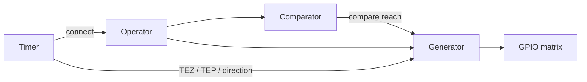

# Cornell Notes

## Topic: RAI - Operators, Comparators, and Generators

## Date: 23/07/2026

---

### Cue Column (Questions, Keywords, or Prompts)

- How are operators, comparators, and generators related?
- Which configuration is fixed at creation and which can change at run time?
- What allocation, GPIO, callback, and deletion rules matter?

---

### Notes Section (Main Notes)

An operator owns its comparators and generators and consumes one of the three operator slots in its MCPWM group. Create it with `mcpwm_new_operator()` and select generator-action and dead-time shadow update events in `mcpwm_operator_config_t`. Connect a timer in the same group with `mcpwm_operator_connect_timer()` before starting waveform generation.

A comparator is allocated below an operator by `mcpwm_new_comparator()`. Its flags select when the shadow compare value becomes active (`update_cmp_on_tez`, `update_cmp_on_tep`, or `update_cmp_on_sync`). `mcpwm_comparator_set_compare_value()` must receive a value within the connected timer period. Register `mcpwm_comparator_event_callbacks_t::on_reach` before the operator becomes active; the callback runs in ISR context and returns `true` when a higher-priority task was woken.

A generator is allocated below an operator by `mcpwm_new_generator()`. `mcpwm_generator_config_t::gen_gpio_num` selects the output GPIO; inversion and loopback are creation flags. GPIO matrix routing and pin ownership are external dependencies. The generator action APIs program event/action tables; they do not start the timer. A generator can be deleted only after it is no longer used for dead-time routing or output.



Driver path: public creation API → validate/allocate → private `*_register_to_operator()` under the operator lock → HAL reset → target LL selects update methods or action fields. See [operator/comparator/generator pipeline](../03_use_cases/04_operator_comparator_and_generator.md) and TRM Chapter 36.3.3, PDF pp. 1337–1362, summarized in [PWM operator](../01_technical_reference_manual/04_pwm_operator_submodule.md).

Stable sources: [operator header](https://github.com/espressif/esp-idf/blob/v6.0.1/components/esp_driver_mcpwm/include/driver/mcpwm_oper.h), [comparator header](https://github.com/espressif/esp-idf/blob/v6.0.1/components/esp_driver_mcpwm/include/driver/mcpwm_cmpr.h), and [generator header](https://github.com/espressif/esp-idf/blob/v6.0.1/components/esp_driver_mcpwm/include/driver/mcpwm_gen.h).

#### API Reference

##### Header Files

```c
#include "driver/mcpwm_oper.h"
#include "driver/mcpwm_cmpr.h"
#include "driver/mcpwm_gen.h"
```

Add `REQUIRES esp_driver_mcpwm` or `PRIV_REQUIRES esp_driver_mcpwm` to the component's `CMakeLists.txt`.

##### Functions

###### `mcpwm_new_operator()` / `mcpwm_del_operator()`

```c
esp_err_t mcpwm_new_operator(const mcpwm_operator_config_t *config,
                             mcpwm_oper_handle_t *ret_oper);
esp_err_t mcpwm_del_operator(mcpwm_oper_handle_t oper);
```

The creation call requires non-NULL pointers, `group_id` in `[0, SOC_MCPWM_GROUPS - 1]`, and a valid interrupt priority. It returns `ESP_ERR_INVALID_ARG`, `ESP_ERR_NO_MEM`, `ESP_ERR_NOT_FOUND` when all three group operators are occupied, `ESP_FAIL` for another initialization failure, or `ESP_OK`. Deletion fails with `ESP_ERR_INVALID_STATE` while comparators or generators remain registered.

###### Operator connection signature

```c
esp_err_t mcpwm_operator_connect_timer(mcpwm_oper_handle_t oper,
                                       mcpwm_timer_handle_t timer);
```

Both handles must be valid and belong to the same group. The private driver saves the timer pointer in the operator, calls `mcpwm_ll_operator_connect_timer()` to write `MCPWM_OPERATORx_TIMERSEL`, selects the timer as the dead-time clock, and records its resolution (TRM 36.3.3.1).

###### `mcpwm_new_comparator()` / `mcpwm_comparator_set_compare_value()`

```c
esp_err_t mcpwm_new_comparator(mcpwm_oper_handle_t oper,
                               const mcpwm_comparator_config_t *config,
                               mcpwm_cmpr_handle_t *ret_cmpr);
esp_err_t mcpwm_comparator_set_compare_value(mcpwm_cmpr_handle_t cmpr,
                                             uint32_t cmp_ticks);
```

Creation claims comparator A or B under the operator lock and applies update-method flags through LL. Setting the value locks the comparator, verifies the handle/state, and writes the comparator shadow timestamp with `mcpwm_ll_operator_set_compare_value()`. The chosen TEZ/TEP/sync transfer condition decides when the active timestamp changes.

###### `mcpwm_new_generator()` / `mcpwm_del_generator()`

```c
esp_err_t mcpwm_new_generator(mcpwm_oper_handle_t oper,
                              const mcpwm_generator_config_t *config,
                              mcpwm_gen_handle_t *ret_gen);
esp_err_t mcpwm_del_generator(mcpwm_gen_handle_t gen);
```

Creation claims generator A or B, configures its GPIO as output, routes the MCPWM signal through the GPIO matrix, and applies inversion/loopback. If GPIO setup fails, the driver unregisters the generator and frees its memory. Deletion disconnects the GPIO, unregisters the slot, and frees the object.

##### Function details

###### `mcpwm_new_operator()`

**Parameters:**
- `config` **[in]** — non-NULL operator configuration. `group_id` must select MCPWM0 or MCPWM1; `intr_priority` is `0` or a supported level; flags select generator-action and dead-time shadow transfers.
- `ret_oper` **[out]** — non-NULL location receiving the allocated opaque operator handle.

**Returns:** `ESP_OK`; `ESP_ERR_INVALID_ARG` for bad pointers/group/priority; `ESP_ERR_NO_MEM` for allocation failure; `ESP_ERR_NOT_FOUND` when all group operators are occupied; `ESP_FAIL` for another initialization failure.

**Uses internally:** heap allocation → `mcpwm_operator_register_to_group()` → `mcpwm_acquire_group_handle()` → `mcpwm_check_intr_priority()` → `mcpwm_hal_operator_reset()` → LL update-method configuration. Registration scans `group->operators[]` under the group lock. Failure calls `mcpwm_operator_destroy()` to unregister, release the group, and free memory.

###### `mcpwm_del_operator()`

**Parameters:** `oper` **[in]** — handle returned by `mcpwm_new_operator()`.

**Returns:** `ESP_OK`; `ESP_ERR_INVALID_ARG` for NULL; `ESP_ERR_INVALID_STATE` while comparator/generator children remain; `ESP_FAIL` if destruction fails.

**Uses internally:** verifies child arrays are empty → disables/clears operator interrupt masks with LL → `mcpwm_operator_destroy()` → `mcpwm_operator_unregister_from_group()` → `mcpwm_release_group_handle()` → heap free.

###### `mcpwm_operator_connect_timer()`

**Parameters:** `oper` **[in]** — destination operator; `timer` **[in]** — time-base timer. Both must be non-NULL and in the same group.

**Returns:** `ESP_OK`; `ESP_ERR_INVALID_ARG` for NULL or cross-group handles.

**Uses internally:** `mcpwm_ll_operator_connect_timer()` selects `MCPWM_OPERATORx_TIMERSEL`; `mcpwm_ll_operator_set_deadtime_clock_src()` selects the timer clock; private fields retain `timer` and its resolution for comparator/dead-time validation.

###### `mcpwm_new_comparator()`

**Parameters:** `oper` **[in]** — owning operator; `config` **[in]** — priority and compare-shadow update flags; `ret_cmpr` **[out]** — returned comparator handle.

**Returns:** `ESP_OK`; `ESP_ERR_INVALID_ARG`; `ESP_ERR_NO_MEM`; `ESP_ERR_NOT_FOUND` when comparator A/B are occupied; `ESP_FAIL` for another error.

**Uses internally:** allocate → `mcpwm_comparator_register_to_operator()` → `mcpwm_check_intr_priority()` → LL selects TEZ/TEP/sync compare update method. Rollback uses `mcpwm_comparator_destroy()`.

###### `mcpwm_del_comparator()`

```c
esp_err_t mcpwm_del_comparator(mcpwm_cmpr_handle_t cmpr);
```

**Parameters:** `cmpr` **[in]** — comparator handle to release.

**Returns:** `ESP_OK`; `ESP_ERR_INVALID_ARG`; `ESP_FAIL` if cleanup fails.

**Uses internally:** disables and clears the comparator interrupt → `mcpwm_comparator_destroy()` → `mcpwm_comparator_unregister_from_operator()` → heap free. The operator remains allocated.

###### `mcpwm_comparator_set_compare_value()`

**Parameters:** `cmpr` **[in]** — comparator handle; `cmp_ticks` **[in]** — compare threshold in connected-timer ticks, not greater than the timer peak.

**Returns:** `ESP_OK`; `ESP_ERR_INVALID_ARG` for NULL/out-of-range; `ESP_ERR_INVALID_STATE` when the operator has no timer; `ESP_FAIL` for another write failure.

**Uses internally:** reads the connected timer/peak → enters comparator lock → `mcpwm_ll_operator_set_compare_value()` writes the A/B timestamp shadow → leaves lock. Creation-time update flags decide activation.

###### `mcpwm_new_generator()`

**Parameters:** `oper` **[in]** — owning operator; `config` **[in]** — output GPIO plus inversion/loopback; `ret_gen` **[out]** — returned generator handle.

**Returns:** `ESP_OK`; `ESP_ERR_INVALID_ARG`; `ESP_ERR_NO_MEM`; `ESP_ERR_NOT_FOUND` when A/B are occupied; `ESP_FAIL` for GPIO or initialization failure.

**Uses internally:** allocate → `mcpwm_generator_register_to_operator()` → `mcpwm_hal_generator_reset()` → `gpio_func_sel()`/GPIO output setup → `esp_rom_gpio_connect_out_signal()` (**External GPIO matrix**) → optional inversion/loopback. Rollback calls `mcpwm_generator_destroy()`.

###### `mcpwm_del_generator()`

**Parameters:** `gen` **[in]** — generator handle.

**Returns:** `ESP_OK`; `ESP_ERR_INVALID_ARG`; `ESP_FAIL` for cleanup failure.

**Uses internally:** resets/disconnects the output GPIO (**External**) → `mcpwm_generator_destroy()` → `mcpwm_generator_unregister_from_operator()` → heap free.

##### Structures

```c
typedef struct {
    int group_id;
    int intr_priority;
    struct {
        uint32_t update_gen_action_on_tez: 1;
        uint32_t update_gen_action_on_tep: 1;
        uint32_t update_gen_action_on_sync: 1;
        uint32_t update_dead_time_on_tez: 1;
        uint32_t update_dead_time_on_tep: 1;
        uint32_t update_dead_time_on_sync: 1;
    } flags;
} mcpwm_operator_config_t;

typedef struct {
    int intr_priority;
    struct {
        uint32_t update_cmp_on_tez: 1;
        uint32_t update_cmp_on_tep: 1;
        uint32_t update_cmp_on_sync: 1;
    } flags;
} mcpwm_comparator_config_t;

typedef struct {
    int gen_gpio_num;
    struct {
        uint32_t invert_pwm: 1;
        uint32_t io_loop_back: 1;
    } flags;
} mcpwm_generator_config_t;
```

##### Detailed information

**Operator allocation sequence:** `mcpwm_new_operator()` → `mcpwm_acquire_group_handle()` → private `mcpwm_operator_register_to_group()` → `mcpwm_hal_operator_reset()` → LL operator timer/action/dead-time/fault defaults. The group owns the interrupt and HAL context; the operator owns comparator/generator arrays and a spinlock.

**Comparator ownership:** `mcpwm_comparator_register_to_operator()` searches the two comparator slots atomically. Rollback unregisters the slot if later initialization fails. Callback registration allocates the shared group interrupt lazily and enables only the comparator-equal mask.

**Generator ownership:** `mcpwm_generator_register_to_operator()` selects generator ID A/B. GPIO configuration is an **External dependency**; action, force, dead-time, and carrier writes are **LL/Register** effects inside MCPWM.

#### Related Use Cases

- [MCPWM Lifecycle and Common API Flow](../03_use_cases/02_mcpwm_lifecycle_and_common_api_flow.md)
- [Operator, Comparator, and Generator Pipeline](../03_use_cases/04_operator_comparator_and_generator.md)
- [Basic and Symmetric PWM](../03_use_cases/05_basic_and_symmetric_pwm.md)

### Summary Section (Summary of Notes)

Allocate operator → comparator/generator, connect a same-group timer, set compare values and actions, then start. Shadow-update flags determine when changes become visible. Delete generators and comparators before their operator.
