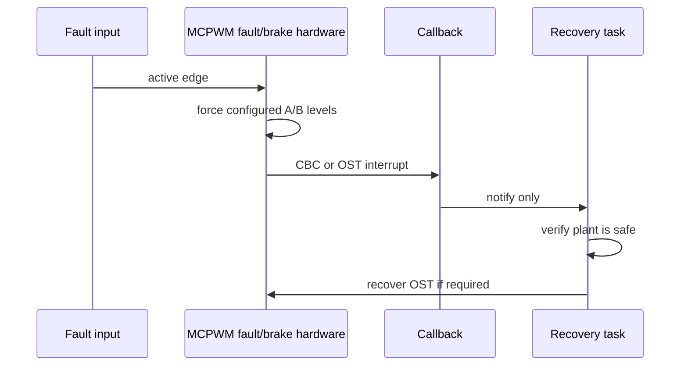

# Cornell Notes

## Topic: Faults, Brake Actions, and Generator Force Actions

## Date: 23/07/2026

---

### Cue Column (Questions, Keywords, or Prompts)

- What distinguishes cycle-by-cycle and one-shot braking?
- In what order are fault detection, operator mode, generator action, and callbacks configured?
- When should continuous or non-continuous software force be used?

---

### Notes Section (Main Notes)

Protection requires four layers: create a fault source; call `mcpwm_operator_set_brake_on_fault()` with `MCPWM_OPER_BRAKE_MODE_CBC` or `OST`; configure each generator with `mcpwm_generator_set_action_on_brake_event()`; optionally register fault/operator callbacks. CBC releases at the configured timer recovery event after the fault clears. OST latches until `mcpwm_operator_recover_from_fault()` is called after the physical fault is safe.

`mcpwm_operator_register_event_callbacks()` reports `on_brake_cbc` and `on_brake_ost`; fault callbacks report activation. These callbacks execute in ISR context. Configure them before enabling active resources and never perform blocking recovery inside the callback. A safe task should verify system conditions, then recover OST.

`mcpwm_generator_set_force_level(generator, level, hold_on)` bypasses normal event actions. With `hold_on=false`, the forced level is non-continuous and ends when the next configured generator event changes the output. With `hold_on=true`, the continuous force persists until cleared by passing level `-1`. Continuous force is useful for commissioning or an explicit safe output, but it can mask normal brake/action behavior; document its ownership and clear it deliberately.



TRM Chapter 36.3.3.5, PDF pp. 1357–1362, documents CBC/OST status, recovery, and A/B action fields. See [faults and brake actions](../03_use_cases/09_faults_and_brake_actions.md) and [runtime safety](../03_use_cases/11_interrupts_callbacks_and_runtime_safety.md).

#### API Reference

##### Functions

```c
esp_err_t mcpwm_operator_set_brake_on_fault(mcpwm_oper_handle_t oper,
                                            const mcpwm_brake_config_t *config);
esp_err_t mcpwm_generator_set_action_on_brake_event(
    mcpwm_gen_handle_t gen, mcpwm_gen_brake_event_action_t action);
esp_err_t mcpwm_operator_recover_from_fault(mcpwm_oper_handle_t oper,
                                            mcpwm_fault_handle_t fault);
esp_err_t mcpwm_fault_register_event_callbacks(
    mcpwm_fault_handle_t fault, const mcpwm_fault_event_callbacks_t *cbs,
    void *user_data);
esp_err_t mcpwm_operator_register_event_callbacks(
    mcpwm_oper_handle_t oper, const mcpwm_operator_event_callbacks_t *cbs,
    void *user_data);
esp_err_t mcpwm_generator_set_force_level(mcpwm_gen_handle_t gen,
                                          int level, bool hold_on);
esp_err_t mcpwm_soft_fault_activate(mcpwm_fault_handle_t fault);
```

Brake setup requires operator and fault in the same group, a valid CBC/OST mode, and a valid CBC recovery event. Generator brake actions require a valid direction, brake mode, and output action. Force level accepts `-1` (release), `0`, or `1`; other levels return `ESP_ERR_INVALID_ARG`.

##### Function details

###### `mcpwm_operator_set_brake_on_fault()`

**Parameters:** `oper` **[in]** — operator to protect; `config` **[in]** — non-NULL structure containing `fault`, CBC/OST `brake_mode`, and CBC recovery-on-TEZ/TEP flags. Fault and operator must share a group when hardware-backed.

**Returns:** `ESP_OK`; `ESP_ERR_INVALID_ARG` for invalid handles/mode/ownership; `ESP_FAIL` otherwise.

**Uses internally:** identify GPIO versus software fault → for CBC, LL selects TEZ/TEP recovery pulse and enables GPIO/software CBC source → for OST, LL enables GPIO/software OST path. Private operator state records the fault/mode relationship used by activation and recovery.

###### `mcpwm_generator_set_action_on_brake_event()`

**Parameters:** `gen` **[in]** — generator; `action` **[in, by value]** — timer direction, CBC/OST brake mode, and output action.

**Returns:** `ESP_OK`; `ESP_ERR_INVALID_ARG` for bad handle/enums; `ESP_FAIL` otherwise.

**Uses internally:** generator/operator spinlock → `mcpwm_ll_generator_set_action_on_brake_event()` → writes A/B CBC/OST up/down action field. This preprogrammed hardware action executes without ISR latency.

###### `mcpwm_operator_recover_from_fault()`

**Parameters:** `oper` **[in]** — braked operator; `fault` **[in]** — associated fault source that must no longer be active.

**Returns:** `ESP_OK`; `ESP_ERR_INVALID_ARG` for incompatible handles; `ESP_ERR_INVALID_STATE` if CBC/OST remains active; `ESP_FAIL` otherwise.

**Uses internally:** LL reads CBC/OST active status → rejects live fault → `mcpwm_ll_brake_clear_ost()` pulses the one-shot clear field. It does not modify generator brake action configuration.

###### `mcpwm_fault_register_event_callbacks()`

**Parameters:** `fault` **[in]** — GPIO fault handle (software fault callbacks are unsupported); `cbs` **[in]** — enter/exit callbacks; `user_data` **[in]** — callback context.

**Returns:** `ESP_OK`; `ESP_ERR_INVALID_ARG` for NULL input, a software fault, or a callback/context that violates IRAM-safe placement; `ESP_FAIL` if interrupt allocation fails.

**Uses internally:** IRAM checks → `mcpwm_get_intr_priority_flag()` → lazy shared interrupt allocation with `mcpwm_gpio_fault_default_isr()` (**External**) → `mcpwm_ll_intr_enable()` for enter/exit bits → save callbacks/context.

###### `mcpwm_operator_register_event_callbacks()`

**Parameters:** `oper` **[in]** — operator; `cbs` **[in]** — CBC/OST callbacks; `user_data` **[in]** — callback context.

**Returns:** `ESP_OK`; `ESP_ERR_INVALID_ARG`; `ESP_ERR_INVALID_STATE` for late ISR installation; `ESP_FAIL` otherwise.

**Uses internally:** IRAM checks → lazy group interrupt allocation with `mcpwm_operator_default_isr()` → LL enable CBC/OST event masks → save callbacks/context. ISR reads/clears status and yields when any callback returns true.

###### `mcpwm_generator_set_force_level()`

**Parameters:** `gen` **[in]** — generator; `level` **[in]** — `-1` release, `0` low, `1` high; `hold_on` **[in]** — continuous when true, one-shot/non-continuous when false.

**Returns:** `ESP_OK`; `ESP_ERR_INVALID_ARG`; `ESP_FAIL` otherwise.

**Uses internally:** generator lock → continuous path uses LL continuous-force mode/value and update trigger; non-continuous path uses LL one-shot force value/trigger; `level == -1` disables the selected force mode. Normal generator actions remain programmed underneath.

###### `mcpwm_soft_fault_activate()`

**Parameters:** `fault` **[in]** — software-fault handle already associated with an operator brake configuration.

**Returns:** `ESP_OK`; `ESP_ERR_INVALID_ARG`; `ESP_ERR_INVALID_STATE` if the software fault is not bound to a usable brake path; `ESP_FAIL` otherwise.

**Uses internally:** inspects the private brake mode installed by `mcpwm_operator_set_brake_on_fault()` → CBC path calls `mcpwm_ll_brake_trigger_soft_cbc()`; OST path calls `mcpwm_ll_brake_trigger_soft_ost()`. Hardware then applies the preconfigured generator brake actions.

##### Structures

```c
typedef struct {
    mcpwm_fault_handle_t fault;
    mcpwm_operator_brake_mode_t brake_mode;
    struct {
        uint32_t cbc_recover_on_tez: 1;
        uint32_t cbc_recover_on_tep: 1;
    } flags;
} mcpwm_brake_config_t;

typedef struct {
    mcpwm_timer_direction_t direction;
    mcpwm_operator_brake_mode_t brake_mode;
    mcpwm_generator_action_t action;
} mcpwm_gen_brake_event_action_t;

typedef struct { mcpwm_fault_event_cb_t on_fault_enter; mcpwm_fault_event_cb_t on_fault_exit; }
    mcpwm_fault_event_callbacks_t;
typedef struct { mcpwm_brake_event_cb_t on_brake_cbc; mcpwm_brake_event_cb_t on_brake_ost; }
    mcpwm_operator_event_callbacks_t;
```

##### Detailed information

**Brake configuration:** private driver resolves the fault's hardware trigger ID, reserves it for the operator, and calls LL to enable CBC or OST plus the CBC recovery pulse (TEZ/TEP). Generator A/B brake action calls map direction/mode to `MCPWM_FHx_A/B_CBC/OST_U/D` fields.

**Fault entry and ISR:** hardware changes outputs without waiting for software. The group ISR reads fault/brake status, clears interrupt bits, and dispatches callbacks. This is why the safe generator action must be configured before enabling the plant; callbacks are diagnostic/control notifications, not the primary shutdown path.

**OST recovery:** `mcpwm_operator_recover_from_fault()` validates association and active state, then calls `mcpwm_ll_brake_clear_ost()` to pulse the clear field. It cannot prove that the external plant is electrically safe; application code owns that safety decision.

**Force action:** non-continuous force writes the one-shot force field; continuous force selects an active shadowed force mode. The generator lock serializes updates. Force bypasses normal event policy and can conceal protection mistakes, so clear it before normal operation.

#### Related Use Cases

- [Faults and Brake Actions](../03_use_cases/09_faults_and_brake_actions.md)
- [Carrier Modulation and Generator Force Actions](../03_use_cases/07_carrier_and_force_actions.md)
- [Interrupts, Callbacks, and Runtime Safety](../03_use_cases/11_interrupts_callbacks_and_runtime_safety.md)

### Summary Section (Summary of Notes)

Configure detection → brake mode → per-generator safe level → callbacks. CBC is automatic cycle-level recovery; OST is latched and must be recovered only after an out-of-ISR safety check. Treat continuous software force as an owned override that must be explicitly cleared.
