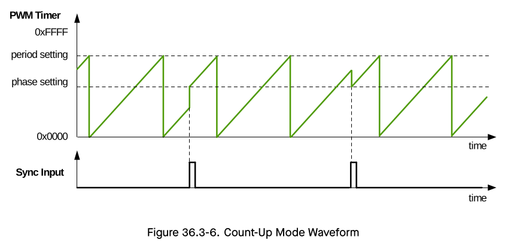
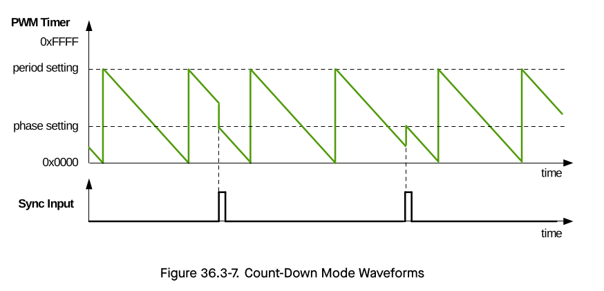
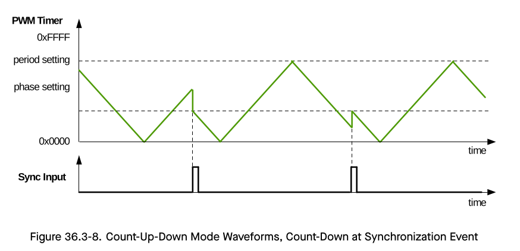
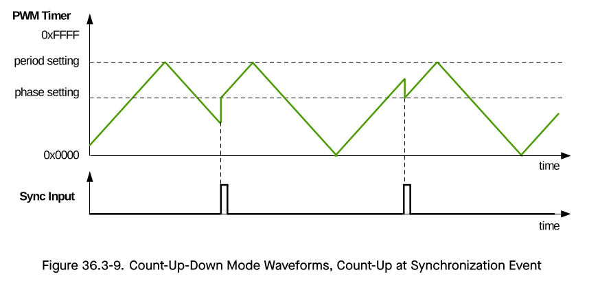
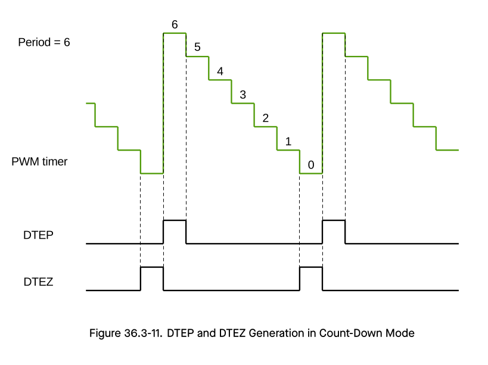
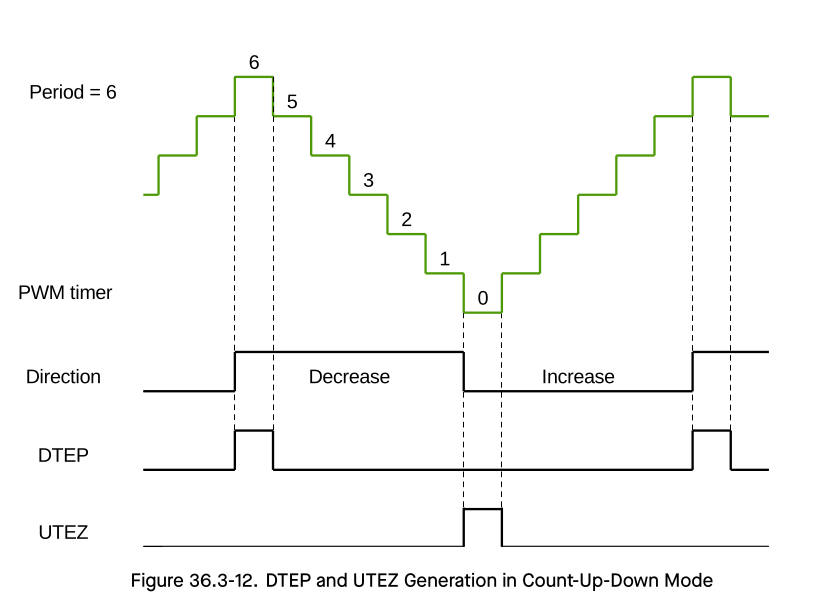

# Cornell Notes

## Topic: PWM Timer Submodule

## Date: 06/06/2026

---

### Cue Column (Questions, Keywords, or Prompts)

- [Insert question or keyword]
- [Insert question or keyword]
- [Insert question or keyword]

---

### Notes Section (Main Notes)

#### PWM Timer Submodule

Each MCPWM module has three PWM timer submodules. Any of them can determine the necessary event timing for any of the three PWM operator submodules. Built-in synchronization logic allows multiple PWM timer submodules, in one or more MCPWM modules, to work together as a system, when using synchronization signals from the GPIO matrix.

##### Configurations of the PWM Timer Submodule

Users can configure the following functions of the PWM timer submodule:
- Control how often events occur by specifying the PWM timer frequency or period.
- Configure a particular PWM timer to synchronize with other PWM timers or modules.
- Get a PWM timer in phase with other PWM timers or modules.
- Set one of the following timer counting modes: count-up, count-down, count-up-down.
- Change the rate of the PWM timer clock (`PT_clk`) with a prescaler. Each timer has its own prescaler configured with `MCPWM_TIMERx_PRESCALE` of the register `MCPWM_TIMER0_CFG0_REG`. The PWM timer increments or decrements at a slower pace, depending on the setting of this field.

##### PWM Timer’s Working Modes and Timing Event Generation

The PWM timer has three working modes, selected by the PWMx timer mode field:

- Count-Up Mode:
  - In this mode, the PWM timer increments from zero until reaching the value configured in the period field.
  - Once done, the PWM timer returns to zero and starts increasing again. PWM period is equal to the value of the period field + 1.
  - **Note**: The period field is `MCPWM_TIMERx_PERIOD` (x = 0, 1, 2), i.e., `MCPWM_TIMER0_PERIOD`, `MCPWM_TIMER1_PERIOD`, `MCPWM_TIMER2_PERIOD`.

- Count-Down Mode:
  - In this mode, the PWM timer decrements to zero, starting from the value configured in the period field.
  - After reaching zero, it is set back to the period value. Then it starts to decrement again. In this case, the PWM period is also equal to the value of period field + 1.

- Count-Up-Down Mode:
  - This is a combination of the two modes mentioned above. The PWM timer starts increasing from zero until the period value is reached. Then, the timer decreases back to zero. This pattern is then repeated.
  - The PWM period is the result of (the value of the period field × 2 + 1).

Figures 36.3-6 to 36.3-9 show PWM timer waveforms in different modes, including timer behavior during synchronization events. 

In **Count-Up mode**, the counting direction after synchronization is always counting up.

In **Count-Down mode**, the counting direction after synchronization is always counting down. 

In **Count-Up-Down Mode**, the counting direction after synchronization can be chosen by setting the `MCPWM_TIMERx_PHASE_DIRECTION`.

When the PWM timer is running, it generates the following timing events periodically and automatically:

- **UTEP**: The timing event generated when the PWM timer’s value equals to the value of the period field (`MCPWM_TIMERx_PERIOD`) and when the PWM timer is increasing.

- **UTEZ**: The timing event generated when the PWM timer’s value equals to zero and when the PWM timer is increasing.

- **DTEP**: The timing event generated when the PWM timer’s value equals to the value of the period field (`MCPWM_TIMERx_PERIOD`) and when the PWM timer is decreasing.

- **DTEZ**: The timing event generated when the PWM timer’s value equals to zero and when the PWM timer is decreasing.

Figures 36.3-10 to 36.3-12 show the timing waveforms of U/DTEP and U/DTEZ.

**Note:** 

- In the Count-Up-Down Mode: 
  - when the counting direction is increasing, the timer range is [0, period value - 1], 
  - when the counting direction is decreasing, the timer range is [period value, 1]. 

- That is, in this mode, when synchronizing the timer to 0, decreasing counting direction will be illegal, namely, `MCPWM_TIMERn_PHASE_DIRECTION` cannot be set to 1. 

- Similarly, when synchronizing the timer to period value, increasing counting direction will be illegal, namely, `MCPWM_TIMERn_PHASE_DIRECTION` cannot be set to 0. Therefore, when the timer is synchronized to 0, the counting direction can only be increasing, and `MCPWM_TIMERn_PHASE_DIRECTION` will be 0. When the timer is synchronized to the period value, the counting direction can only be decreasing, and `MCPWM_TIMERn_PHASE_DIRECTION` will be 1.

---

### Summary Section (Summary of Notes)

- The PWM timer has three working modes: Count-Up, Count-Down, and Count-Up-Down.
- Timing events (UTEP, UTEZ, DTEP, DTEZ) are generated based on the timer's value and counting direction.
- In Count-Up-Down mode, the counting direction after synchronization is constrained to prevent illegal states.