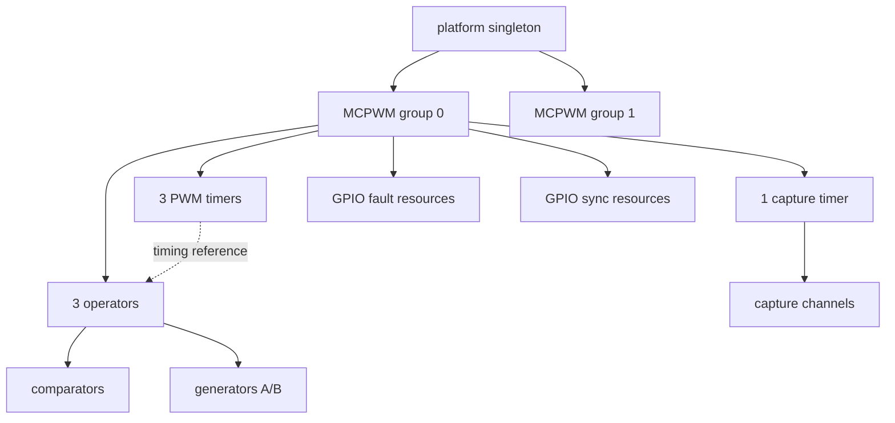
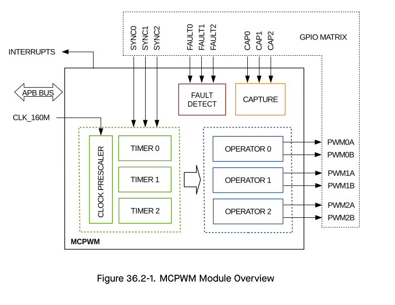
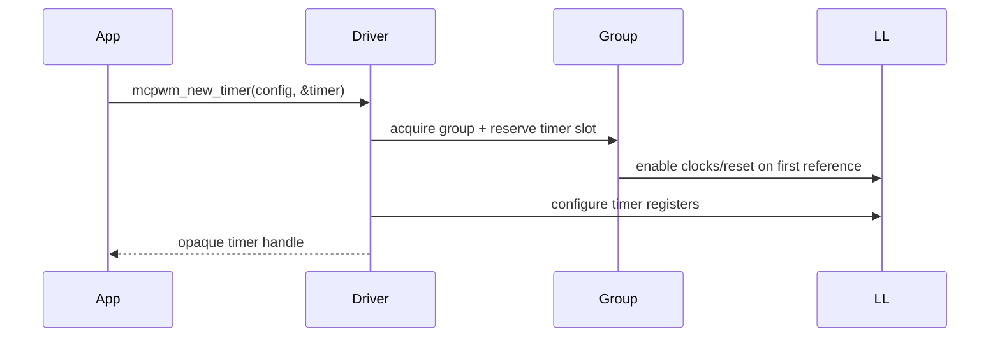

# Cornell Notes

## Topic: MCPWM Resource Relationships and Software Layers

## Date: 20/07/2026

---

### Cue Column (Questions, Keywords, or Prompts)

- How does an ESP-IDF handle correspond to MCPWM hardware?
- Which resources belong to a group, timer, operator, or capture timer?
- Which interfaces may application code call?
- Where should a register-level investigation begin?

---

### Notes Section (Main Notes)

#### The Five Layers

| Layer | Purpose | Examples | Application use? |
|---|---|---|---|
| Application | Describes the required waveform | servo, inverter, pulse measurement | Yes |
| Public driver | Stable allocation and control API | `mcpwm_new_timer()`, `mcpwm_timer_enable()` | **Yes** |
| Private driver | Ownership, state, locks, cleanup | `mcpwm_timer_register_to_group()`, `mcpwm_set_prescale()` | No |
| HAL/LL | Converts driver intent into register operations | `mcpwm_hal_timer_reset()`, `mcpwm_ll_timer_set_peak()` | No |
| Hardware | Counters, comparators, event logic and outputs | timer period, TEZ/TEP, generator actions | Observe through TRM |

`driver/mcpwm_prelude.h` collects the common public headers. Symbols in `src/mcpwm_private.h`, `hal/mcpwm_hal.h`, and `hal/mcpwm_ll.h` are implementation details, even when they are visible in the source tree.

#### Resource Tree

ESP32-S3 has two independent MCPWM groups. A group owns the shared peripheral clock selection, group prescaler, interrupt priority, HAL context, spinlock, and hardware-resource tables. A timer supplies timing events. An operator consumes one timer's timing reference; its comparators create compare events and its generators convert events into output levels.

#### What Allocation Really Means

Factory APIs allocate a heap object and reserve one entry in a fixed hardware table. They do not manufacture extra hardware. `ESP_ERR_NOT_FOUND` means the corresponding table is full. The first child in a group creates and initializes the shared group; the last child deletion releases it and gates its clocks.

#### Hardware-to-Software Map

| TRM concept | Public object/API | Private owner | Main implementation |
|---|---|---|---|
| MCPWM0/MCPWM1 | `group_id` | `mcpwm_group_t` | `mcpwm_com.c` |
| PWM timer | `mcpwm_timer_handle_t` | `mcpwm_timer_t` | `mcpwm_timer.c` |
| PWM operator | `mcpwm_oper_handle_t` | `mcpwm_oper_t` | `mcpwm_oper.c` |
| Compare event | `mcpwm_cmpr_handle_t` | `mcpwm_cmpr_t` | `mcpwm_cmpr.c` |
| PWMxA/PWMxB | `mcpwm_gen_handle_t` | `mcpwm_gen_t` | `mcpwm_gen.c` |
| Fault/brake | fault handle + operator | fault/operator objects | `mcpwm_fault.c`, `mcpwm_oper.c` |
| Capture module | capture timer/channel handles | capture objects | `mcpwm_cap.c` |

See [TRM overview](../01_technical_reference_manual/01_overview_and_features.md), [TRM submodules](../01_technical_reference_manual/02_submodules.md), and [programming-guide functional overview](../02_programming_guide/02_functional_overview.md).

Official sources: [ESP32-S3 Technical Reference Manual](https://documentation.espressif.com/esp32-s3_technical_reference_manual_en.pdf) and [ESP-IDF v6.0.1 MCPWM Programming Guide](https://docs.espressif.com/projects/esp-idf/en/v6.0.1/esp32s3/api-reference/peripherals/mcpwm.html).

#### API Catalog Links

- Handles: [`mcpwm_timer_handle_t`](15_mcpwm_apis.md#type-mcpwm-timer-handle-t), [`mcpwm_oper_handle_t`](15_mcpwm_apis.md#type-mcpwm-oper-handle-t), [`mcpwm_cmpr_handle_t`](15_mcpwm_apis.md#type-mcpwm-cmpr-handle-t), [`mcpwm_gen_handle_t`](15_mcpwm_apis.md#type-mcpwm-gen-handle-t)
- Entry points: [`mcpwm_new_timer()`](15_mcpwm_apis.md#api-mcpwm-new-timer), [`mcpwm_timer_enable()`](15_mcpwm_apis.md#api-mcpwm-timer-enable)
- [Complete MCPWM API and type catalog](15_mcpwm_apis.md)

---

### Summary Section (Summary of Notes)

- Public handles represent reserved hardware plus driver state; they are not raw register pointers.
- Group resources are shared, while operator children and capture channels have strict parents.
- Trace a public call through driver ownership logic and HAL/LL before mapping it to the TRM.
