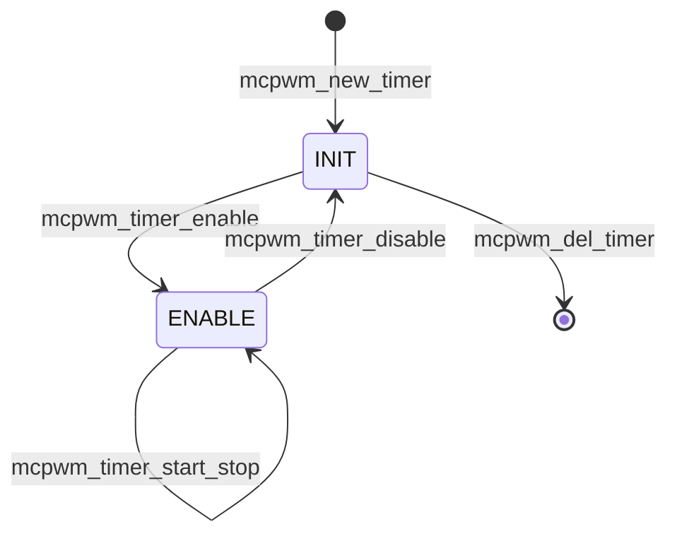

# Cornell Notes

## Topic: MCPWM Lifecycle and Common API Flow

## Date: 20/07/2026

---

### Cue Column (Questions, Keywords, or Prompts)

- In what order are MCPWM resources created and destroyed?
- What do enable, start, stop, and disable mean?
- How does a factory API recover from partial failure?
- Why does deletion sometimes return `ESP_ERR_INVALID_STATE`?

---

### Notes Section (Main Notes)

#### Safe Ownership Order

Create parents before children and delete children before parents:

```text
create: timer → operator → connect → comparator/generator → callbacks → enable → start
stop:   stop timer → disable channels/timer → delete generator/comparator → operator → timer
```

The operator and timer are peers in the group, but `mcpwm_operator_connect_timer()` makes the operator depend on that timer. Comparators and generators are operator children; capture channels are capture-timer children; timer sync sources can prevent timer deletion.

#### Timer State Machine



`start_stop()` only commands the hardware counter; it does not change the driver's `ENABLE` state. Therefore stop first, then disable. Delete is accepted only in `INIT`, and only after owned sync resources are removed.

#### Inside a Factory API

All `mcpwm_new_*()` functions follow the same transaction pattern:

1. Validate pointers, IDs, flags, ranges, and SoC capabilities.
2. Allocate a zeroed private object.
3. Acquire the parent/group and reserve a free hardware slot under a lock.
4. Check shared settings such as interrupt priority or clock compatibility.
5. Reset/configure HAL/LL hardware and route GPIO if applicable.
6. Initialize software state and publish the output handle last.
7. On error, destroy the partial object, release slots/references, and free memory.

This is why callers must only use an output handle after `ESP_OK`.

#### Minimal Lifecycle

```c
mcpwm_timer_handle_t timer = NULL;
mcpwm_timer_config_t cfg = {
    .group_id = 0,
    .clk_src = MCPWM_TIMER_CLK_SRC_DEFAULT,
    .resolution_hz = 1000000,
    .period_ticks = 20000,
    .count_mode = MCPWM_TIMER_COUNT_MODE_UP,
};
ESP_ERROR_CHECK(mcpwm_new_timer(&cfg, &timer));
ESP_ERROR_CHECK(mcpwm_timer_enable(timer));
ESP_ERROR_CHECK(mcpwm_timer_start_stop(timer, MCPWM_TIMER_START_NO_STOP));

ESP_ERROR_CHECK(mcpwm_timer_start_stop(timer, MCPWM_TIMER_STOP_EMPTY));
ESP_ERROR_CHECK(mcpwm_timer_disable(timer));
ESP_ERROR_CHECK(mcpwm_del_timer(timer));
```

#### Deletion Checks

| Object | Must be true before deletion |
|---|---|
| Timer | state is `INIT`; timer sync source removed |
| Operator | generators and comparators deleted |
| Comparator/generator | no longer needed by actions/callbacks |
| Capture timer | `INIT`; capture channels deleted |
| Capture channel | `INIT` |
| Fault/sync source | detached from dependent operator/timer where required |

Source trail: `components/esp_driver_mcpwm/src/mcpwm_timer.c`, `mcpwm_oper.c`, `mcpwm_cap.c`, and `mcpwm_private.h` at tag `v6.0.1`.

#### API Catalog Links

- Timer lifecycle: [`mcpwm_new_timer()`](15_mcpwm_apis.md#api-mcpwm-new-timer) → [`mcpwm_timer_enable()`](15_mcpwm_apis.md#api-mcpwm-timer-enable) → [`mcpwm_timer_start_stop()`](15_mcpwm_apis.md#api-mcpwm-timer-start-stop) → [`mcpwm_timer_disable()`](15_mcpwm_apis.md#api-mcpwm-timer-disable) → [`mcpwm_del_timer()`](15_mcpwm_apis.md#api-mcpwm-del-timer)
- Parent/child lifecycle: [`mcpwm_operator_connect_timer()`](15_mcpwm_apis.md#api-mcpwm-operator-connect-timer), [`mcpwm_del_operator()`](15_mcpwm_apis.md#api-mcpwm-del-operator), [`mcpwm_del_comparator()`](15_mcpwm_apis.md#api-mcpwm-del-comparator), [`mcpwm_del_generator()`](15_mcpwm_apis.md#api-mcpwm-del-generator)
- Capture cleanup: [`mcpwm_del_capture_channel()`](15_mcpwm_apis.md#api-mcpwm-del-capture-channel), [`mcpwm_del_capture_timer()`](15_mcpwm_apis.md#api-mcpwm-del-capture-timer)

---

### Summary Section (Summary of Notes)

- Allocation is a transaction: validate, reserve, configure, publish; errors unwind in reverse.
- Enable controls driver/runtime resources; start/stop controls the counter.
- Destroy the ownership graph from leaves toward the group.
