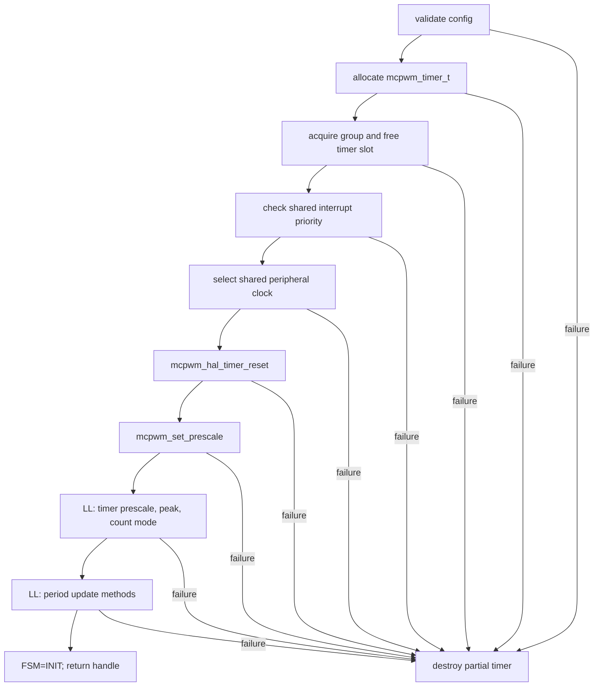

# Cornell Notes

## Topic: Timer Creation, Clock Selection, and Prescaling

## Date: 20/07/2026

---

### Cue Column (Questions, Keywords, or Prompts)

- What happens inside `mcpwm_new_timer()`?
- How do source, group, and timer dividers determine tick resolution?
- Why can allocation order produce a prescaler conflict?
- How do period updates reach the active hardware register?

---

### Notes Section (Main Notes)

#### Frequency Model

```text
group_resolution = source_clock / group_prescale
timer_resolution = group_resolution / timer_prescale
edge-aligned PWM frequency = timer_resolution / period_ticks
up-down PWM frequency = timer_resolution / period_ticks
```

For ESP-IDF v6.0.1, `period_ticks` describes the full requested PWM period. In up-down mode the driver stores `peak_ticks = period_ticks / 2` before programming the hardware peak.

#### Inside `mcpwm_new_timer()`



Validation rejects an invalid group/priority, zero or out-of-range peak, unsupported `allow_pd`, and null pointers. Registration returns `ESP_ERR_NOT_FOUND` when all three timers in the selected group are used.

`mcpwm_acquire_group_handle()` creates the group on its first reference, enables the bus and function clocks, resets the peripheral, initializes the HAL, and clears interrupts. `mcpwm_select_periph_clock()` makes the clock source a group-wide invariant. `mcpwm_set_prescale()` searches legal group/module divider combinations, preferring an exact division and otherwise the first usable high-resolution combination.

| Public configuration | Internal/LL operation | TRM concept |
|---|---|---|
| `clk_src` | `mcpwm_select_periph_clock()` | MCPWM source clock |
| `resolution_hz` | `mcpwm_set_prescale()` + `mcpwm_ll_timer_set_clock_prescale()` | group and timer prescalers |
| `period_ticks` | `mcpwm_ll_timer_set_peak()` | `TIMERx_PERIOD`/peak |
| `count_mode` | `mcpwm_ll_timer_set_count_mode()` | up/down/up-down mode |
| update flags | enable update on TEZ or sync | period shadow update method |

#### Shared-Prescaler Consequence

The first allocated timer fixes the group prescaler. Later timers may use different timer prescalers, but they cannot require a different group prescaler. Allocate multiple timers in a consistent resolution order and check every return value. Separate incompatible sets into group 0 and group 1.

#### Shadowed Period Update

`mcpwm_timer_set_period()` writes the hardware's shadowed peak. The active period changes according to `update_period_on_empty` and `update_period_on_sync`. This prevents a mid-cycle period write from creating a malformed pulse. See [TRM timer shadow registers](../01_technical_reference_manual/03_pwm_timer_submodule.md#pwm-timer-shadow-register).


Source trail: public `driver/mcpwm_timer.h`; internals `mcpwm_timer.c` and `mcpwm_com.c`; LL `components/hal/esp32s3/include/hal/mcpwm_ll.h`, all at `v6.0.1`.

#### API Catalog Links

- [`mcpwm_timer_config_t`](15_mcpwm_apis.md#type-mcpwm-timer-config-t) and [`mcpwm_new_timer()`](15_mcpwm_apis.md#api-mcpwm-new-timer)
- [`mcpwm_timer_set_period()`](15_mcpwm_apis.md#api-mcpwm-timer-set-period), [`mcpwm_timer_count_mode_t`](15_mcpwm_apis.md#type-mcpwm-timer-count-mode-t), and [`mcpwm_timer_clock_source_t`](15_mcpwm_apis.md#type-mcpwm-timer-clock-source-t)
- `mcpwm_set_prescale()` and `mcpwm_ll_*` are [internal symbols](15_mcpwm_apis.md#private-and-internal-symbols-seen-while-tracing), not application APIs.

---

### Summary Section (Summary of Notes)

- Timer resolution is produced by one shared group divider and one per-timer divider.
- The first group user constrains later users' clock source, prescaler, and interrupt priority.
- Period writes are shadowed; update flags decide when the new waveform becomes active.
