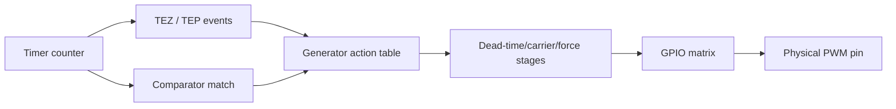

# Cornell Notes

## Topic: Operator, Comparator, and Generator Pipeline

## Date: 20/07/2026

---

### Cue Column (Questions, Keywords, or Prompts)

- How does a timer event become a GPIO transition?
- Why must an operator be connected to a timer?
- What is configured by comparator and generator factory APIs?
- When do compare values become active?

---

### Notes Section (Main Notes)

#### Event Pipeline



An operator does not own a counter. `mcpwm_operator_connect_timer()` selects which same-group timer provides its timing. A comparator belongs to an operator and produces an event when that timer count reaches `compare_ticks`. A generator belongs to the operator and selects high, low, toggle, or no-change for each event and count direction.

#### Minimal Construction Sequence

```c
mcpwm_oper_handle_t oper;
mcpwm_cmpr_handle_t cmp;
mcpwm_gen_handle_t gen;
ESP_ERROR_CHECK(mcpwm_new_operator(&(mcpwm_operator_config_t){.group_id = 0}, &oper));
ESP_ERROR_CHECK(mcpwm_operator_connect_timer(oper, timer));
ESP_ERROR_CHECK(mcpwm_new_comparator(oper,
    &(mcpwm_comparator_config_t){.flags.update_cmp_on_tez = true}, &cmp));
ESP_ERROR_CHECK(mcpwm_new_generator(oper,
    &(mcpwm_generator_config_t){.gen_gpio_num = PWM_GPIO}, &gen));
ESP_ERROR_CHECK(mcpwm_comparator_set_compare_value(cmp, duty_ticks));
```

#### Inside the Common APIs

| Public API | Driver work | Hardware result |
|---|---|---|
| `mcpwm_new_operator()` | allocate, reserve group operator, reset operator, check priority | clean operator slot |
| `mcpwm_operator_connect_timer()` | verify same group, remember timer | select operator timer input |
| `mcpwm_new_comparator()` | reserve comparator child, set update flags | comparator shadow/update policy |
| `mcpwm_comparator_set_compare_value()` | validate against timer peak; lock | write compare shadow value |
| `mcpwm_new_generator()` | reserve generator child; configure GPIO | PWM output routed through GPIO matrix |
| generator action setters | encode direction/event/action | program generator event table |

If creation fails, each factory removes any reserved child slot, disconnects GPIO as applicable, and frees its object. Deletion is leaf-first: generator/comparator before operator.

#### Shadow Update Rule

Use `update_cmp_on_tez`, `update_cmp_on_tep`, or `update_cmp_on_sync` so a duty update becomes active at a deterministic boundary. Updating immediately can be useful but may miss or duplicate a compare event if the counter has already crossed the new value.

See [TRM operator submodule](../01_technical_reference_manual/04_pwm_operator_submodule.md) and [programming-guide resource allocation](../02_programming_guide/03_resource_allocation_and_initialization.md).

#### API Catalog Links

- Operator: [`mcpwm_new_operator()`](15_mcpwm_apis.md#api-mcpwm-new-operator), [`mcpwm_operator_connect_timer()`](15_mcpwm_apis.md#api-mcpwm-operator-connect-timer), [`mcpwm_operator_config_t`](15_mcpwm_apis.md#type-mcpwm-operator-config-t)
- Comparator: [`mcpwm_new_comparator()`](15_mcpwm_apis.md#api-mcpwm-new-comparator), [`mcpwm_comparator_set_compare_value()`](15_mcpwm_apis.md#api-mcpwm-comparator-set-compare-value), [`mcpwm_comparator_config_t`](15_mcpwm_apis.md#type-mcpwm-comparator-config-t)
- Generator: [`mcpwm_new_generator()`](15_mcpwm_apis.md#api-mcpwm-new-generator), [`mcpwm_generator_config_t`](15_mcpwm_apis.md#type-mcpwm-generator-config-t), and the [generator action APIs](15_mcpwm_apis.md#generator-apis-action-structures-and-macros)

---

### Summary Section (Summary of Notes)

- Timer produces time; comparator produces a timestamp event; generator turns events into levels.
- Parent and group relationships are checked by the driver before LL routing is changed.
- Shadowed compare updates are the normal way to change duty without glitches.
