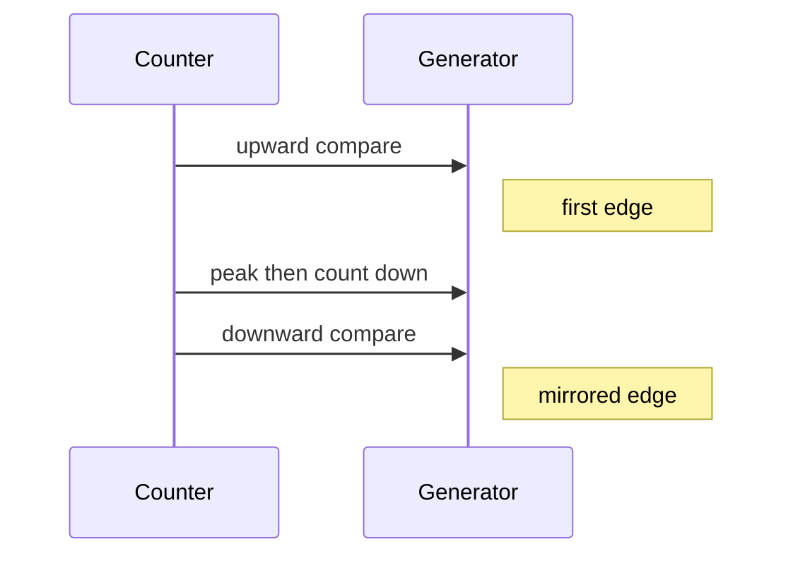

# Cornell Notes

## Topic: Basic Edge-Aligned and Symmetric PWM

## Date: 20/07/2026

---

### Cue Column (Questions, Keywords, or Prompts)

- Which events produce a basic active-high PWM signal?
- How do edge-aligned and center-aligned PWM differ?
- How are frequency and duty calculated?
- Which action mistakes produce a constant output?

---

### Notes Section (Main Notes)

#### Edge-Aligned Active-High PWM

For count-up mode, set the output high at timer empty (TEZ), then low at the upward compare event.

```c
ESP_ERROR_CHECK(mcpwm_generator_set_action_on_timer_event(gen,
    MCPWM_GEN_TIMER_EVENT_ACTION(MCPWM_TIMER_DIRECTION_UP,
                                 MCPWM_TIMER_EVENT_EMPTY,
                                 MCPWM_GEN_ACTION_HIGH)));
ESP_ERROR_CHECK(mcpwm_generator_set_action_on_compare_event(gen,
    MCPWM_GEN_COMPARE_EVENT_ACTION(MCPWM_TIMER_DIRECTION_UP,
                                   cmp, MCPWM_GEN_ACTION_LOW)));
```

At 1 MHz timer resolution and `period_ticks = 20000`, the PWM is 50 Hz. `compare_ticks = 1500` gives a 1.5 ms high pulse, appropriate as a typical servo midpoint command.

```text
frequency = resolution_hz / period_ticks
duty(active high, count up) = compare_ticks / period_ticks
```

Active-low swaps HIGH and LOW actions.

#### Center-Aligned PWM

Use `MCPWM_TIMER_COUNT_MODE_UP_DOWN`. A symmetric pulse normally uses actions on both the upward and downward comparator crossings. ESP-IDF receives the full cycle in `period_ticks`, then programs half of it as the hardware peak.



#### Inside the Action APIs

The action macros create small event descriptors; the public setters validate the handles and direction, identify comparator/operator relationships, take the generator lock, and call LL helpers to program the operator's generator action table. No ISR is involved: hardware evaluates these actions every PWM cycle.

| Desired waveform | Timer event | Compare event(s) |
|---|---|---|
| active-high edge-aligned | HIGH at UP+EMPTY | LOW at UP+COMPARE |
| active-low edge-aligned | LOW at UP+EMPTY | HIGH at UP+COMPARE |
| centered pulse | initial level at EMPTY/PEAK | opposite actions at UP and DOWN compare |

Always derive the transition table on paper before coding. If no action establishes the initial level, or direction does not match the timer mode, the pin can remain constant.

Reference implementation: `examples/peripherals/mcpwm/mcpwm_servo_control` at ESP-IDF `v6.0.1`. Hardware background: [TRM timer](../01_technical_reference_manual/03_pwm_timer_submodule.md) and [operator](../01_technical_reference_manual/04_pwm_operator_submodule.md).

#### API Catalog Links

- [`mcpwm_generator_set_action_on_timer_event()`](15_mcpwm_apis.md#api-mcpwm-generator-set-action-on-timer-event) with [`MCPWM_GEN_TIMER_EVENT_ACTION`](15_mcpwm_apis.md#macro-mcpwm-gen-timer-event-action)
- [`mcpwm_generator_set_action_on_compare_event()`](15_mcpwm_apis.md#api-mcpwm-generator-set-action-on-compare-event) with [`MCPWM_GEN_COMPARE_EVENT_ACTION`](15_mcpwm_apis.md#macro-mcpwm-gen-compare-event-action)
- [`mcpwm_comparator_set_compare_value()`](15_mcpwm_apis.md#api-mcpwm-comparator-set-compare-value), [`mcpwm_timer_direction_t`](15_mcpwm_apis.md#type-mcpwm-timer-direction-t), [`mcpwm_generator_action_t`](15_mcpwm_apis.md#type-mcpwm-generator-action-t)

---

### Summary Section (Summary of Notes)

- A waveform is an event-to-action table, not an implicit duty-cycle setting.
- Edge-aligned PWM needs one boundary action and one compare action.
- Symmetric PWM uses both count directions, so direction-specific actions matter.
