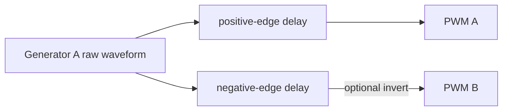

# Cornell Notes

## Topic: Complementary PWM and Dead Time

## Date: 20/07/2026

---

### Cue Column (Questions, Keywords, or Prompts)

- Why do half-bridges require dead time?
- How are two complementary outputs derived?
- What resources constrain rising- and falling-edge delays?
- Why is dead time not a complete safety mechanism?

---

### Notes Section (Main Notes)

#### Purpose

Complementary PWM drives the high- and low-side switches of a half-bridge. Switching both on together causes shoot-through. Dead time delays selected rising or falling edges so one device turns off before the other turns on.



#### Public Configuration

```c
mcpwm_dead_time_config_t dt = {
    .posedge_delay_ticks = rise_ticks,
    .negedge_delay_ticks = 0,
};
ESP_ERROR_CHECK(mcpwm_generator_set_dead_time(gen_a, gen_a, &dt));

dt.posedge_delay_ticks = 0;
dt.negedge_delay_ticks = fall_ticks;
dt.flags.invert_output = true;
ESP_ERROR_CHECK(mcpwm_generator_set_dead_time(gen_a, gen_b, &dt));
```

The exact routing depends on the desired topology; use the programming guide's classical configurations as truth tables, not as interchangeable recipes.

#### Inside `mcpwm_generator_set_dead_time()`

The driver verifies that input and output generators belong to the same operator, converts delay ticks using the operator dead-time resolution, and records ownership of the positive- and negative-edge delay cells. Each operator has limited delay resources; incompatible reuse returns an error. LL helpers select the input source, bypass/delay paths, output swap, and inversion.

| Public field | Hardware idea |
|---|---|
| `posedge_delay_ticks` | rising-edge delay cell |
| `negedge_delay_ticks` | falling-edge delay cell |
| `invert_output` | inversion after delay routing |
| input/output generator handles | dead-time source and destination |

Delay time is `ticks / dead_time_resolution_hz`. Verify the final pins with an oscilloscope at minimum and maximum duty. At extreme compare values, ensure both devices still receive a safe off interval.

Dead time protects normal commutation only. Startup, software failure, fault polarity, gate-driver propagation, and forced levels still require safe generator actions and hardware fault/brake handling. See [faults and brake actions](09_faults_and_brake_actions.md).

Reference: `components/esp_driver_mcpwm/src/mcpwm_gen.c` and `driver/mcpwm_gen.h` at `v6.0.1`; [TRM operator submodule](../01_technical_reference_manual/04_pwm_operator_submodule.md).

#### API Catalog Links

- [`mcpwm_generator_set_dead_time()`](15_mcpwm_apis.md#api-mcpwm-generator-set-dead-time)
- [`mcpwm_dead_time_config_t`](15_mcpwm_apis.md#type-mcpwm-dead-time-config-t) and [`mcpwm_gen_handle_t`](15_mcpwm_apis.md#type-mcpwm-gen-handle-t)

---

### Summary Section (Summary of Notes)

- Dead time is edge-delay routing with scarce per-operator resources.
- Complementary output must be verified after delay, inversion, and GPIO routing.
- Use faults/brakes as the safety layer; dead time alone is insufficient.
