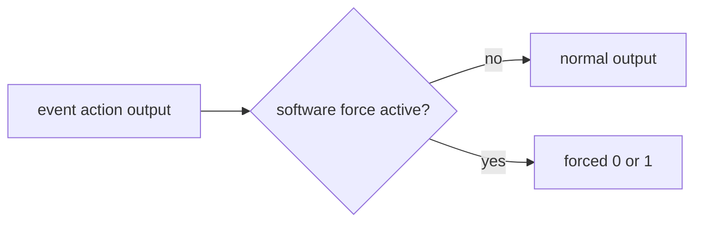

# Cornell Notes

## Topic: Carrier Modulation and Generator Force Actions

## Date: 20/07/2026

---

### Cue Column (Questions, Keywords, or Prompts)

- What does carrier modulation add to a PWM output?
- How is the requested carrier approximated by hardware dividers?
- What is the difference between temporary and held force levels?
- Which mechanism should be used for emergency shutdown?

---

### Notes Section (Main Notes)

#### Carrier Modulation

`mcpwm_operator_apply_carrier()` gates/modulates an operator's generated PWM with a higher-frequency carrier, useful with transformer-isolated gate drivers.

```c
mcpwm_carrier_config_t carrier = {
    .frequency_hz = 1000000,
    .duty_cycle = 0.5,
    .first_pulse_duration_us = 5,
};
ESP_ERROR_CHECK(mcpwm_operator_apply_carrier(oper, &carrier));
```

Inside the API, the driver validates frequency/duty, calls `mcpwm_set_prescale()` with the carrier divider limit, derives achievable period/high/first-pulse ticks, programs carrier inversion options, and enables the carrier only when the real frequency is nonzero. Because dividers are integral, actual frequency and duty can differ from the request.

#### Force Level

```c
ESP_ERROR_CHECK(mcpwm_generator_set_force_level(gen, 0, true));  // hold low
ESP_ERROR_CHECK(mcpwm_generator_set_force_level(gen, -1, true)); // release
```

`level` is `0`, `1`, or `-1` to remove force. With `hold_on = true`, the software force remains until explicitly released. With `hold_on = false`, a configured generator event can supersede it.



#### Inside the Force API

The public function validates the generator and level, locks the generator, then calls LL helpers for continuous or non-continuous software force. It changes the output path immediately; it does not stop the timer, change compare values, or invoke a callback.

| Need | Correct mechanism |
|---|---|
| commissioning/test level | generator force |
| normal waveform | timer/compare actions |
| safety reaction to external signal | fault + brake |
| stop time base | timer start/stop command |

A held force can defeat ordinary generator events, so always release it deliberately. Do not use a task-level force call as the sole emergency shutdown path; hardware faults react without scheduler latency.

Reference: `mcpwm_oper.c`, `mcpwm_gen.c`, and [TRM operator submodule](../01_technical_reference_manual/04_pwm_operator_submodule.md).

#### API Catalog Links

- Carrier: [`mcpwm_operator_apply_carrier()`](15_mcpwm_apis.md#api-mcpwm-operator-apply-carrier), [`mcpwm_carrier_config_t`](15_mcpwm_apis.md#type-mcpwm-carrier-config-t)
- Force: [`mcpwm_generator_set_force_level()`](15_mcpwm_apis.md#api-mcpwm-generator-set-force-level)
- `mcpwm_set_prescale()` is an [internal helper](15_mcpwm_apis.md#private-and-internal-symbols-seen-while-tracing).

---

### Summary Section (Summary of Notes)

- Carrier is a post-generation modulation stage with quantized frequency and duty.
- Force overrides output level but does not alter the underlying timer or action table.
- Hardware fault/brake logic is the correct fast safety mechanism.
