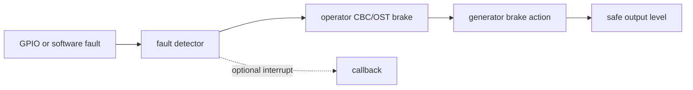

# Cornell Notes

## Topic: Fault Detection and Brake Actions

## Date: 20/07/2026

---

### Cue Column (Questions, Keywords, or Prompts)

- How does a fault force PWM outputs to a safe state?
- When should cycle-by-cycle or one-shot braking be used?
- Why must fault polarity be verified before enabling power?
- How is one-shot braking recovered?

---

### Notes Section (Main Notes)

#### Safety Path



The output reaction is performed in hardware. The callback reports the event but must not be part of the time-critical shutdown path.

#### CBC Versus OST

| Mode | Behavior | Recovery |
|---|---|---|
| CBC, cycle-by-cycle | brake while active; reevaluate at configured TEZ/TEP boundary | automatic after fault clears |
| OST, one-shot | latch brake after detection | explicit `mcpwm_operator_recover_from_fault()` after signal clears |

#### Minimal Configuration

```c
mcpwm_fault_handle_t fault;
ESP_ERROR_CHECK(mcpwm_new_gpio_fault(&(mcpwm_gpio_fault_config_t){
    .group_id = 0, .gpio_num = FAULT_GPIO,
    .flags.active_level = 0,
}, &fault));
ESP_ERROR_CHECK(mcpwm_operator_set_brake_on_fault(oper,
    &(mcpwm_brake_config_t){
        .fault = fault,
        .brake_mode = MCPWM_OPER_BRAKE_MODE_OST,
    }));
ESP_ERROR_CHECK(mcpwm_generator_set_action_on_brake_event(gen,
    MCPWM_GEN_BRAKE_EVENT_ACTION(MCPWM_TIMER_DIRECTION_UP,
                                 MCPWM_OPER_BRAKE_MODE_OST,
                                 MCPWM_GEN_ACTION_LOW)));
```

Configure brake actions for every relevant generator and timer direction.

#### Inside the Common APIs

`mcpwm_new_gpio_fault()` allocates a fault slot, routes the GPIO through the matrix, programs active level and filters, and records the group. A soft fault is a software-trigger object that becomes bound to an operator. `mcpwm_operator_set_brake_on_fault()` verifies same-group/ownership rules and enables the chosen trigger in CBC or OST hardware. Generator brake-action setters program the output response table.

Fault callbacks lazily install the shared interrupt service and enable enter/exit event bits. `mcpwm_operator_recover_from_fault()` first reads whether CBC/OST remains active; OST latch clearing is rejected while the physical fault is still asserted.

Before connecting a power stage, test the inactive and active electrical levels, pull resistors, startup state, and safe action using a scope or logic analyzer. A reversed `active_level` can hold the motor braked—or treat a disconnected wire as safe.

See [TRM operator fault/brake logic](../01_technical_reference_manual/04_pwm_operator_submodule.md) and source `mcpwm_fault.c`, `mcpwm_oper.c`, `mcpwm_gen.c` at `v6.0.1`.

#### API Catalog Links

- Fault objects: [`mcpwm_new_gpio_fault()`](15_mcpwm_apis.md#api-mcpwm-new-gpio-fault), [`mcpwm_new_soft_fault()`](15_mcpwm_apis.md#api-mcpwm-new-soft-fault), [`mcpwm_gpio_fault_config_t`](15_mcpwm_apis.md#type-mcpwm-gpio-fault-config-t)
- Braking: [`mcpwm_operator_set_brake_on_fault()`](15_mcpwm_apis.md#api-mcpwm-operator-set-brake-on-fault), [`mcpwm_operator_recover_from_fault()`](15_mcpwm_apis.md#api-mcpwm-operator-recover-from-fault), [`mcpwm_brake_config_t`](15_mcpwm_apis.md#type-mcpwm-brake-config-t)
- Actions/callbacks: [`mcpwm_generator_set_action_on_brake_event()`](15_mcpwm_apis.md#api-mcpwm-generator-set-action-on-brake-event), [`mcpwm_fault_register_event_callbacks()`](15_mcpwm_apis.md#api-mcpwm-fault-register-event-callbacks)

---

### Summary Section (Summary of Notes)

- Hardware brake actions provide deterministic shutdown; callbacks provide notification.
- CBC recovers cyclically; OST remains latched until safe explicit recovery.
- Validate electrical polarity and actions without power before driving a bridge.
