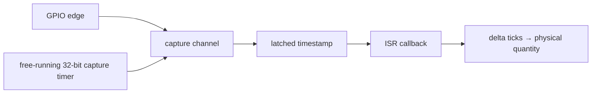
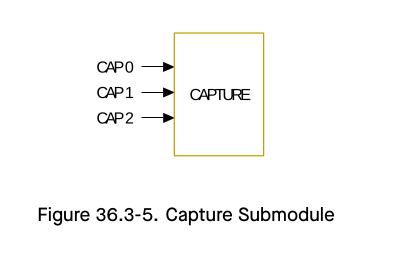

# Cornell Notes

## Topic: Capture Timer, Channels, and Pulse Measurement

## Date: 20/07/2026

---

### Cue Column (Questions, Keywords, or Prompts)

- How does capture differ from waveform generation?
- What value is latched on an input edge?
- How are pulse width, frequency, speed, or distance derived?
- In what order are capture resources enabled and started?

---

### Notes Section (Main Notes)

#### Capture Data Flow



The channel stores the capture timer count at the selected rising/falling edge. For wrap-safe unsigned arithmetic, `delta = current - previous`; then `seconds = delta / resolution_hz`.



#### Public Sequence

```c
mcpwm_cap_timer_handle_t cap_timer;
mcpwm_cap_channel_handle_t channel;
ESP_ERROR_CHECK(mcpwm_new_capture_timer(
    &(mcpwm_capture_timer_config_t){.group_id = 0}, &cap_timer));
ESP_ERROR_CHECK(mcpwm_new_capture_channel(cap_timer,
    &(mcpwm_capture_channel_config_t){
        .gpio_num = CAP_GPIO,
        .prescale = 1,
        .flags.pos_edge = true,
        .flags.neg_edge = true,
    }, &channel));
ESP_ERROR_CHECK(mcpwm_capture_channel_register_event_callbacks(channel,
    &(mcpwm_capture_event_callbacks_t){.on_cap = on_capture}, ctx));
ESP_ERROR_CHECK(mcpwm_capture_channel_enable(channel));
ESP_ERROR_CHECK(mcpwm_capture_timer_enable(cap_timer));
ESP_ERROR_CHECK(mcpwm_capture_timer_start(cap_timer));
```

Stop/disable in reverse, then delete the channel before its timer.

#### Inside the Common APIs

`mcpwm_new_capture_timer()` reserves the group's single capture timer, establishes its resolution, resets/configures capture hardware, and sets `INIT`. Channel creation reserves a channel slot, validates prescale/edges, routes the GPIO, and programs edge selection. Callback registration lazily allocates the capture interrupt and enables the channel event.

Enable APIs enforce `INIT → ENABLE`; start controls the free-running hardware counter. The ISR clears status, reads captured value and edge polarity into `mcpwm_capture_event_data_t`, invokes `on_cap`, and requests a context switch if the callback returns `true`.

| Measurement | Calculation |
|---|---|
| pulse width | falling timestamp − rising timestamp |
| period | current same-edge timestamp − previous same-edge timestamp |
| frequency | `resolution_hz / period_ticks` |
| HC-SR04 distance | pulse time × speed of sound ÷ 2 |
| rotational speed | edge frequency ÷ pulses per revolution |

Keep ISR work short: copy timestamps or notify a task; perform floating-point conversion outside the callback. Reference [TRM capture submodule](../01_technical_reference_manual/05_pwm_capture_submodule.md) and `examples/peripherals/mcpwm/mcpwm_capture_hc_sr04`.

#### API Catalog Links

- Timer: [`mcpwm_new_capture_timer()`](15_mcpwm_apis.md#api-mcpwm-new-capture-timer), [`mcpwm_capture_timer_enable()`](15_mcpwm_apis.md#api-mcpwm-capture-timer-enable), [`mcpwm_capture_timer_start()`](15_mcpwm_apis.md#api-mcpwm-capture-timer-start)
- Channel: [`mcpwm_new_capture_channel()`](15_mcpwm_apis.md#api-mcpwm-new-capture-channel), [`mcpwm_capture_channel_enable()`](15_mcpwm_apis.md#api-mcpwm-capture-channel-enable), [`mcpwm_capture_channel_register_event_callbacks()`](15_mcpwm_apis.md#api-mcpwm-capture-channel-register-event-callbacks)
- Data/types: [`mcpwm_capture_event_data_t`](15_mcpwm_apis.md#type-mcpwm-capture-event-data-t), [`mcpwm_capture_timer_config_t`](15_mcpwm_apis.md#type-mcpwm-capture-timer-config-t), [`mcpwm_capture_channel_config_t`](15_mcpwm_apis.md#type-mcpwm-capture-channel-config-t)

---

### Summary Section (Summary of Notes)

- Capture records timestamps; software interprets timestamp differences.
- Create timer then channels; enable channels and timer before starting the counter.
- Use unsigned deltas and move expensive calculations out of the ISR.
