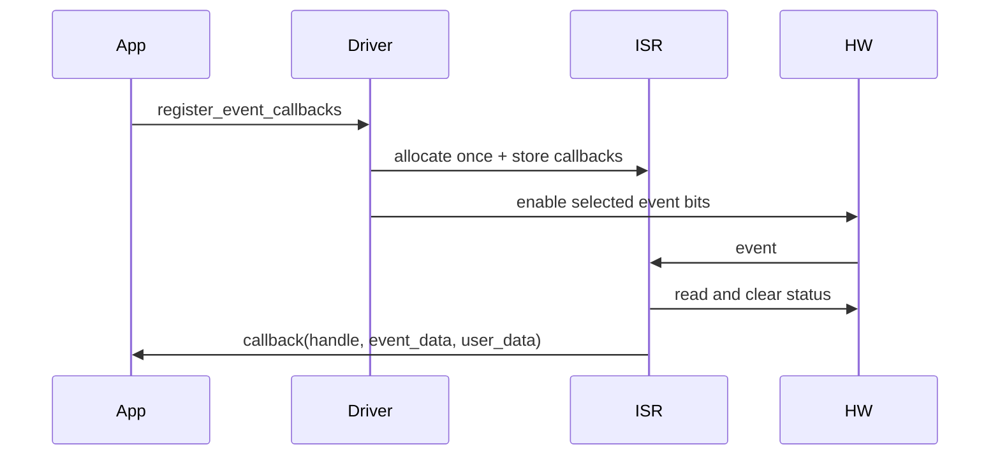

# Cornell Notes

## Topic: Interrupts, Callbacks, IRAM, and Thread Safety

## Date: 20/07/2026

---

### Cue Column (Questions, Keywords, or Prompts)

- When is an MCPWM ISR installed?
- What may a callback safely do?
- What changes when cache-safe ISR support is enabled?
- Which driver calls are thread-safe?

---

### Notes Section (Main Notes)

#### Lazy Interrupt Installation

Registering a callback installs that object's interrupt service on first use. The driver allocates the shared MCPWM interrupt with an event-status mask, stores callbacks/user data, and enables only events having non-null callbacks.

Timer interrupts are enabled/disabled with the timer lifecycle. Some other object interrupts are enabled as part of successful callback registration. Deleting the owning object frees its interrupt handle.

#### ISR Contract

- Do not block, allocate normally, log excessively, or call APIs not documented ISR-safe.
- Copy event data or use an ISR-safe queue/task notification.
- Return `true` only when a higher-priority task was woken; the common ISR then yields.
- Treat callback event-data pointers as valid only for the callback duration.

#### Cache-Safe Mode

With `CONFIG_MCPWM_ISR_CACHE_SAFE`, handlers can run while flash cache is disabled. The driver verifies callbacks are in IRAM and non-null user data is in internal RAM. Any data and called functions used from the callback must also remain cache-accessible. `CONFIG_MCPWM_CTRL_FUNC_IN_IRAM` places selected control functions in IRAM; it does not make every driver API ISR-safe.

#### Shared Group Constraints

The first object fixes a group's explicit interrupt priority. Later objects requesting a different nonzero priority fail with `ESP_ERR_INVALID_STATE`. Factory/allocation APIs are thread-safe through platform locks and per-group critical sections. Most operational APIs are not generally thread-safe across tasks; protect shared handles at the application level.

| Callback family | Event examples |
|---|---|
| Timer | empty, full, stop |
| Comparator | compare reached |
| Fault | enter, exit |
| Operator | CBC/OST brake |
| Capture | edge captured |

Source trail: default ISR functions in `mcpwm_timer.c`, `mcpwm_cmpr.c`, `mcpwm_fault.c`, `mcpwm_oper.c`, and `mcpwm_cap.c`; guide sections “IRAM Safe” and “Thread Safety”.

#### API Catalog Links

- Registration APIs: [`mcpwm_timer_register_event_callbacks()`](15_mcpwm_apis.md#api-mcpwm-timer-register-event-callbacks), [`mcpwm_comparator_register_event_callbacks()`](15_mcpwm_apis.md#api-mcpwm-comparator-register-event-callbacks), [`mcpwm_operator_register_event_callbacks()`](15_mcpwm_apis.md#api-mcpwm-operator-register-event-callbacks), [`mcpwm_fault_register_event_callbacks()`](15_mcpwm_apis.md#api-mcpwm-fault-register-event-callbacks), [`mcpwm_capture_channel_register_event_callbacks()`](15_mcpwm_apis.md#api-mcpwm-capture-channel-register-event-callbacks)
- [Event-data and callback types](15_mcpwm_apis.md#event-data-and-callback-types)

---

### Summary Section (Summary of Notes)

- Callback registration lazily installs an ISR and programs event masks.
- Cache-safe configuration imposes IRAM/internal-RAM requirements on the whole callback path.
- Allocation is thread-safe; serialize operational access to shared handles.
