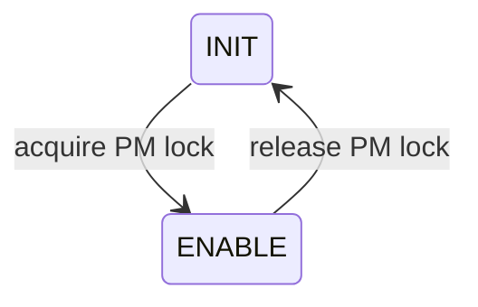
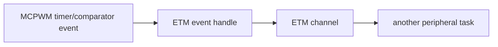

# Cornell Notes

## Topic: Power Management, Sleep Retention, and ETM

## Date: 20/07/2026

---

### Cue Column (Questions, Keywords, or Prompts)

- How does dynamic frequency scaling affect MCPWM timing?
- What happens when a timer is enabled or disabled under power management?
- What does `allow_pd` retain across light sleep?
- How can MCPWM events trigger peripherals without CPU ISR latency?

---

### Notes Section (Main Notes)

#### Power-Management Locks

The group's source clock must stay stable while PWM timing matters. On ESP32-S3, selecting the peripheral clock under `CONFIG_PM_ENABLE` creates an APB-frequency lock. `mcpwm_timer_enable()` acquires the group lock and `mcpwm_timer_disable()` releases it. Capture timers similarly protect their clock while enabled.

This is another reason enable/disable is separate from start/stop: a stopped but enabled object can still retain runtime resources.

#### Sleep Retention

When the target/configuration supports peripheral power-down retention, `.flags.allow_pd = true` requests register backup/restore around light sleep. The first requesting object creates the group's retention module. Retention consumes memory but avoids full MCPWM reinitialization after wake. Without SoC support, the factory rejects `allow_pd` with `ESP_ERR_NOT_SUPPORTED`.

Inside group creation, the driver enables bus and function clocks, initializes HAL, and registers retention metadata. Releasing the last group reference deletes PM/retention resources and gates clocks.

#### Event Task Matrix (ETM) — Not Available on ESP32-S3

ETM connects hardware events to hardware tasks without executing a CPU ISR.

Common headers declare `mcpwm_timer_new_etm_event()` and `mcpwm_comparator_new_etm_event()`, but ESP32-S3 does not define `SOC_MCPWM_SUPPORT_ETM`, so `mcpwm_etm.c` is not linked for this target. The diagram describes supported targets only; attempting to use these declarations in an ESP32-S3 application produces an unresolved implementation at link time.

| Requirement | Mechanism |
|---|---|
| stable PWM during DFS | PM lock through enable/disable |
| restore after powered-down light sleep | `allow_pd` retention |
| notify software | callback/ISR |
| deterministic peripheral-to-peripheral trigger | ETM |

Sources: `mcpwm_com.c`, `mcpwm_timer.c`, `mcpwm_cap.c`, `mcpwm_etm.c`, and public `driver/mcpwm_etm.h`, tag `v6.0.1`.

#### API Catalog Links

- Power lifecycle: [`mcpwm_timer_enable()`](15_mcpwm_apis.md#api-mcpwm-timer-enable), [`mcpwm_timer_disable()`](15_mcpwm_apis.md#api-mcpwm-timer-disable), [`mcpwm_timer_config_t`](15_mcpwm_apis.md#type-mcpwm-timer-config-t)
- Target-gated declarations: [`mcpwm_timer_new_etm_event()`](15_mcpwm_apis.md#api-mcpwm-timer-new-etm-event), [`mcpwm_comparator_new_etm_event()`](15_mcpwm_apis.md#api-mcpwm-comparator-new-etm-event)
- [ESP32-S3 capability caveats](15_mcpwm_apis.md#esp32-s3-capability-caveats)

---

### Summary Section (Summary of Notes)

- Enabled objects hold the clock-stability resources needed for accurate timing.
- Retention trades memory for restoration across light-sleep power-down.
- ETM is the hardware path for deterministic cross-peripheral event routing.
