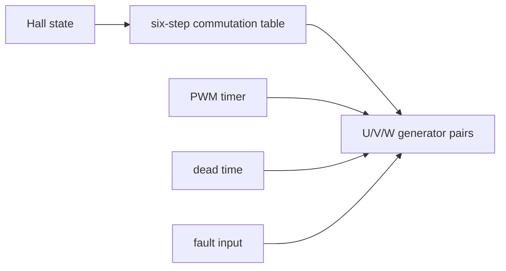

# Cornell Notes

## Topic: Complete MCPWM Application Sequences

## Date: 20/07/2026

---

### Cue Column (Questions, Keywords, or Prompts)

- Which MCPWM resources does each application require?
- What is the correct construction order for each example?
- Which lower-level notes explain each stage?
- Which safety and measurement features should be added before real hardware use?

---

### Notes Section (Main Notes)

#### Selection Guide

| Application | Main resources | Read first | ESP-IDF v6.0.1 example |
|---|---|---|---|
| RC servo | 1 timer, operator, comparator, generator | [basic PWM](05_basic_and_symmetric_pwm.md) | `mcpwm_servo_control` |
| BDC speed/direction | PWM pair, operator actions, optional fault | [pipeline](04_operator_comparator_and_generator.md), [faults](09_faults_and_brake_actions.md) | `mcpwm_bdc_speed_control` |
| BLDC six-step | 3 operator pairs, dead time, Hall inputs, fault | [dead time](06_complementary_pwm_and_dead_time.md), [capture](10_capture_timer_and_channels.md) | `mcpwm_bldc_hall_control` |
| Three-phase SVPWM | synchronized three-phase pairs, duty updates, dead time | [sync](08_synchronization_and_phase_control.md), [dead time](06_complementary_pwm_and_dead_time.md) | `mcpwm_foc_svpwm_open_loop` |

#### Servo Sequence

```text
timer(1 MHz, 20,000 ticks) → operator → comparator → generator GPIO
→ HIGH on TEZ → LOW on compare → enable/start → update compare for angle
```

This is the smallest complete MCPWM waveform and the best first experiment. Confirm 50 Hz and pulse width on a scope before attaching the servo.

#### BDC Sequence

Create one time base and the generator outputs required by the bridge. Encode forward, reverse, coast, and brake as explicit generator levels/actions. Add a hardware fault before increasing power. Never reverse direction by changing both bridge legs asynchronously; force a safe state, update actions/duty, then resume.

#### BLDC Hall Six-Step Sequence



Create the shared timer, three operators, six generators and comparators, apply complementary dead time, configure Hall GPIO callbacks/capture, configure a hardware brake path, then start PWM at a safe zero command. Hall state chooses which phase is driven high, low, or floating; PWM duty controls torque/speed.

#### Open-Loop SVPWM Sequence

Use a common timer for three operators so duty updates share one time base. Generate three phase references, convert them to bounded compare ticks, and commit shadowed comparator values at the same TEZ/sync boundary. Add complementary outputs and dead time for a real inverter. Open-loop angle generation proves waveform production; it is not closed-loop motor control.

#### Common Bring-Up Order

1. Compile with return-value checking and safe default GPIO levels.
2. Inspect logic-level PWM with no power stage.
3. Verify frequency, phase, complementary polarity, and dead time.
4. Assert the fault input and verify hardware shutdown/recovery.
5. Attach the driver/power stage with current limiting.
6. Add sensor feedback and only then increase command range.

#### API Catalog Links

- Servo/basic PWM: [`mcpwm_new_timer()`](15_mcpwm_apis.md#api-mcpwm-new-timer), [`mcpwm_new_operator()`](15_mcpwm_apis.md#api-mcpwm-new-operator), [`mcpwm_new_comparator()`](15_mcpwm_apis.md#api-mcpwm-new-comparator), [`mcpwm_new_generator()`](15_mcpwm_apis.md#api-mcpwm-new-generator)
- Multi-phase/safety: [`mcpwm_generator_set_dead_time()`](15_mcpwm_apis.md#api-mcpwm-generator-set-dead-time), [`mcpwm_operator_set_brake_on_fault()`](15_mcpwm_apis.md#api-mcpwm-operator-set-brake-on-fault)
- Measurement: [`mcpwm_new_capture_timer()`](15_mcpwm_apis.md#api-mcpwm-new-capture-timer), [`mcpwm_new_capture_channel()`](15_mcpwm_apis.md#api-mcpwm-new-capture-channel)

---

### Summary Section (Summary of Notes)

- All examples are combinations of the same timer → operator → event → generator pipeline.
- Scale from one verified channel to synchronized multi-phase outputs.
- Hardware safety verification is part of the application sequence, not an optional final step.
