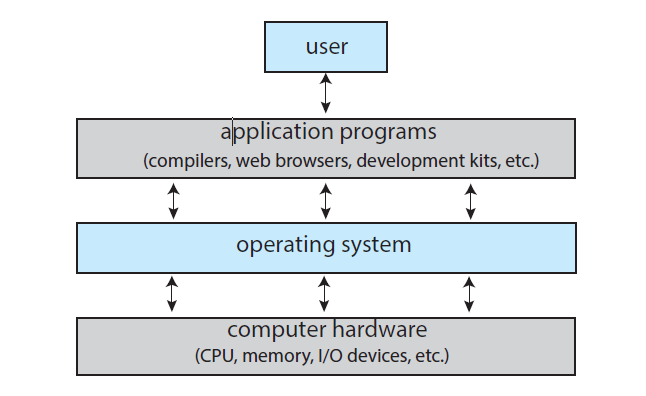

# Cornell Notes

## Topic: What Operating Systems Do

## Date: 11/05/2026

---

### Cue Column (Questions, Keywords, or Prompts)

- First question or keyword
- Second question or keyword
- Third question or keyword

---

### Notes Section (Main Notes)

- By first looking at the operating system's role in the overall computer system. A computer system can be divided roughly into for components:
  - Hardware
  - Operating System
  - Application Programs
  - Users
- The **hardware** - the central processing unit (CPU), the memory, and the input/output (I/O) devices - provides the basic computing resources for the system.
- The **application programs** - such as word processors, spreadsheets, compilers, and web browsers - define the ways in which these resources are used to solve the computing problems of the users.
- The **operating system** controls the hardware and coordinates its use among the various application programs for the various users.
- A computer system is also viewed to consist of hardware, software, and data.
- The operating system provides the means for proper use of theses resources in the operation of the computer system.

#### User View
- The goal is to maximize the work (or play) that the
user is performing. In this case, the operating system is designed mostly for **ease of use**, with some attention paid to performance and security and none paid to **resource utilization** - how various hardware and software resources are shared.

- Some computers have little or no user view. For example, embedded computers in home devices and automobiles may have numeric keypads and may turn indicator lights on or off to show status, but they and their operating systems and applications are designed primarily to run without user intervention.

#### System View
- From the computer's point of view, the operating system is the program most intimately involved with the hardware.
- In this context, we can view an operating system as a **resource allocator**.
- A computer system has many resources that may be required to solve a problem: the CPU, memory, I/O devices, and so on. 
- The operating system is responsible for solving the numerous and possibly conflicting requests for resources, the OS must decide how to allocate them to specific programs and users so that it can operate the computer system efficiently and fairly.
- An operating system is also a **control program**. It manages the execution of user programs to prevent errors and improper use of the computer. For example, if a user program tries to access memory that has not been allocated to it, the operating system should prevent this from happening and notify the user of the error.
#### Defining an Operating System
- A more common definition, and the one that we usually follow, is that the operating system is the one program running at all times on the computer - usually called the **kernel**.
- Along with the **kernel**, there are two other types of programs:
  - **System programs**: which are associated with the operating system but are not necessarily part of the kernel.
  - **Application programs**: which include all programs not associated with the operation of the system.
- The matter of what constitutes an operating system is further complicated by the fact that some systems do not have a clear distinction between the operating system and application programs. For example, in some embedded systems, the application program may be part of the kernel, and there may be no clear distinction between the two.
- Today, we can look at operating system for mobile devices. Mobile operating systems often include not only a core kernel but also **middleware** - a set of software frameworks that provide additional services to application programs beyond those provided by the kernel. For example, a mobile operating system may include middleware for handling network communication, multimedia processing, and user interface management.

---

### Summary Section (Summary of Notes)

#### Why study operating systems?
- As almost all code runs on top of an operating system, knowledge of how operating systems work is crucial to proper, efficient, effective, and secure programming.
- Understanding the fundamentals of operating systems, how they drive computer hardware, and what they provide to applications is not only essential to those who program them but also highly useful to those who write programs on them and use them.
- The operating system includes the always-running kernel, middleware frameworks that ease application development and provide features, and system programs that aid in managing the system while it is running.
- Most of this text is concerned with the kernel of general-purpose operating systems, but other components are discussed as needed to fully explain operating system design and operation.