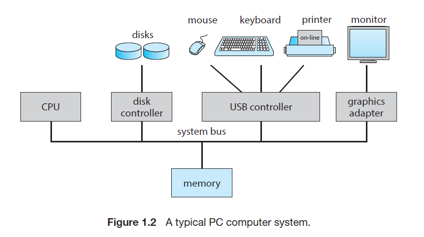
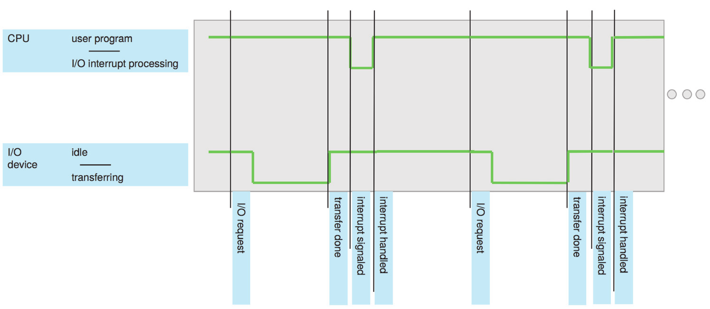

# Cornell Notes

## Topic: Computer-System Organization

## Date: 12/05/2026

---

### Cue Column (Questions, Keywords, or Prompts)

- First question or keyword
- Second question or keyword
- Third question or keyword

---

### Notes Section (Main Notes)

#### Computer-System Organization
- A modern general-purpose computer system consists of one or more CPUs and a number of device controllers connected through a common bus that provides access between components and shared memory.
- Each device controller is in charge of a specific type of device (for example, a disk drive, audio device, or graphics display). Depending on the controller, more than one device may be attached.
- For instance, one system USB port can connect to a USB hub, to which several devices can connect.
- A device controller maintains some local buffer storage and a set of special-purpose registers. The device controller is responsible for moving the data between the peripheral devices that it controls and its local buffer storage.
- Typically, operating systems have a **device driver** for each device controller. This device driver understands the device controller and provides the rest of the operating system with a uniform interface to the device.
- The CPU and the device controllers can execute parallel, competing for memory cycles. To ensure orderly access to the shared memory, a memory controller synchronizes access to the memory.
- There are three key aspects of the systems:
  - **Interrupts**: Alert the CPU to events that require attention.
  - **Storage structure**: The organization of memory and storage devices.
  - **I/O structure**: The organization of input/output devices and their controllers.

##### Interrupts
- Consider a typical computer operation: a program performing I/O.
  - To start an I/O operation, the device driver loads the appropriate registers in the device controller and tells it to start the operation.
  - The device controller examines the contents of these registers to determine what action to take (read the characters from the keyboard, for example).
  - The controller starts the transfer dof data from the device to its local buffer. Once the transfer is complete, the device controller informs the device driver that it has finished its operation.
  - Then, the driver can give control to other parts of the operating system.
  - For other operations, the device driver returns status information such as "write completed successfully: or "device busy".
- But how does the controller inform the device driver that it has finished its operation? This is accomplished via an **interrupt**.

###### Overview
- Hardware may trigger an interrupt at any time by sending a signal to the CPU, usually by the way of the system bus. Interrupts are used for many other purposes as well and are a key part of how operating systems and hardware interact.
- When the CPU is interrupted, it stops what it is doing and immediately transfers execution to a fixed location. The fixed location usually contains the starting address where the service routine for the interrupt is located.
- The **interrupt service routine** (ISR) executes; on completion, the CPU resumes the interrupted computation.

- Interrupts are an important part of a computer architecture. Each computer design has its own interrupt mechanism, but several functions are common.
- The interrupt must transfer control to the appropriate interrupt service routine.The straightforward method for managing this transfer would be to invoke a generic routine to examine the interrupt information.
- The routine would call the interrupt-specific handler. However, interrupts must be handled quickly, as they can occur at any time. Therefore, the CPU must be able to determine the appropriate handler directly from the interrupt information.
- A table of pointers to interrupt routines can be used instead to provide the necessary speed so the interrupt routine can be called via the table, with no intermediate needed.
- **Table of pointers** is stored in the low memory (the first hundred or so locations) and is called the **interrupt vector**, of addresses is then indexed by a unique number, given with the interrupt request, to provide the address of the interrupt service routine for the interrupting device.
  - Operating systems as different as Windows and UNIX dispatch interrupts in this manner.
- The interrupt architecture must also save the state information of whatever was interrupted, so that it can restore this information after servicing the interrupt. If the interrupt routine needs to modify the processor state
  - For instance, by modifying register values—it must explicitly save the current state and then restore that state before returning. 
  - After the interrupt is serviced, the saved return address is loaded into the program counter, and the interrupted computation resumes as though the interrupt had not occurred.
---

### Summary Section (Summary of Notes)

Brief summary of key ideas and takeaways