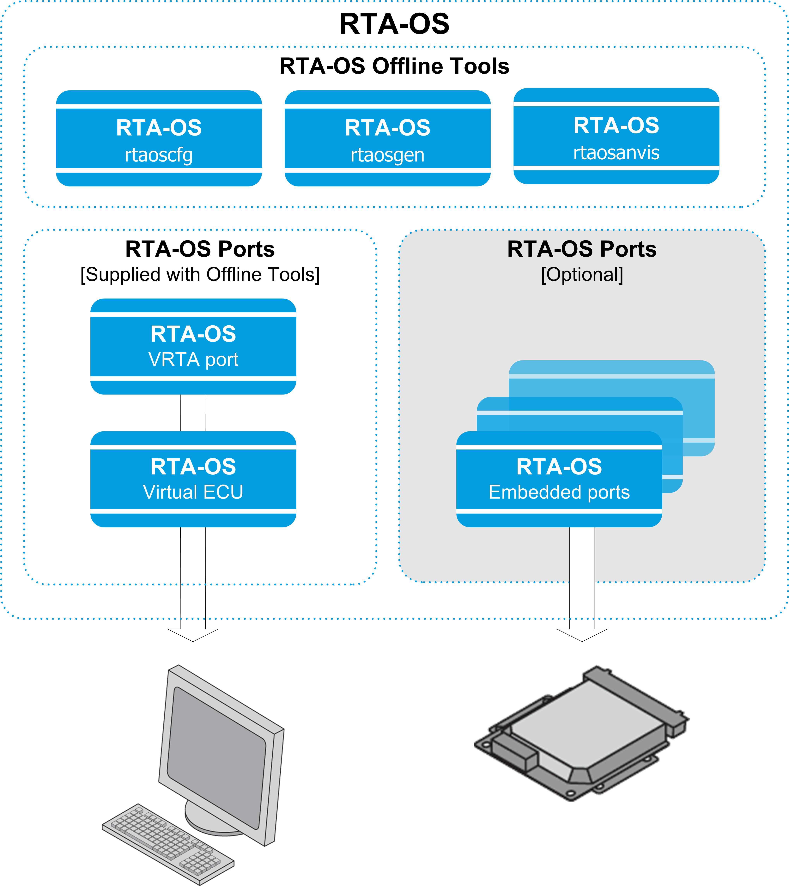

# Cornell Notes

## Topic: Introduction

## Date: 16/05/2026

---

### Cue Column (Questions, Keywords, or Prompts)

- What is RTA-OS?
- What are the purposes of designing the RTA-OS kernel?
- What is ASIL D?
- What is the OSEK/VDX OS Standard?
- What is ANSI C and MISRA-C 2012 compliance?

---

### Notes Section (Main Notes)

#### Introduction to RTAOS
- RTA-OS is a statically configurable, preemptive, real-time operating system (RTOS) for use in high-performance, resource-constrained applications. RTA-OS is a full implementation of the open-standard AUTOSAR 3.x, AUTOSAR 4.0 (including multicore), AUTOSAR 4.1, AUTOSAR 4.2, AUTOSAR 4.3, AUTOSAR 4.4, AUTOSAR 4.5 (R19-11), AUTOSAR 4.6 (R20-11), AUTOSAR 4.7 (R21-11) and AUTOSAR 4.8 (R22-11) OS specifications and is also fully compliant to Version 2.2.3 of the OSEK/VDX OS Standard. OSEK is now standardized in ISO 17356.
- The RTA-OS tools are suitable for use in systems that conform to ASIL D.

#### Purpose to design the RTA-OS kernel
- **High performance:**
  - The kernel is very small and very fast. The memory footprint of the kernel and its run-time performance are class leading, making RTA-OS particularly suitable for systems manufactured in large quantities, where it is necessary to meet very tight constraints on hardware costs and where any final product must function correctly.
  - RTA-OS provides a number of unique optimizations that contribute to reductions in unit cost of systems. The kernel uses a single-stack architecture for all types of task. This provides significant RAM savings over a traditional stackper- task model. Furthermore, careful application design can exploit the singlestack architecture to offer significant stack RAM savings. The offline tools analyze your OS configuration and use this information to build the smallest and fastest kernel possible. 
  - The offline tools analyze your OS configuration and use this information to build the smallest and fastest kernel possible. Code that you are not going to use is excluded from the kernel to avoid wasting execution time and memory space.
- **Real-time**:
  - Conventional RTOS designs normally have unpredictable overheads, usually dependent upon the number of tasks and the state of the system at each point in time.
    - This makes it difficult to guarantee real-time predictability no matter how ‘fast’ the kernel is. 
    - In RTA-OS the kernel is fast and all runtime overheads - such as switching to and from tasks, handling interrupts and waking up tasks - have low worst-case bounds and little or no variability of execution times.
  - In many cases, context switching happens in constant execution time, meaning that RTA-OS can be used for the development of hard real-time systems where responses must be made within specific timing deadlines.
  - Meeting hard deadlines involves calculating the worst-case response time of each task and Interrupt Service Routine (ISR) and ensuring that everything runs on time, every time.
  - **RTA-OS is a real RTOS** because it meets the assumptions of fixed priority schedulability analysis.
- **Portable:**
  - RTA-OS is available for a wide variety of microcontroller/compiler combinations (or port). All ports share the same common RTA-OS code, which comprises about 97% of the total kernel functionality. 
  - The kernel is written in **ANSI C** that is MISRA-C 2012 compliant. A MISRA report for RTA-OS can be generated by the offline tools.
  - As far as is possible, RTA-OS does not impose on hardware - generally, there is no need to hand over control of hardware, such as the cache, watchdog timers and I/O ports. 
    - As a result of this, hardware can be used freely by your code, allowing legacy software to be integrated into the system.

#### RTA-OS Architecture
- The RTA-OS product architecture is shown in below figure and consists of:

- **RTAOSCfg** is a graphical configuration tool that reads and writes configurations in the AUTOSAR XML configuration language.
- **RTAOSGen** is a command-line tool for generating a RTA-OS kernel library from your input configuration.
- **Port plug-ins**, one for each target/compiler combination for which you use RTAOS. 
  - You can install multiple ports at the same time and switch between them as desired. 
  - You can also install multiple versions of the same port concurrently, allowing your to easily manage projects that use legacy compilers and/or microcontrollers.
- **VRTA** is a special port plug-in which provides the functionality of RTA-OS on a standard Windows PC. 
  - This allows you to design and test application behavior without needing real target hardware1. 
  - VRTA comes with a development kit that allows you to build Virtual ECUs that can simulate interrupts, I/O etc.
  - VRTA can be used to emulate multicore AUTOSAR applications.
- **VRTA-ux** is a similar port plug-in that can be used to create VECUs that run under Linux.
Linux.

---

### Summary Section (Summary of Notes)

RTA-OS is a real RTOS that is designed to be high performance, real-time and portable. It is a full implementation of the open-standard AUTOSAR OS specifications and is compliant to the OSEK/VDX OS Standard. The kernel is written in ANSI C that is MISRA-C 2012 compliant, making it suitable for use in systems that conform to ASIL D.