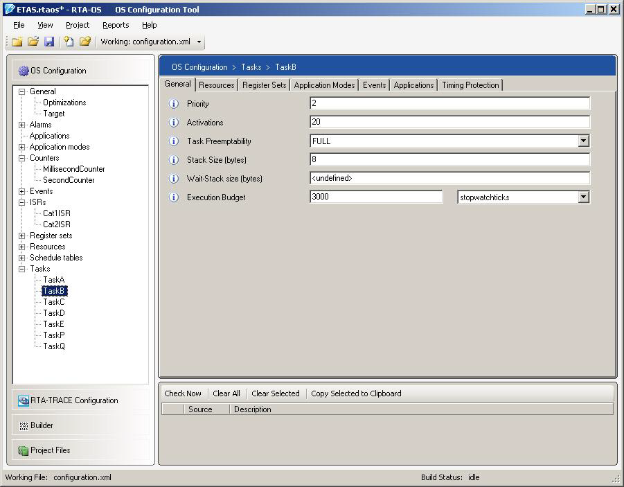

# Cornell Notes

## Topic: Configuration

## Date: 16/05/2026

---

### Cue Column (Questions, Keywords, or Prompts)

- First question or keyword
- Second question or keyword
- Third question or keyword

---

### Notes Section (Main Notes)

#### Configuration
- RTA-OS is statically configured, which means that every task and interrupt you need must be declared at configuration time, together with any critical sections, synchronization points, counters etc.
- All configuration is held in XML files conforming to the AUTOSAR standard. The XML is not particularly easy to read, so the use of a tool is recommended. RTA-OS includes **RTAOSCfg**, a graphical configuration editor for configuring your RTA-OS application.
- **RTAOSCfg** accepts any AUTOSAR XML file as input and allows you to edit the OS-specific parts of a configuration. If the input file contains both OS and non- OS specific configuration then only the OS configuration will be modified.

##### OS Configuration
- Each new **OS configuration** requires you to specify the administrative parts of an AUTOSAR XML configuration. 
- This is required because parts of the OS configuration need to reference other parts (for example, tasks need to reference which resources they use) and these references are formed as an absolute path to an item in the AUTOSAR XML configuration. The items required are:
  - **AR-PACKAGE Name**: defines the name of the AUTOSAR package. All AUTOSAR configuration items live in an AR-PACKAGE and a system may contain multiple packages. The OS configuration for a single ECU must live in a single package - it is not possible to split an OS configuration over multiple packages.
  - **ECU Configuration Name**: defines the name of the `ECU-CONFIGURATION` of which this OS configuration will be a part. An `ECU-CONFIGURATION` contains all the configuration elements for all of the basic software for one ECU.
  - **OS Configuration Name**: defines the name of the OS configuration. This is the name that will be used to refer to the OS.
  - **Release**: defines which variant of AUTOSAR OS should be used. Since there are some differences between AUTOSAR releases, this may need to be set to conform with other configuration files.
- Below image is an example of the **RTAOSCfg** tool where to configure the OS Configuration

---

### Summary Section (Summary of Notes)

Brief summary of key ideas and takeaways