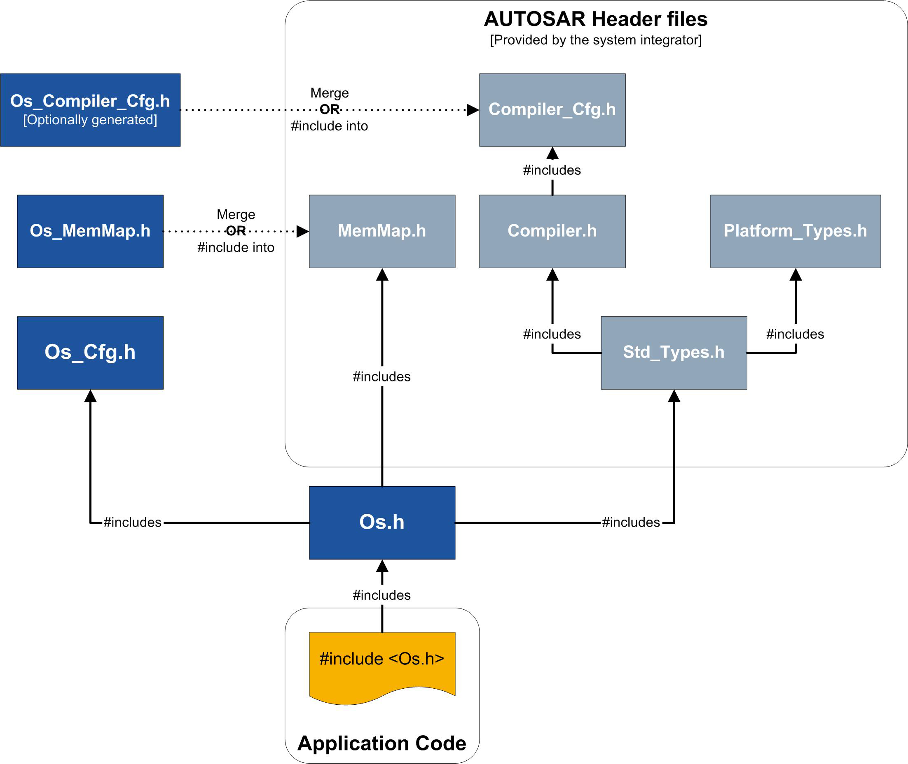

# Cornell Notes

## Topic: Understand AUTOSAR dependencies

## Date: 16/05/2026

---

### Cue Column (Questions, Keywords, or Prompts)

- First question or keyword
- Second question or keyword
- Third question or keyword

---

### Notes Section (Main Notes)

#### AUTOSAR Headers file hierachy
- The OS configuration is used to generate a set of header files that define the OS API and the configuration of the OS. The generated header files are organized into a hierarchy of directories that reflect the structure of the AUTOSAR configuration.



#### Understanding AUTOSAR Dependencies

- RTA-OS is an AUTOSAR basic software module2 and as such it must conform to the AUTOSAR basic software module build concept.
- In AUTOSAR, all basic software modules provide a single include file called `<BSW Short name>.h`. For the OS this is `Os.h`. 
- Each of these header files has dependencies on other AUTOSAR include files. The AUTOSAR include hierarchy is shown in the above figure.

#### `Std_Types.h`
- Provides all the portable (i.e. target hardware invariant) type definitions for AUTOSAR. `Std_Types.h` includes a further two AUTOSAR header files:
  - `Platform_Types.h`: defines the AUTOSAR standard types (uint8, uint16, boolean, float32 etc.) for the target hardware.
  - `Compiler.h`:
    - Defines a set of macros that are used internally by basic software modules to mark functions, data and pointers according to the mode by which they can be addressed. It is not used in AUTOSAR versions 4.7.0 onwards
    - The memory and pointer classes used by `Compiler.h` are defined by each basic software module in a file a called `Compiler_Cfg.h`. A minimum set of names are defined by the AUTOSAR standard and each name is prefix with the name of the basic software module. For the OS, all section name macros start with `OS_`.
    - The system integrator must merge the `Compiler_Cfg.h` files for all basic software modules to create a ‘master’ `Compiler_Cfg.h` before the system is compiled. In RTA-OS, the OS module’s `Compiler_Cfg.h` is called `Os_Compiler_Cfg.h` and it contains the complete list of the names used by RTA-OS. The file can be easily `#included` into the system-wide `Compiler_Cfg.h`. It is not used in AUTOSAR versions 4.7.0 onwards.
    - You should take particular note of the RTA-OS sections called `OS_CALLOUT_CODE` and OS_APPL_CODE.
    - `OS_CALLOUT_CODE` is used to refer to Hooks and Callbacks that cause the OS to call your code. 
    - Code can be placed in this section using the directive `FUNC(<typename>, OS_CALLOUT_CODE)`. For example the following code shows how to place the `ErrorHook()` into `OS_CALLOUT_CODE`
    - OS_APPL_CODE is used to refer to Tasks, ISRs and Trusted Functions. For Tasks and ISRs this mapping is implicit. For Trusted Functions you can place code in this section using the directive `FUNC(<typename>, OS_APPL_CODE)`.
      ```c
      FUNC(void , OS_CALLOUT_CODE) ErrorHook(StatusType Error){
      /* Handle error */
      }
      ```
#### `MemMap.h`
- (Or `<module>_MemMap.h` for AUTOSAR version 4.1 onwards) defines how data and code is mapped to memory sections and uses the compiler’s primitives for placing code and data into different types of memory section according to the following process:
  - Each basic software module defines a series of section names using macros in `Compiler_Cfg.h`
  - The vendor of the basic software module uses these macros to place code in the virtual sections during implementation, for example:
    ```c
    #define OS_START_SEC_CODE
    #include "MemMap.h"
    /* Some OS code here */
    #define OS_STOP_SEC_CODE
    #include "MemMap.h"
    ```
  - For AUTOSAR versions 4.0 and earlier the system integrator develops a MemMap.h file that maps the basic software’s virtual section names on to system-wide section names and from there on to primitives of the compiler for section placement, for example:
    ```c
    /* Map OS code into the section containing all BSW code
    */
    #ifdef OS_START_SEC_CODE
    #undef OS_START_SEC_CODE
    #define START_SECTION_BSW_CODE
    #endif
    ...
    /* Name the system section with a compiler primitive */
    #ifdef START_SECTION_BSW_CODE
    #pragma section code "bsw_code_section"
    #endif
    ```

- In RTA-OS it is possible to specify the name of the code sections to use for `Hooks`, `OsApplication Hooks`, `Tasks` and `ISRs`. This is done using the AUTOSAR `OSMemoryMappingCodeLocationRef` element in the ARXML configuration (See more details in EbOs packages)
  - This was added in AUTOSAR 4.3.1, but RTA-OS allows it to be used in any AUTOSAR version
  - The `OSMemoryMappingCodeLocationRef` is shown in RTAOSCfg as ’Code Location’.
  - This entry should contain an AUTOSAR path to a `SwAddrMethod`. RTA-OS uses the last part of the path to construct the section name. 
    - So, for example, if a Task is assigned a Code Location of /a/b/c/XYZ then the declaration for the Task’s code will be surrounded by the MemMap defines `OS_START_SEC_XYZ` and `OS_STOP_SEC_XYZ`. 
    - Note that RTA-OS does not actually check that the value in the Code Location exists - it simply takes the last part of the path and uses that to construct the section name. You can, in fact, skip entering a full path and simply use the desired section name `XYZ`.
- AUTOSAR 4.7.0 adds `OSMemoryMappingCodeLocationRef` to OS-Applications and `TrustedFunctions`. For an OS-Application the value is taken to be the default location for Hooks, TrustedFunctions, Tasks and ISRs that belong to it. For a TrustedFunction the value is used to override its default location. RTA-OS allows these to be used in any AUTOSAR version.
- The names given to sections can include modifiers that affect how and where they get linked. 
  - Sections that include `_CODE` are expected to contain executable content and would typically get located in Flash Memory. Sections that include `_CLEARED` or `_POWER_ON_INIT` represent data sections that are expected to be initialized during the startup code that runs when the chip resets.
  - Sections that include `_NO_INIT` or `_NOINIT` represent data that should not be initialized by the startup code. This can be used to handle data that should persist over resets. RTA-OS uses it to indicate data that will be initialized by the OS itself so the startup code can run faster by not bothering to initialize it.
- As with `Compiler_Cfg.h`, each basic software module must also provide a module-specific version of `MemMap.h`. In RTA-OS, the module-specific version of `MemMap.h` is called Os_`MemMap.h`. For AUTOSAR versions 4.0 and earlier the `Os_MemMap.h` file can be either merged or #included into a ‘master’ `MemMap.h` **before the system is compiled**


---

### Summary Section (Summary of Notes)

Brief summary of key ideas and takeaways