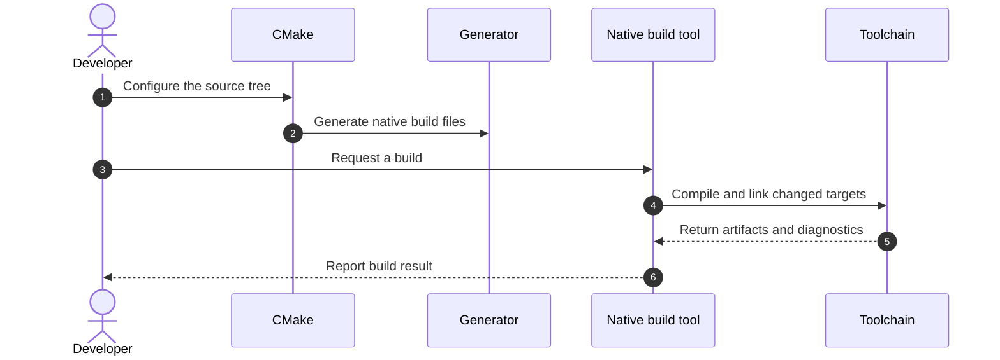

# Build-System Orientation

## Purpose

Build systems turn source files and declared dependencies into requested
artifacts, while avoiding work whose inputs have not changed. They also record
the repeatable steps needed to compile, link, test, install, or package a
project.

This note establishes the vocabulary used by the Make and CMake notes. It is
an orientation, not a tool-specific tutorial.

## Intended Audience

Developers who can invoke a compiler but have not yet worked with a build
description or a generated build directory.

## Core Vocabulary

- **Source tree:** the version-controlled project inputs, such as source code,
  headers, and build-description files.
- **Build tree (or binary tree):** the generated configuration, intermediate
  files, and output artifacts for one build configuration.
- **Target:** a named output or action in a build graph. Depending on the tool,
  it can represent a file, executable, library, or custom action.
- **Dependency:** an input that must be available or up to date before another
  target can be produced.
- **Recipe / command:** the command sequence that performs a build action.
- **Generator:** the CMake component that writes build files for a native build
  tool or IDE.

## Make and CMake Have Different Roles

GNU Make is a build tool. Its makefile provides target-to-prerequisite
relationships and recipes; Make uses the dependency information and file
timestamps to decide what must be updated.

CMake is a buildsystem generator. A project describes its build in
`CMakeLists.txt`; CMake configures that description and writes files for a
selected generator. The generated backend may be Make, Ninja, an IDE, or
another supported native build tool. CMake therefore does not replace the
compiler, linker, or generated backend—it coordinates their use.

## A Build Lifecycle

1. **Describe:** declare source files, targets, dependencies, and required
   build settings.
2. **Configure:** choose a toolchain, generator, and configuration values.
3. **Generate:** when using CMake, produce native build files in a build tree.
4. **Build:** let the native tool compile and link only the necessary work.
5. **Verify or package:** run tests, install, package, or inspect artifacts as
   required by the project.

This is the CMake path. In a direct Make workflow, the developer asks Make to
build and Make invokes the toolchain without a preceding CMake generation step.

For an embedded target, configuration may additionally select a cross compiler,
board, CPU architecture, linker script, SDK, or flashing workflow. Those are
project-specific inputs; this unit focuses on the portable build concepts that
precede them.

## Choosing the Right Starting Point

- Learn **Make** first when you need to understand an existing Makefile,
  maintain a small direct build, or reason about rules and file dependencies.
- Learn **CMake** first when a project must support more than one native build
  backend, IDE, platform, or reusable library interface.
- Learn both when CMake generates Unix Makefiles: CMake describes the project,
  while Make executes the generated rules.

## Further Reading

- [GNU Make overview](https://www.gnu.org/software/make/manual/make.html)
- [CMake command-line manual](https://cmake.org/cmake/help/latest/manual/cmake.1.html)
- [CMake buildsystem reference](https://cmake.org/cmake/help/latest/manual/cmake-buildsystem.7.html)
