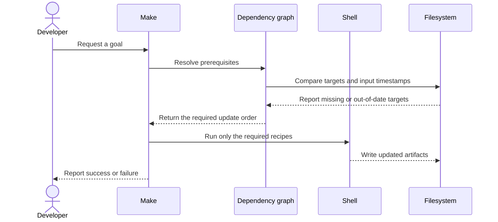

# GNU Make Fundamentals

## Purpose

GNU Make keeps a collection of derived files up to date. A makefile expresses
which inputs a target depends on and which recipe can update that target. Make
uses this dependency graph and file modification times to determine the work it
needs to run.

## Intended Audience

Developers reading or maintaining a small GNU Makefile, especially one that
directly invokes a compiler, linker, formatter, or test command.

## Rule Anatomy

The conceptual shape of a rule is:

```make
target: prerequisites
        recipe
```

- A **target** is usually a generated file, but can name an action.
- **Prerequisites** are files or targets that must be considered before the
  target is updated.
- A **recipe** is the shell command sequence used to update the target. GNU
  Make requires a recipe line to begin with its recipe prefix (a tab by
  default); ordinary spaces are not equivalent.

The first suitable target is normally the default goal. Make also accepts an
explicit goal on the command line, so a named maintenance task need not run as
part of every default build.

## Incremental Builds and the Dependency Graph

Make recursively considers a target's prerequisites before its own recipe. If a
file target is missing or older than a prerequisite, its recipe needs to run.
Correct dependency declarations are therefore more important than merely
having a command that succeeds once: a missing header, generated source, or
linker script dependency can cause a stale artifact to be reused.

Prefer dependencies that reflect real inputs. Avoid using an always-changing
file as a prerequisite unless rebuilding every time is the deliberate goal.



The diagram also explains a common debugging rule: when Make skips necessary
work, inspect the declared prerequisites before changing the recipe.

## Variables

Variables reduce repeated text and make a Makefile easier to adjust. A variable
reference uses `$(name)` or `${name}`. GNU Make supports several assignment
styles; the important beginner distinction is whether a value is expanded when
assigned or when it is used. When a variable's contents are computed from other
variables, choose that timing intentionally and keep names descriptive.

Command-line variable assignments can override ordinary makefile settings. That
is useful for a documented build parameter, but it should not hide required
configuration or silently change compiler/toolchain selection.

## Phony Targets

A target that names an action rather than a file must be declared phony, for
example with `.PHONY`. Typical action names include `clean`, `all`, and
`install`. Without that declaration, a real file with the same name can make
Make believe the action is already up to date.

Treat cleanup actions with particular care: verify what a command removes and
avoid broad or path-dependent deletion logic.

## Useful Invocations

- `make` builds the default goal.
- `make <goal>` requests a named goal.
- `make -n <goal>` prints the recipes that would run without executing them.
- `make -j <count>` permits independent prerequisites to build in parallel.

Parallel execution exposes incomplete dependencies: if a Makefile only works
serially, the graph is likely missing a required ordering relationship.

## What to Read Next

Once rules and file dependencies are clear, move to CMake to learn how a
project can describe targets independently of the native build backend.

## Primary References

- [GNU Make: Introduction to Makefiles](https://www.gnu.org/software/make/manual/html_node/Introduction.html)
- [GNU Make: Rules](https://www.gnu.org/software/make/manual/html_node/Rules.html)
- [GNU Make: Variables](https://www.gnu.org/software/make/manual/html_node/Using-Variables.html)
- [GNU Make: Phony Targets](https://www.gnu.org/software/make/manual/html_node/Phony-Targets.html)
- [GNU Make: Running Make](https://www.gnu.org/software/make/manual/html_node/Running.html)
