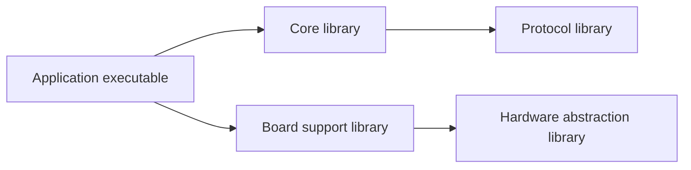

# CMake Fundamentals

## Purpose

CMake lets a project describe executables, libraries, dependencies, and build
requirements at a high level. CMake then configures that description and
generates native build files for the selected environment.

## Intended Audience

Developers who need to read or author a small `CMakeLists.txt`, or who need to
understand why CMake projects have both a source directory and a generated
build directory.

## Project Description and Generated Buildsystem

A CMake project starts from a top-level `CMakeLists.txt`. During configuration,
CMake evaluates the project's CMake language, discovers or receives required
settings, and prepares a buildsystem. During generation, it writes files for a
chosen generator. The resulting native tool then performs compilation and
linking.

Keep generated files outside the source tree whenever practical. A separate
build directory makes it possible to maintain independent debug/release,
toolchain, board, or generator configurations without mixing their artifacts
with version-controlled sources.

## Targets Are the Central Abstraction

A CMake buildsystem is organised as high-level logical targets. A target may
represent an executable, a library, or a custom build action. Dependencies
between targets determine build order and regeneration when inputs change.

Each box is a logical target rather than a compiler command. CMake generates
the backend-specific rules needed to build this dependency graph for the chosen
toolchain and generator.

The key target-definition commands are `add_executable()` and `add_library()`.
Target-oriented commands then attach sources, include directories, compile
definitions, compile options, and link dependencies to the target that needs
them. This keeps requirements near the component that owns them instead of
depending on directory-wide state.

## Usage Requirements

CMake distinguishes requirements needed to build a target from requirements
that its consumers need. Target commands use three scope keywords:

- `PRIVATE`: applies only while building the declaring target.
- `INTERFACE`: applies only to consumers of that target.
- `PUBLIC`: applies both to the target and to its consumers.

For example, a library dependency needed solely by implementation source files
is normally `PRIVATE`; a dependency exposed through the library's public
headers is normally `PUBLIC`; and a header-only interface dependency is often
`INTERFACE`. These terms describe genuine compile/link requirements, not a way
to pass arbitrary preferred flags to downstream projects.

## Generators and Configurations

The generator determines the kind of native build files CMake writes. Examples
include Ninja files, Unix Makefiles, and IDE project files. A CMake project
should describe desired results without assuming one backend's file format or
command syntax.

Generator behaviour also affects how build configurations are selected. Some
generators build one configuration per build tree, while multi-configuration
generators select a configuration at build time. Consult the generator's
documentation before assuming that a `Debug` or `Release` choice is stored or
selected the same way everywhere.

## Practical Reading Checklist

When opening a CMake project, identify:

1. the declared project and minimum CMake version;
2. the executable and library targets it defines;
3. each target's sources and direct dependencies;
4. the `PRIVATE`, `PUBLIC`, and `INTERFACE` requirements; and
5. the variables, options, toolchain file, or presets that configure it.

## Primary References

- [CMake command-line manual](https://cmake.org/cmake/help/latest/manual/cmake.1.html)
- [CMake buildsystem reference](https://cmake.org/cmake/help/latest/manual/cmake-buildsystem.7.html)
- [CMake tutorial](https://cmake.org/cmake/help/latest/guide/tutorial/index.html)
- [CMake generators](https://cmake.org/cmake/help/latest/manual/cmake-generators.7.html)
