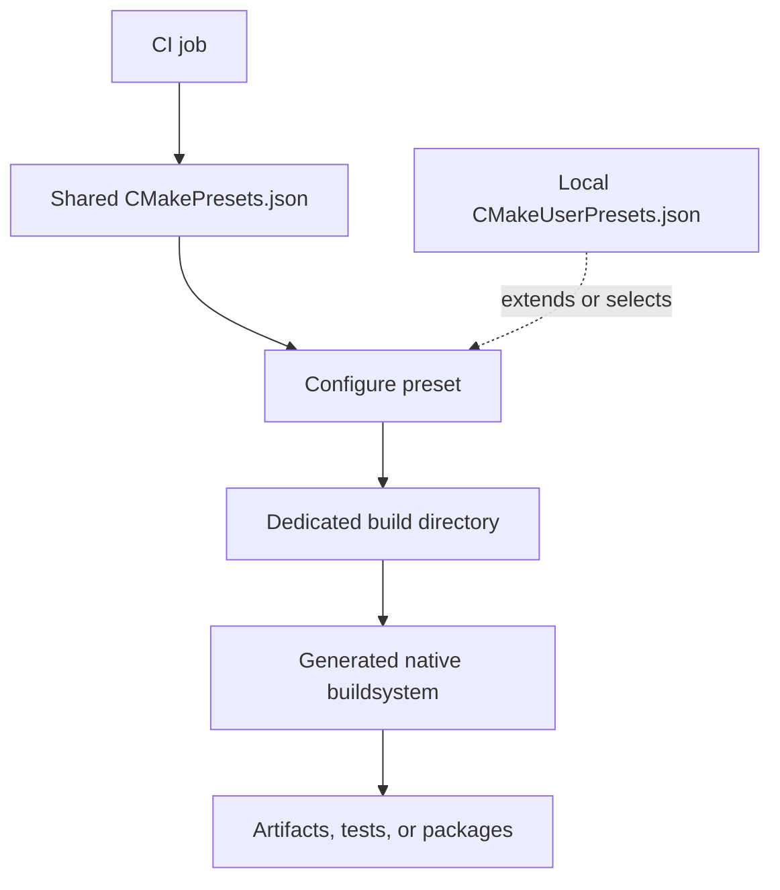

# CMake Workflows and Presets

## Purpose

A build is repeatable only when its configuration is repeatable. This note
explains how CMake build directories and presets can capture team-wide choices
without committing a developer's private environment.

## Intended Audience

Developers who can navigate a basic CMake project and now need predictable
local, CI, cross-compilation, or multi-configuration workflows.

## Keep Configurations Separate

Each build directory represents a configured build. Do not reuse one directory
for unrelated generators, toolchains, boards, or substantially different cache
settings. When a configuration becomes unclear, create a fresh build directory
instead of trying to infer which cached values are still valid.

This separation is especially useful in embedded work, where host and target
builds may use different compilers, SDK paths, processor settings, linker
scripts, or board definitions.

## Presets

`CMakePresets.json` stores project-shared configuration presets. A configure
preset can name a generator and build directory and can supply cache variables,
environment variables, and other configuration options. Build, test, package,
and workflow presets can build on that shared configuration.

`CMakeUserPresets.json` is intended for user-local configuration. Keep
machine-specific paths, private credentials, locally installed tool locations,
and personal experimental presets there rather than in the shared file. The
user preset file is not normally committed to version control.

The shared file defines reviewed project intent; the user file supplies local
adjustments without forcing them onto every developer or CI runner.

## A Team Workflow

1. Define a small set of named, shared configurations for the platforms and
   build modes the project supports.
2. Give each shared configuration a predictable build directory.
3. Put only portable, reviewable project settings in shared presets.
4. Let individual developers extend those settings in user presets when their
   machines differ.
5. Make CI invoke the same shared preset names so local and CI intent remains
   aligned.

The exact preset schema and the minimum CMake version supporting a field matter.
Check the official preset reference before adding a newer field to a project
with an older supported CMake version.

## Diagnostic Checklist

When a CMake configuration or build behaves unexpectedly, first record:

- CMake version and selected generator;
- source and build directory paths;
- selected preset and any command-line overrides;
- compiler/toolchain identity and target platform; and
- the first relevant configure or build error.

Then determine whether the problem occurred during configuration, generation,
or the native build. This prevents a compiler or linker failure from being
mistaken for a CMake-language problem.

## Deferred Hands-On Work

This note intentionally does not supply a runnable preset or project. Future
examples can demonstrate a shared `CMakePresets.json`, a local user preset, a
Ninja/Unix Makefiles comparison, and a CI build/test invocation in the
`Examples/` submodule.

## Primary References

- [CMake user-interaction guide](https://cmake.org/cmake/help/latest/guide/user-interaction/index.html)
- [CMake Presets reference](https://cmake.org/cmake/help/latest/manual/cmake-presets.7.html)
- [CMake buildsystem reference](https://cmake.org/cmake/help/latest/manual/cmake-buildsystem.7.html)
