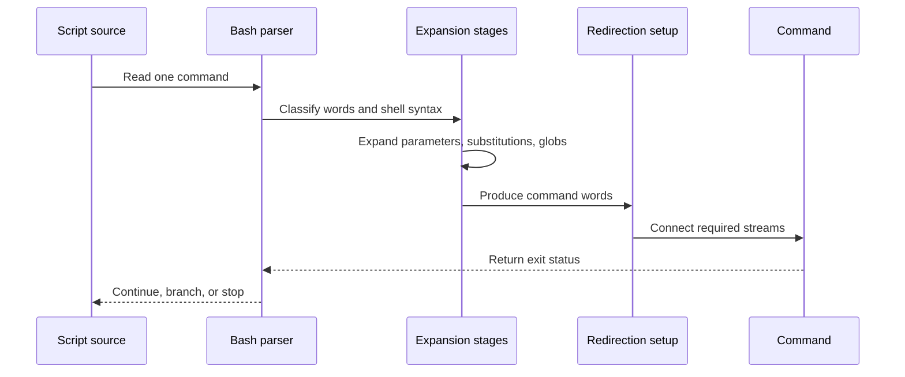

# Shell Execution and Quoting

## The shell is a language processor

Before starting a program, Bash parses shell syntax and expands words. A line is not simply split at spaces and handed to a command. This distinction explains many surprising results in scripts.

A simple command generally consists of optional assignments and redirections, followed by a command name and its arguments. Bash expands the command words, performs redirections, and then runs a builtin, function, external program, or shell construct as appropriate.

## From source line to result

The expansion stage occurs before the command receives its arguments. Quoting controls whether expanded data is later split into words or treated as filename patterns.

## Exit status is the control signal

Commands report an integer exit status. By convention, zero means success and a nonzero value means a failure or a meaningful alternative result. Shell conditionals, `&&`, and `||` test this status; they do not consume a separate Boolean type.

Capture or test a status immediately when it matters. A subsequent command replaces the value exposed through the special parameter `$?`.

## Expansion order

Bash performs expansions in a defined order:

1. Brace expansion.
2. Tilde expansion.
3. Parameter and variable expansion, arithmetic expansion, and command substitution (left to right).
4. Word splitting.
5. Filename expansion (globbing).
6. Quote removal.

Only some stages can turn one word into multiple words. In particular, unquoted parameter expansion can be subject to word splitting and filename expansion. This is why data that represents one argument should normally remain quoted.

For the exact rules, read [Bash Shell Expansions](https://www.gnu.org/software/bash/manual/html_node/Shell-Expansions.html).

## Quoting model

| Form | Main effect | Typical use |
| --- | --- | --- |
| Unquoted | Expansions are active; later splitting and globbing may occur. | Shell syntax or deliberately generated patterns. |
| Single quotes | Treats all enclosed characters literally. | Fixed text. |
| Double quotes | Allows parameter, arithmetic, and command substitution while preserving most literal characters. | Data passed as one argument. |
| Backslash | Quotes one following character in the applicable context. | A small local escape. |

Double quotes are not an all-purpose escape mechanism: they change the behavior of special parameters, pattern matching, and command substitutions. Consult the [Quoting](https://www.gnu.org/software/bash/manual/html_node/Quoting.html) chapter when code depends on those details.

## Variables and the environment

A shell variable belongs to the current shell. Exporting a variable places it in the environment of subsequently started child processes; it does not make the variable global across unrelated processes. Conversely, a child process cannot modify its parent's environment.

Assignments placed before a command can form part of that command's execution environment. Treat this syntax as command-local unless the assignment occurs by itself in the current shell.

## Review questions

- Which parts of a command are syntax, and which parts are data?
- Could a value contain whitespace, wildcard characters, or a leading dash?
- Does each required value remain one argument after expansion?
- Is the relevant exit status checked before another command overwrites it?

Next: [Control flow and functions](02_Control-Flow-and-Functions.md).
