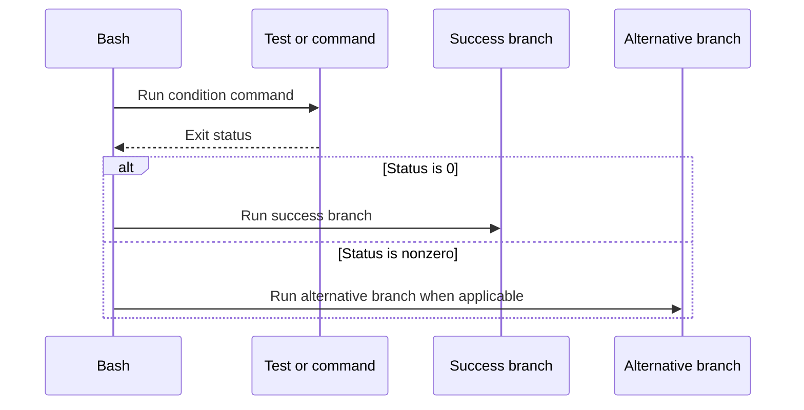

# Control Flow and Functions

## Conditions run commands

The command after `if`, `while`, `until`, `&&`, or `||` is evaluated by its exit status. A successful test returns zero; a failing test returns nonzero. This allows external commands, shell builtins, and compound commands to act as conditions.

Prefer Bash's `[[ ... ]]` for Bash scripts when testing strings, files, or patterns. It is shell syntax rather than an ordinary command and has different word-expansion rules from `[`/`test`. Use `[` only when its POSIX portability is required and account for its stricter argument-based syntax.

The [Bash conditional constructs reference](https://www.gnu.org/software/bash/manual/html_node/Conditional-Constructs.html) defines the exact operators and matching behavior.

## A condition is a command-status decision

The diagram describes the decision model, not a second Boolean value returned by the command. A nonzero status is not always an exceptional error; the surrounding script must define what it means.

## Selecting and repeating work

`if` chooses a branch from a command's status. `case` compares one value against patterns and is often clearer than a long chain of equality checks. `for`, `while`, and `until` repeat a command list, but they differ in how the next value or condition is obtained.

Choose the loop based on the data source:

- Use an argument or array loop when the input is already a list of values.
- Use a condition-controlled loop when repeated work continues until a command succeeds or fails.
- Treat filename generation as a separate concern; a glob is not a substitute for safely reading arbitrary file names.

`break` and `continue` alter the nearest enclosing loop unless supplied a valid loop-depth argument. Keep nested-loop control explicit so that readers can see which loop is affected.

## Functions

A Bash function groups commands under a name and executes in the current shell environment unless it is invoked in a subshell context. Function arguments are available through the positional parameters for that call. `return` supplies an exit status, not a general data value; shell output, variables, or files are separate data channels.

Variables are global by default in Bash functions. Mark function-internal state with `local` to avoid changing a caller's values accidentally. Do not assume that `local` is available in a POSIX `sh` script.

## Short-circuit lists

In a list joined with `&&`, the right-hand command runs only if the left-hand command succeeds. With `||`, it runs only if the left-hand command fails. These forms are concise for simple sequencing, but deeply chained lists conceal which failure was expected and which one should stop the script. Use an explicit conditional when error handling needs explanation or multiple steps.

## Function-design checklist

- State the function's inputs, output channel, and exit-status contract.
- Keep temporary names local to the function.
- Let the caller decide how to present errors unless the function owns the user interaction.
- Distinguish an expected nonzero result from an operational failure.
- Avoid changing the current directory or shell options without documenting their lifetime and effects.

Next: [Parameters, arrays, and text](03_Parameters-Arrays-and-Text.md).
