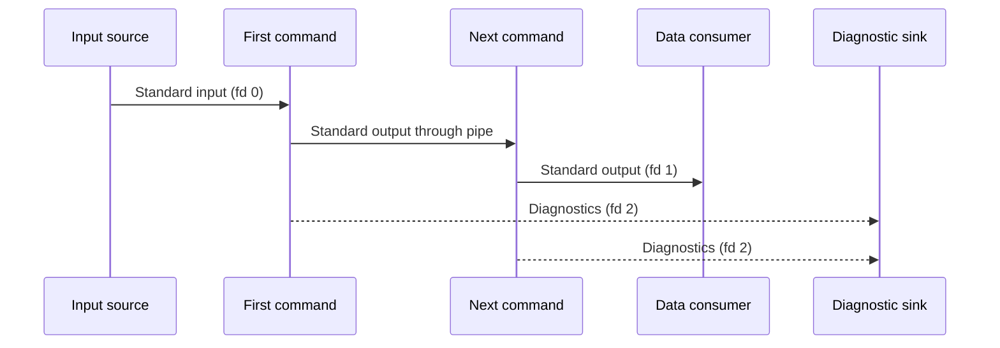

# Pipelines, Redirection, and Errors

## Standard streams

Processes conventionally receive input on standard input (file descriptor 0), write normal output to standard output (1), and write diagnostics to standard error (2). Keeping data and diagnostics separate makes scripts composable and lets callers decide what to display, capture, or discard.

Redirections are processed by the shell before the command runs. Their order can matter when more than one descriptor is redirected, because a descriptor can be duplicated from its current target. Use the [Bash Redirections reference](https://www.gnu.org/software/bash/manual/html_node/Redirections.html) for the precise semantics of output, append, input, here-documents, here-strings, and descriptor operations.

## Stream boundaries in a pipeline

The pipe connects only standard output of one component to standard input of the next. Diagnostics remain separate unless a redirection explicitly combines them.

## Pipelines

A pipeline connects the standard output of one command to the standard input of the next. By default, the pipeline's status is the status of its final command. With Bash's `pipefail` option enabled, a nonzero status in an earlier pipeline component can instead make the pipeline fail.

Pipeline components normally execute in separate process environments. Variable updates made inside one may therefore not be visible to the parent shell. Bash has options and contexts that affect this behavior, so treat a pipeline as an execution boundary unless the code deliberately relies on a documented Bash feature.

## Error handling needs a contract

`set -e` changes when Bash exits after failures, but it has context-dependent exceptions, especially around conditionals, command substitutions, and lists. It is not a complete error-handling policy. `set -u` and `pipefail` likewise have useful but consequential behavior.

Choose shell options per script and document the contract they support. For critical operations, check statuses explicitly, emit an actionable diagnostic to standard error, and stop or recover according to the script's stated behavior.

## Cleanup and signals

`trap` can run a command when the shell receives selected signals or when it exits. Use it to release resources that the script owns, such as temporary paths or locks. Cleanup must be safe if it runs after a partial failure, and it must not erase a path that was not created or validated by the script.

The [Bash Signals](https://www.gnu.org/software/bash/manual/html_node/Signals.html) and [Bourne Shell Builtins](https://www.gnu.org/software/bash/manual/html_node/Bourne-Shell-Builtins.html) references describe `trap` and signal handling.

## Review questions

- Which stream carries data, and which carries diagnostics?
- Could redirection order change the intended destination?
- Does a pipeline report failures from every stage that matters?
- Does any variable update rely on a subprocess staying in the current shell?
- Is cleanup idempotent and limited to validated resources?

Next: [Reliable and portable Bash](05_Reliable-and-Portable-Bash.md).
