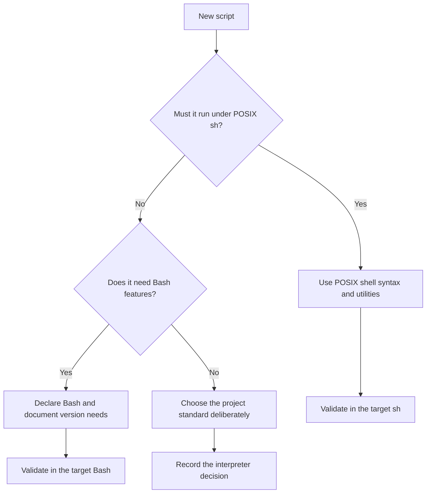

# Reliable and Portable Bash

## Start with an interpreter decision

Decide whether a script requires Bash or must run under POSIX `sh`. The shebang, the CI environment, and the deployed target must agree. Calling a Bash script through `sh` can disable or reject Bash-specific syntax even when Bash is installed on the host.

Use POSIX syntax only when portability is an actual requirement. Otherwise, declaring Bash can make argument handling, conditions, and arrays clearer. Do not claim portability merely because a script happens to work in one terminal.

## Choose the language before writing syntax

The interpreter decision belongs at the start of design. A shebang cannot make unsupported syntax portable, and an interactive Bash session does not verify `/bin/sh` behavior.

## Defensive habits

- Quote data expansions unless you deliberately need word splitting or globbing.
- Treat file names, command arguments, and environment values as arbitrary data.
- Use `--` only with commands that document it as an option terminator; it helps prevent data beginning with `-` from being parsed as an option.
- Avoid parsing display-oriented command output when a command offers a machine-readable interface or a direct query.
- Use temporary paths and cleanup procedures that are unique, owned, and validated before removal.
- State preconditions, side effects, and failure behavior near the relevant script boundary.

## Globbing and word splitting

Globbing is pattern expansion performed by the shell, not by the called command. An unmatched pattern, a hidden file, or a path containing whitespace can produce behavior that differs from an informal mental model. Configure or avoid globbing when the script's correctness cannot tolerate ambiguity.

Word splitting uses the characters in `IFS`. Changing `IFS` changes parsing behavior and should have a narrow, visible scope. Never rely on a space-delimited string to preserve arbitrary values.

## Shell options

The `set` builtin controls options such as `-e` and `-u`; `shopt` controls Bash options such as `nullglob`. Options alter global shell behavior, including that of functions called later. Set them consciously and avoid copying a standard prologue without knowing how its options interact with the script.

See [The Set Builtin](https://www.gnu.org/software/bash/manual/html_node/The-Set-Builtin.html) and [The Shopt Builtin](https://www.gnu.org/software/bash/manual/html_node/The-Shopt-Builtin.html).

## Portability review

When a script must support POSIX `sh`, review for Bash-only syntax and behavior, including arrays, `[[ ... ]]`, arithmetic command syntax, process substitution, `source`, `shopt`, and Bash-specific parameter transformations. Then compare the remaining script to the [POSIX Shell Command Language](https://pubs.opengroup.org/onlinepubs/9799919799/utilities/V3_chap02.html), not to a Bash session launched interactively.

## Final review checklist

- Interpreter and required version are explicit.
- Every external input has a clear boundary and validation rule.
- Data remains one argument where the called command expects one argument.
- Failures that matter are detected and explained.
- Diagnostics use standard error; normal output remains usable by callers.
- Temporary resources and cleanup are safe after partial execution.
- Bash-only features are intentional and documented.

Next: [Glossary and reference](06_Glossary-and-Reference.md).
