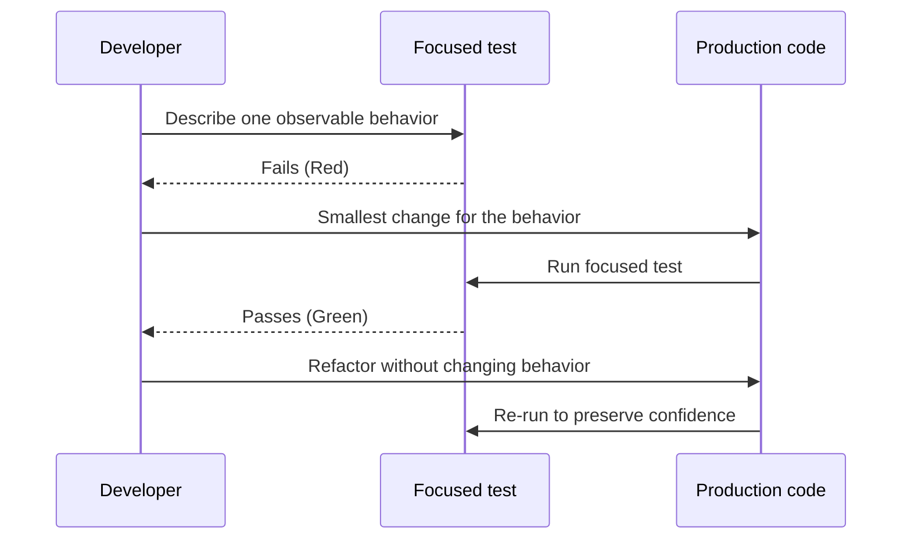
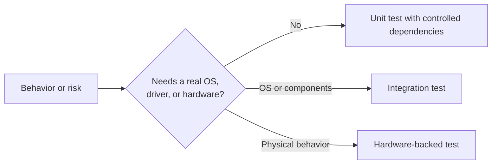

# TDD Foundations

## Purpose and audience

This note is for developers beginning TDD in C or embedded software. The goal is
not merely to accumulate tests: use a tight feedback loop to make behavior
explicit and keep modules easy to change.

## The TDD loop

TDD works in deliberately small increments:

1. **Red** — state one observable behavior as a failing test.
2. **Green** — make the smallest production change that passes that test.
3. **Refactor** — improve production and test code without changing behavior.
4. Repeat with the next behavior.

A useful rhythm is one behavior, one failure, one small implementation step.
When a failure is difficult to explain, the test or the production interface is
usually too broad for the current increment.

### Feedback loop

## What makes a good unit test

A unit test should express a single rule in a way that is fast, deterministic,
and independent of test execution order. A reader should be able to answer:

- What condition is being arranged?
- What action is being taken?
- What result or interaction is expected?

Arrange–Act–Assert is a helpful structure for this purpose. Prefer names that
state the condition and expected result, rather than implementation details.
Describe what happens for an invalid input, not the private branch that happens
to handle it.

## Test seams in embedded C

Hardware, time, interrupts, file systems, and RTOS services make tests slower
or less deterministic when accessed directly. A **seam** is a controlled point
where a test can replace such a dependency with a stub, fake, or mock.

Common seams include:

- A small interface around register or driver access.
- An injected clock, random-number source, or scheduler callback.
- A wrapper around an external module or function dependency that can be
  substituted during a unit test.

Create seams at architectural boundaries, not around every function. The aim is
to test the module's decisions in isolation while leaving hardware integration
to a suitable higher-level test.

## Unit tests and integration tests

Unit tests isolate a module and control its dependencies. They are best for
rules, error handling, state transitions, and boundary conditions. Integration
tests combine real components and are best for verifying that configuration,
drivers, the OS, and component boundaries work together.

Neither replaces the other. Start with the smallest test that can expose the
behavior in question. Move outward only when the behavior depends on real
integration.

## A practical TDD checklist

Before writing a test, identify the behavior, inputs, expected outcome, and
dependencies. During the loop, keep each change small and run the narrowest
relevant test. Before finishing, refactor duplication, preserve readable names,
and ensure the test would fail if the behavior were removed.

## Related reading

- [Ceedling test environments](https://throwtheswitch.github.io/Ceedling/latest/overview/test-environments/)
- [Zephyr Test Framework (`ztest`)](https://docs.zephyrproject.org/latest/develop/test/ztest.html)

## Deferred examples

A future exercise can walk through a small pure-C calculation or state-machine
rule using Red–Green–Refactor. It should remain independent of hardware and
show one behavior at a time.
