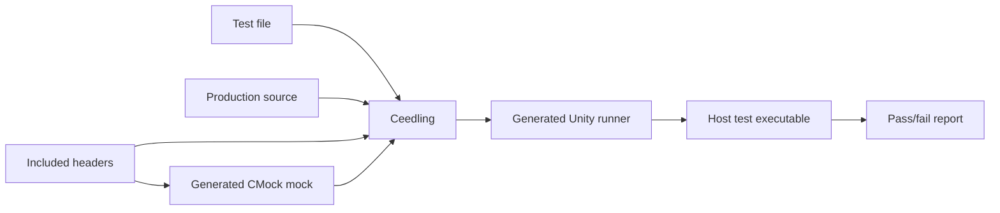
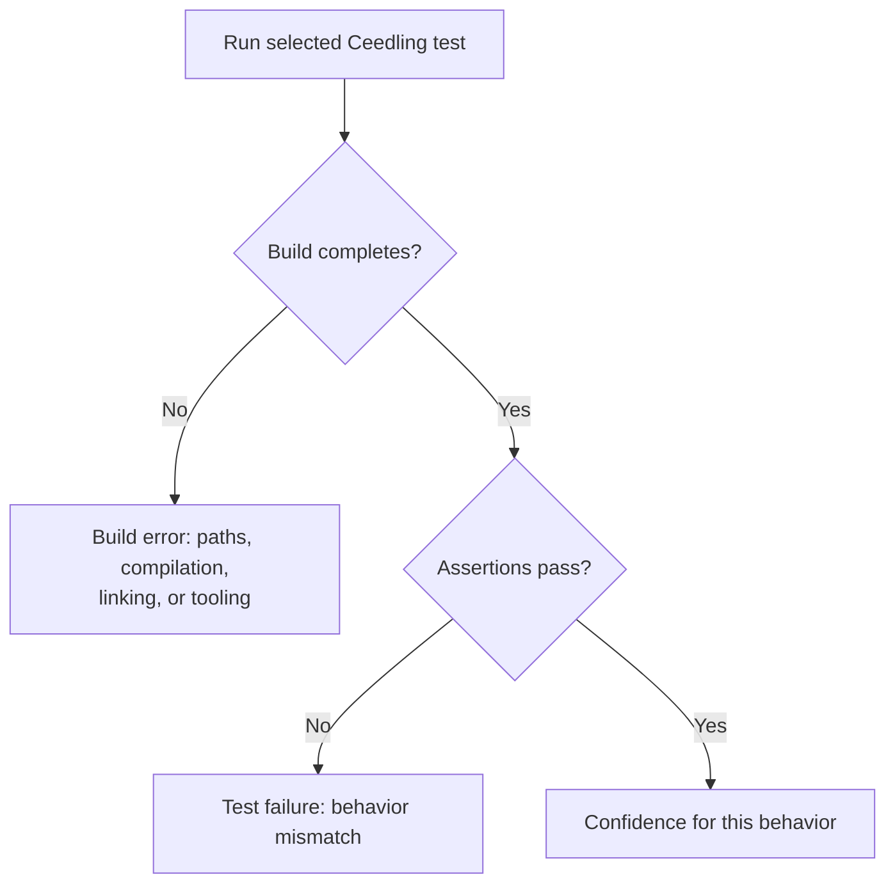

# Ceedling Unit Tests

## Purpose and audience

This note is for C developers who need fast, host-side unit-test feedback.
Ceedling is a test-centered build system for C that brings together Unity, an
xUnit-style test framework, and CMock, a mock-generation tool. It can also
manage release builds, but this note focuses on unit-test work.

## When Ceedling is a good fit

Choose Ceedling when the code under test can compile on the host, or can be
made host-testable through carefully chosen seams. This is often the fastest
way to validate pure logic, protocol parsing, state machines, and policies that
would otherwise be buried under hardware dependencies.

For this learning path, Ceedling is the default TDD environment. Start there
unless the behavior genuinely requires a booted Zephyr system, a Zephyr-specific
configuration, or physical hardware.

Host-side testing does not prove target hardware behavior. Pair it with
integration or on-target testing where driver, timing, startup, or hardware
interaction matters.

## Core pieces

- **Ceedling** finds source and test files, generates runners and mocks, and
  orchestrates compilation and execution.
- **Unity** supplies the test lifecycle and assertions.
- **CMock** generates mocks from C headers so a test can set interaction
  expectations for collaborators.

Ceedling can use fake-function approaches through plugins as well, but select
one approach per dependency boundary and keep the test's intent obvious.

### What Ceedling assembles

## Project model

Ceedling is driven by a `project.yml` configuration file. Its important concepts
are the build root and explicit paths for tests, sources, and include files.
Test-file includes guide which production sources and generated mocks become
part of each test executable. Consequently, a small, deliberate include list is
part of keeping a test focused.

Follow the versioned documentation that matches the Ceedling release in use;
configuration keys and behavior can change between major releases.

## Test conventions

Ceedling discovers test cases using Unity/Ceedling conventions. Test-case
functions use a `void` return type and `void` parameter list and have names
beginning with `test`. The generated runner calls the discovered cases, so there
is no separate hand-maintained registration list to forget.

Use setup and teardown only for state that each case truly needs. A test should
not rely on the prior case's state, execution order, or output. Keep the test
fixture smaller than the behavior under examination.

## Mocks, stubs, and fakes

Use a **stub** when the dependency only needs to return a controlled value. Use
a **fake** when a lightweight working implementation makes the test clearer.
Use a **mock** when the interaction itself is part of the behavior: for example,
that an error is reported once and only after validation fails.

Avoid mocking implementation details. If a harmless refactor changes call order
or an internal helper and causes many tests to fail, the tests may be
overspecified. Prefer asserting externally meaningful effects and mock only
genuine boundaries.

## Running and diagnosing tests

Ceedling provides commands to run every unit test, a named test fixture, or a
matching individual case. It distinguishes a build **error**—such as a missing
file, compilation error, or link error—from a test **failure**, where an
assertion does not hold. Both should fail automation, but the distinction makes
triage quicker: repair the test build first, then investigate behavioral
failures.

## A Ceedling-first TDD cadence

Use the narrowest feedback loop while developing:

1. Write one focused Unity test for the next observable behavior.
2. Run that test fixture or matching case through Ceedling.
3. Make the smallest production change that turns the result green.
4. Refactor production and test code, then rerun the focused test.
5. Run the complete Ceedling suite before handing off the change.

When a module calls hardware or an RTOS service, move that call behind a small
boundary. Test the decision-making code with Ceedling; reserve broader tests
for validating the boundary against Zephyr or real hardware. This keeps most
feedback fast while preserving evidence at the integration level.

## Official references

- [Ceedling Quick Start](https://throwtheswitch.github.io/Ceedling/latest/getting-started/quick-start/)
- [Ceedling installation](https://throwtheswitch.github.io/Ceedling/latest/getting-started/installation/)
- [Ceedling test conventions](https://throwtheswitch.github.io/Ceedling/latest/testing-guide/conventions/)
- [Ceedling command-line reference](https://throwtheswitch.github.io/Ceedling/latest/reference/command-line/)
- [Ceedling configuration reference](https://throwtheswitch.github.io/Ceedling/latest/configuration/)
- [Ceedling source repository](https://github.com/ThrowTheSwitch/Ceedling)

## Deferred examples

Future material may add a minimal Ceedling project, a CMock boundary for a
hardware-facing dependency, and a focused command-line workflow. No runnable
Ceedling project is included in this documentation phase.
