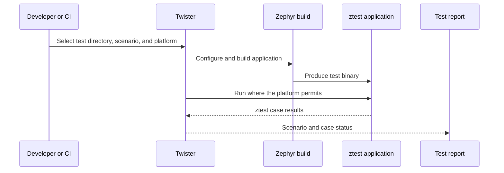
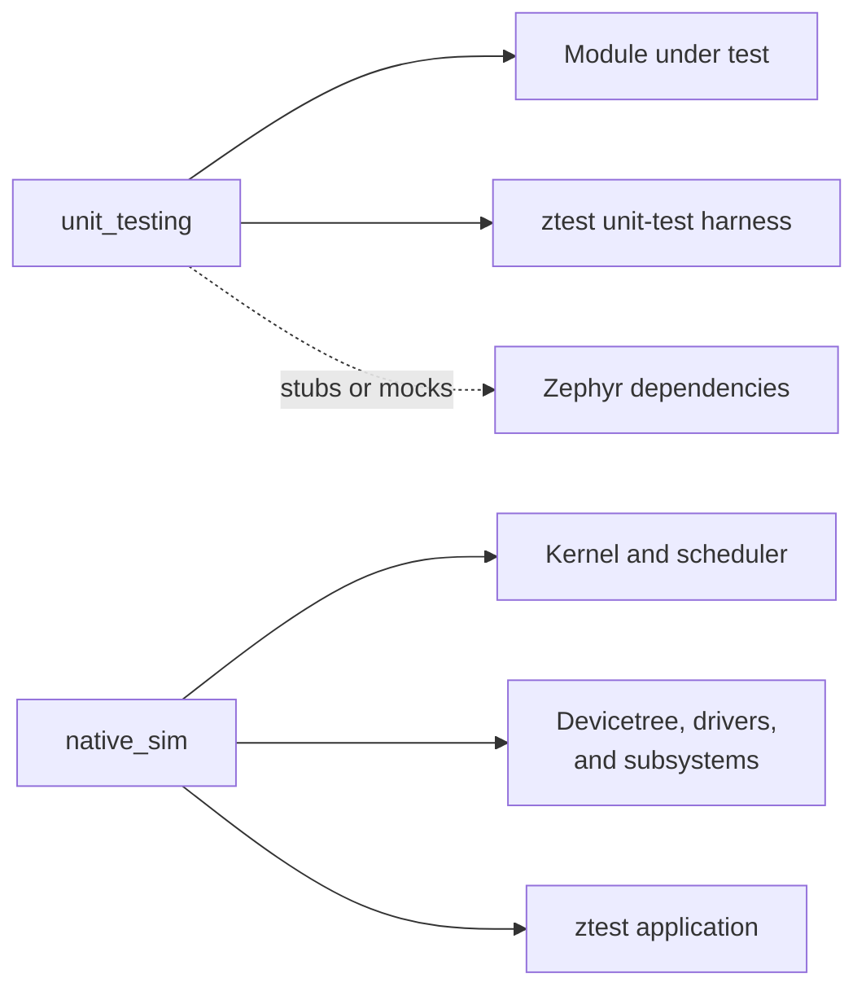

# Zephyr ztest Reference

## Purpose and audience

This is a reference for developers testing C modules in a Zephyr project.
Ceedling is the primary TDD workflow in this learning path; use ztest when the
behavior belongs in Zephyr's build and test environment. Zephyr's Test
Framework, **ztest**, supplies assertions and a structured way to declare test
suites and cases. **Twister** discovers test applications, builds them for the
selected platforms, runs them where possible, and produces reports.

## ztest building blocks

A ztest suite groups related test cases. A test case is declared with a ztest
macro and should use a descriptive `test_` name. Assertions report expected
conditions, while assumptions can mark a case as skipped when a prerequisite is
not met.

Suites can provide lifecycle hooks:

- A suite setup function for one-time fixture creation.
- Before and after functions for per-test reset and cleanup.
- A teardown function for releasing suite-level resources.

Fixtures prevent setup duplication, but should be reset enough that cases stay
order-independent. ztest also supports parameterized cases when the same rule
must be checked over a deliberate set of values.

## Test applications and Twister metadata

A Zephyr test application normally includes its build description, test
configuration, Kconfig configuration, and source files. Twister discovers an
application from `tests.yaml`; the file names a test scenario and conveys
metadata such as tags, platform constraints, and test type.

Scenario, suite, and case names are related but distinct. A scenario describes
the build/run conditions, a suite groups cases in the test binary, and a case
is the smallest reported behavior. Keep these names domain-oriented and unique
within their respective scopes so reports remain useful in CI.

## Isolated unit testing with `unit_testing`

For an isolated module, set a Twister scenario's type to `unit`. Twister then
uses Zephyr's `unit_testing` pseudo-board and produces a native host executable.
This build contains the module under test and the ztest unit-test harness, not
the full Zephyr kernel, scheduler, devicetree, driver model, or boot sequence.

Every dependency that the module normally receives from Zephyr must therefore
be supplied by the test, commonly as a stub or mock. This makes the feedback
loop fast and focused, but it cannot validate OS integration.

## `unit_testing` compared with `native_sim`

Both choices run on a host, but they answer different questions:

- **`unit_testing`** isolates one module and omits the Zephyr OS. Use it for
  focused logic and interactions with controlled dependencies.
- **`native_sim`** builds a complete Zephyr system for the host. Use it for
  integration behavior involving kernel services, Kconfig, devicetree,
  initialization, drivers, or multiple subsystems.

Do not use a `native_sim` test merely because it is convenient to run locally;
it costs more and is less isolated. Do not use `unit_testing` to claim that a
driver works with the kernel or hardware; those components are absent.

## Running with Twister

Use Twister to select a test application's directory, a named scenario, or a
platform. Its verbose output and generated reports explain whether a case
passed, failed, was skipped, was filtered, or was only built. The exact command
and platform selection should be owned by the project's build and CI guidance.

## Official references

- [Zephyr Test Framework (`ztest`)](https://docs.zephyrproject.org/latest/develop/test/ztest.html)
- [Zephyr Test Runner (Twister)](https://docs.zephyrproject.org/latest/develop/test/twister.html)
- [Twister command-line options](https://docs.zephyrproject.org/latest/develop/twister/commandline.html)
- [Zephyr unit-test sample sources](https://github.com/zephyrproject-rtos/zephyr/tree/main/tests/unit)

## Deferred examples

Future material may add one fixture-driven ztest case, one parameterized rule,
an isolated `unit_testing` module with a stubbed dependency, and one
`native_sim` scenario executed through Twister. These are intentionally not
included here.
