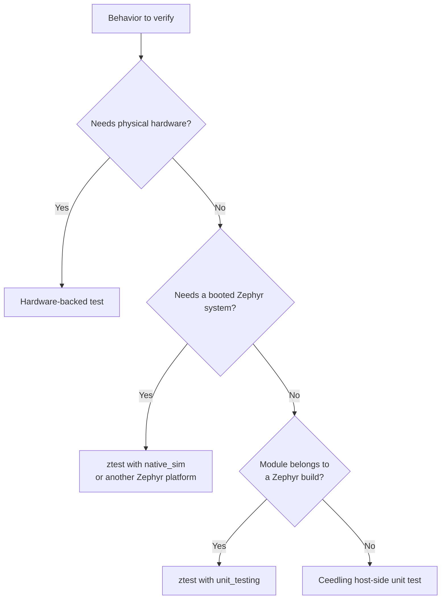

# Ceedling and ztest Strategy

## Purpose and audience

This guide helps an embedded team choose a test environment based on the
behavior it needs to prove. **Choose Ceedling first for host-side TDD.** ztest
is a complementary Zephyr tool, not a replacement for every fast unit test.
The tools do not need to share one build or one test binary.

## Decision guide

Choose the smallest environment that can truthfully exercise the behavior:

- Use **Ceedling** for host-side C unit tests when the module can compile with a
  normal host toolchain and its outside dependencies can be replaced at clear
  seams.
- Use **ztest with `unit_testing`** when the module belongs to a Zephyr project
  but can be built as an isolated host binary with its Zephyr dependencies
  stubbed or mocked.
- Use **ztest with `native_sim`** when the behavior relies on a running Zephyr
  system: kernel services, Kconfig, devicetree, drivers, initialization, or
  multiple components.
- Use **target or hardware-backed tests** when the claim depends on physical
  hardware, timing, electrical behavior, or a peripheral's real implementation.

This is a spectrum, not a quality ranking. Faster and more isolated tests give
the earliest feedback; broader tests provide confidence about integration.

## Ceedling and ztest compared

| Concern | Ceedling | ztest with `unit_testing` | ztest with `native_sim` or another Zephyr platform |
| --- | --- | --- | --- |
| Primary purpose | Fast host-side TDD for C modules | Isolated module test inside a Zephyr project | Zephyr integration and system behavior |
| Runtime environment | Host executable | Host executable without the Zephyr OS | A booted Zephyr system on a host, emulator, or board |
| Dependencies | Control them with CMock, fakes, or stubs | Supply stubs or mocks for absent Zephyr dependencies | Use real Zephyr subsystems where configured |
| Feedback cost | Usually the lowest | Low, with Zephyr build setup | Higher because more of Zephyr is built and run |
| Best evidence | Pure logic and module decisions | A Zephyr module's isolated behavior | Kernel, configuration, driver, and subsystem interactions |
| Default choice here | **Yes** | Only when the module must use Zephyr's unit-test flow | Only when integration is the behavior under test |

The key distinction is not whether a test runs on a host. Both Ceedling and
`unit_testing` do. The distinction is the build ecosystem and the evidence
needed: Ceedling maximizes fast C-level feedback, while ztest integrates with
Zephyr's test metadata, build system, and platform matrix.

## Keep the boundary explicit

Test code should make its environment apparent. A Ceedling test is not a
Zephyr booted application. A ztest `unit_testing` binary is not `native_sim`.
Recording the test's level in its location, scenario metadata, and CI job name
prevents reviewers from assuming a broader guarantee than the test provides.

For portable domain logic, keep hardware and OS calls at thin edges. That
allows the same decision-making module to be exercised quickly with Ceedling or
isolated ztest, while a smaller number of ztest integration tests verify the
Zephyr wiring around it.

## Dependency-double policy

Use stubs and fakes to control environmental inputs. Use mocks when an
interaction is an externally meaningful contract, such as reporting a fault or
requesting a retry. Avoid making a test depend on internal helper calls unless
that interaction itself is the required behavior.

Reset all doubles between cases. A passing test must not depend on another
test's call history, allocated state, configuration, or execution order.

## CI and reporting

Run quick isolated tests early and broadly; use Twister's scenario and platform
selection to run Zephyr tests at an appropriate scope. Preserve reports as CI
artifacts and inspect whether a scenario was run, built only, skipped, or
filtered before treating an absent result as a pass.

In both toolchains, a failed build is different from a failing assertion. Make
both visible in CI, because one indicates a broken test environment while the
other indicates a behavior mismatch.

## Team checklist

Before adding a test, answer:

1. What observable behavior or risk does this test cover?
2. What is the smallest environment that can exercise it honestly?
3. Which dependencies must be real, and which should be controlled?
4. Where will the result be reported and how will CI select it?
5. What integration or target-level test complements this unit-level evidence?

## Official references

- [Ceedling test environments](https://throwtheswitch.github.io/Ceedling/latest/overview/test-environments/)
- [Ceedling test conventions](https://throwtheswitch.github.io/Ceedling/latest/testing-guide/conventions/)
- [Zephyr ztest unit testing](https://docs.zephyrproject.org/latest/develop/test/ztest.html#quick-start-unit-testing)
- [Zephyr Twister](https://docs.zephyrproject.org/latest/develop/test/twister.html)

## Deferred examples

Future work can compare the same module tested in a host-side Ceedling fixture,
a ztest `unit_testing` fixture, and a `native_sim` integration scenario. No
runnable comparison is added in this phase.
