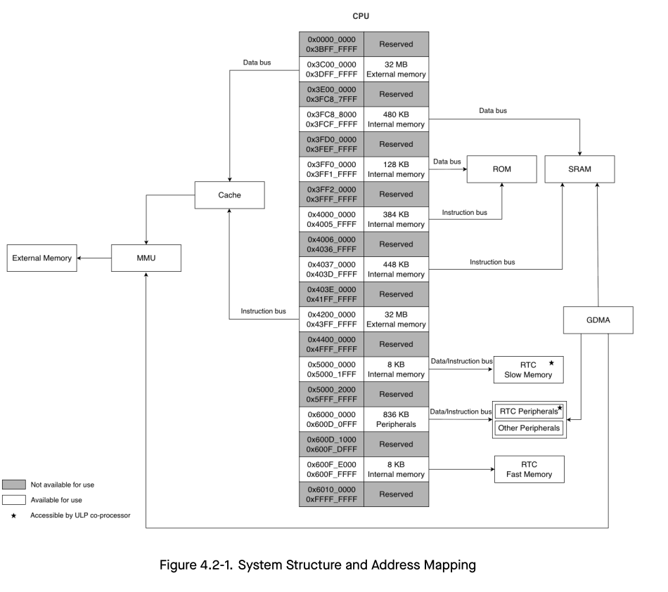

# Cornell Notes

## Topic: Overview and Features

## Date: 06/06/2026

---

### Cue Column (Questions, Keywords, or Prompts)

- \[Insert question or keyword\]
- \[Insert question or keyword\]
- \[Insert question or keyword\]

---

### Notes Section (Main Notes)

#### Overview

The ESP32-S3 is a dual-core system with two Harvard Architecture Xtensa® LX7 CPUs. All internal memory, external memory, and peripherals are located on the CPU buses.

#### Features

##### Address Space

- 848 KB of internal memory address space accessed from the instruction bus
- 560 KB of internal memory address space accessed from the data bus
- 836 KB of peripheral address space
- 32 MB of external memory **virtual address** space accessed from the instruction bus
- 32 MB of external memory **virtual address** space accessed from the data bus
- 480 KB of internal DMA address space
- 32 MB of external DMA address space

##### Internal Memory

- 384 KB Internal ROM
- 512 KB Internal SRAM
- 8 KB RTC FAST Memory
- 8 KB RTC SLOW Memory

##### External Memory

- Supports up to 1 GB external Flash
- Supports up to 1 GB external RAM

##### Peripheral Space

- 45 modules / peripherals in total

##### GDMA

- 10 GDMA-supported modules / peripherals

**Note:**

- The address space with gray background is not available to users.
- The memory or peripherals marked with a <mark data-color="#ffd700aa" style="background-color: rgba(255, 215, 0, 0.667); color: inherit;">pentagram </mark>can be accessed by the ULP co-processor.
- The range of addresses available in the address space may be larger than the actual available memory of a particular type.

---

### Summary Section (Summary of Notes)

\[Insert a brief summary of the key ideas and takeaways\]