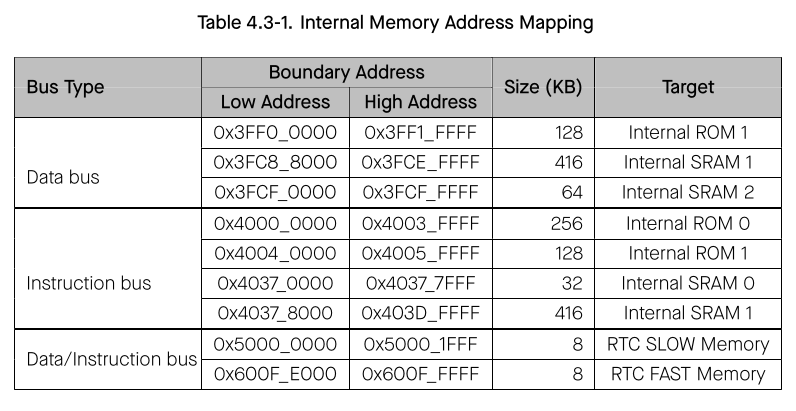

# Cornell Notes

## Topic: Internal Memory

## Date: 06/06/2026

---

### Cue Column (Questions, Keywords, or Prompts)

- [Insert question or keyword]
- [Insert question or keyword]
- [Insert question or keyword]

---

### Notes Section (Main Notes)

#### Internal Memory

The ESP32-S3 consists of the following three types of internal memory:
- Internal ROM (384 KB): The internal ROM is a read-only memory and cannot be programmed. Internal ROM contains the ROM code (software instructions and some software read-only data) of some low level system software.
- Internal SRAM (512 KB): The Internal Static RAM (SRAM) is a volatile memory that can be quickly accessed by the CPU (generally within a single CPU clock cycle).
  - A part of the SRAM can be configured to operate as a cache for external memory access, which cannot be accessed by CPU in such case.
  - Some parts of the SRAM can only be accessed via the CPU’s instruction bus.
  - Some parts of the SRAM can only be accessed via the CPU’s data bus.
  - Some parts of the SRAM can be accessed via both the CPU’s instruction bus and the CPU’s data bus.

- RTC Memory (16 KB): The RTC (Real Time Clock) memory implemented as Static RAM (SRAM) and thus is volatile. However, RTC memory has the added feature of being persistent throughout deep sleep (i.e., the RTC memory retains its values throughout deep sleep).
  - RTC FAST Memory (8 KB): RTC FAST memory can only be accessed by the CPU, and cannot be accessed by the ULP co-processor. It is generally used to store instructions and data that needs to persist across a deep sleep.
  - RTC SLOW Memory (8 KB): The RTC SLOW memory can be accessed by both the CPU and the ULP co-processor, and thus is generally used to store instructions and share data between the CPU and the ULP co-processor.

Based on the three different types of internal memory described above, the internal memory of the ESP32-S3 is split into four segments: Internal ROM (384 KB), Internal SRAM (512 KB), RTC FAST Memory (8 KB) and RTC SLOW Memory (8 KB). However, within each segment, there may be different bus access restrictions (e.g., some parts of the segment may only be accessible by the CPU’s instruction bus). Therefore, some segments are also further divided down into parts.

**Note:** All of the internal memories are managed by Permission Control module. An internal memory can only be accessed when it is allowed by Permission Control, then the internal memory can be available to the CPU. For more information about Permission Control, please refer to section Permission Control (PMS).

#### 1. Internal ROM 0

Internal ROM 0 is a 256 KB, read-only memory space, addressed by the CPU only through the instruction bus, as shown in Table 4.3-1.

#### 2. Internal ROM 1

Internal ROM 1 is a 128 KB, read-only memory space, addressed by the CPU through the instruction bus via 0x4004_0000 ~ 0x4005_FFFF or through the data bus via 0x3FF0_0000 ~ 0x3FF1_FFFF in the same order, as shown in Table 4.3-1.

This means, for example, address 0x4004_0000 and 0x3FF0_0000 correspond to the same word, 0x4004_0004 and 0x3FF0_0004 correspond to the same word, 0x4004_0008 and 0x3FF0_0008 correspond to the same word, etc (same below).

#### 3. Internal SRAM 0

Internal SRAM 0 is a 32 KB, read-and-write memory space, addressed by the CPU through the instruction bus, as shown in Table 4.3-1.

A 16 KB or the total 32 KB of this memory space can be configured as instruction cache (ICache) to store instructions or read-only data of the external memory. In this case, the occupied memory space cannot be accessed by the CPU, while the remaining can still can be accessed by the CPU.

#### 4. Internal SRAM 1

Internal SRAM 1 is a 416 KB, read-and-write memory space, addressed by the CPU through the data bus or instruction bus in the same order, as shown in Table 4.3-1

The total 416 KB memory space comprises multiple 8 KB and 16 KB memory (sub-memory) blocks. A memory block (up to 16 KB) can be used as a Trace Memory, in which case this block can still be accessed by the CPU.

#### 5. Internal SRAM 2

Internal SRAM 2 is a 64 KB, read-and-write memory space, addressed by the CPU through the data bus, as shown in Table 4.3-1.

A 32 KB or the total 64 KB can be configured as data cache (DCache) to cache data of the external memory.
The space used as DCache cannot be accessed by the CPU, while the remaining space can still be accessed by the CPU.

#### 6. RTC FAST Memory

RTC FAST Memory is a 8 KB, read-and-write SRAM, addressed by the CPU through the data/instruction bus via the shared address 0x600F_E000 ~ 0x600F_FFFF, as described in Table 4.3-1.

#### 7. RTC SLOW Memory

RTC SLOW Memory is a 8 KB, read-and-write SRAM, addressed by the CPU through the data/instruction bus via shared address 0x5000_E000 ~ 0x5001_FFFF, as described in Table 4.3-1.

RTC SLOW Memory can also be used as a peripheral addressable to the CPU via 0x6002_1000 ~ 0x6002_2FFF.

---

### Summary Section (Summary of Notes)

[Insert a brief summary of the key ideas and takeaways]