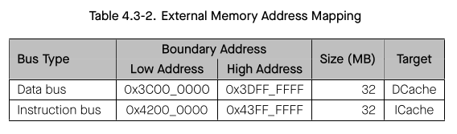
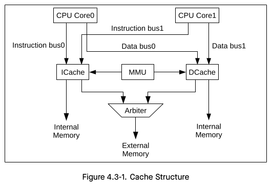

# Cornell Notes

## Topic: Functional Description - External Memory

## Date: 06/06/2026

---

### Cue Column (Questions, Keywords, or Prompts)

- [Insert question or keyword]
- [Insert question or keyword]
- [Insert question or keyword]

---

### Notes Section (Main Notes)

#### External Memory

ESP32-S3 supports SPI, Dual SPI, Quad SPI, Octal SPI, QPI, and OPI interfaces that allow connection to external flash and RAM. It also supports hardware encryption and decryption based on XTS_AES algorithm to protect users’ programs and data in the external flash and RAM.

#### External Memory Address Mapping

The CPU accesses the external memory via the cache. According to information inside the MMU (Memory Management Unit), the cache maps the CPU’s instruction/data bus address into a physical address of the external flash and RAM. Due to this address mapping, ESP32-S3 can address up to 1 GB external flash and 1 GB external RAM.

Using the cache, ESP32-S3 is able to support the following address space mappings at a time:
- Up to 32 MB instruction bus address space can be mapped to the external flash or RAM as individual 64 KB blocks via the ICache. 4-byte aligned reads and fetches are supported.
- Up to 32 MB data bus address space can be mapped to the external RAM as individual 64 KB blocks via the DCache. Single-byte, double-byte, 4-byte, 16-byte aligned reads and writes are supported. This address space can also be mapped to the external flash or RAM for read operations only.

Table 4.3-2 lists the mapping between the cache and the corresponding address ranges on the data bus and instruction bus.

**Note:** Only if the CPU obtains permission for accessing the external memory, can it be responded for memory access. For more detailed information about permission control, please refer to section Permission Control (PMS).

#### Cache

As shown in Figure 4.3-1, ESP32-S3 has a dual-core-shared ICache and DCache structure, which allows prompt response upon simultaneous requests from the instruction bus and data bus. Some internal memory space can be used as cache (see [Internal SRAM 0](03_fd_internal_memory.md#3-internal-sram-0) and [Internal SRAM 2](03_fd_internal_memory.md#5-internal-sram-2) in [03_fd_internal_memory](03_fd_internal_memory.md)).

When the instruction bus of two cores initiate a request on ICache simultaneously, the arbiter determines which core gets the access to the ICache first.

When the data bus of two cores initiate a request on DCache simultaneously, the arbiter determines which core gets the access to the DCache first.

When a cache miss occurs, the cache controller will initiate a request to the external memory.

When ICache and DCache initiate requests on the external memory simultaneously, the arbiter determines which gets the access to the external memory first.

The size of ICache can be configured to 16 KB or 32 KB, while its block size can be configured to 16 B or 32 B. 

When an ICache is configured to 32 KB, its block cannot be 16 B. The size of DCache can be configured to 32 KB or 64 KB, while its block size can be configured to 16 B, 32 B or 64 B. When a DCache is configured to 64 KB, its block cannot be 16 B.

#### Cache Operations

ESP32-S3 caches support the following operations:

##### 1. Write-Back

This operation is used to clear the dirty bits in dirty blocks and update the new data to the external memory. After the write-back operation finished, both the external memory and the cache are bearing the new data. The CPU can then read/write the data directly from the cache. **Only DCache has this function**.

If the data in the cache is newer than the one stored in the external memory, then the new data will be considered as a dirty block. The cache tracks these dirty blocks through their dirty bits. When the dirty bits of a data are cleared, the cache will consider the data as new.

##### 2. Clean
05_fc_gdma_address_space This operation is used to clear dirty bits in the dirty block, without updating data to the external memory. After the clean operation finish, there will still be old data stored in the external memory, while the cache keeps the new one (but the cache does not know about this). The CPU can then read/write the data directly from the cache. **Only DCache has this function**.

#### 3. Invalidate

This operation is used to remove valid data in the cache. Even if the data is a dirty block mentioned above, it will not be updated to the external memory. But fo05_fc_gdma_address_spacer the non-dirty data, it will be only stored in the external memory after this operation.

The CPU needs to access the external memory in order to read/write this data. As for the dirty blocks, they will be totally lost with only old data in the external memory after this operation.

There are two types of invalidate operation: automatic invalidation (**Auto-Invalidate**) and manual invalidation (**Manual-Invalidate**). **Manual-Invalidate** is performed only on data in the specified area in the cache, while **Auto-Invalidate** is performed on all data in the cache. **Both ICache and DCache have this function**.

#### 4. Preload

This operation is to load instructions and data into the cache in advance. The minimum unit of preload-operation is one block.

There are two types of preload-operation: manual preload (**Manual-Preload**) and automatic preload (**Auto-Preload**).
- **Manual-Preload** means that the hardware prefetches a piece of continuous data according to the virtual address specified by the software.
- **Auto-Preload** means the hardware prefetches a piece of continuous data according to the current address where the cache hits or misses (depending on configuration).

**Both ICache and DCache have this function.**

#### 5. Lock/Unlock

The **lock** operation is used to prevent the data in the cache from being easily replaced. There are two types of lock: **prelock** and **manual lock**.
- **Prelock**: When prelock is enabled, the cache locks the data in the specified area when filling the missing data to cache memory, while the data outside the specified area will not be locked.
- **Manual lock**: When manual lock is enabled, the cache checks the data that is already in the cache memory and locks the data only if it falls in the specified area, and leaves the data outside the specified area unlocked. When there are missing data, the cache will replace the data in the unlocked way first, so the data in the locked way is always stored in the cache and will not be replaced.

But when all ways within the cache are locked, the cache will replace data, as if it was not locked.

**Unlocking** is the reverse of locking, except that it only can be done manually. **Both ICache and DCache have this function**.

**Note:** the **writing-back**, **cleaning** and **Manual-Invalidate** operations will only work on the **unlocked data**. If you expect to perform such operations on the locked data, please **unlock them first**.

---

### Summary Section (Summary of Notes)

[Insert a brief summary of the key ideas and takeaways]