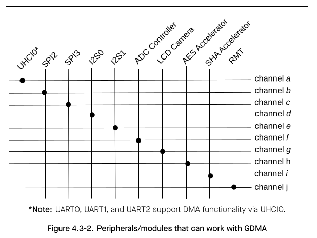

# Cornell Notes

## Topic: Functional Description - GDMA Address Space

## Date: 

---

### Cue Column (Questions, Keywords, or Prompts)

- [Insert question or keyword]
- [Insert question or keyword]
- [Insert question or keyword]

---

### Notes Section (Main Notes)

#### GDMA Address Space

The GDMA (General Direct Memory Access) peripheral in ESP32-S3 can provide DMA (Direct Memory Access) services including:
- Data transfers between different locations of internal memory;
- Data transfers between internal memory and external memory;
- Data transfers between different locations of external memory.

GDMA uses the same addresses as the CPU’s data bus to access Internal SRAM 1 and Internal SRAM 2.

Specifically, GDMA uses address range 0x3FC8_8000 ~ 0x3FCE_FFFF to access Internal SRAM 1 and 0x3FCF_0000 ~ 0x3FCF_FFFF to access Internal SRAM 2. 

**Note:** GDMA cannot access the internal memory occupied by cache.

In addition, GDMA can access the external memory (only RAM) via the same address as CPU accessing DCache (0x3C00_0000 ~ 0x3DFF_FFFF). When DCache and GDMA access the external memory simultaneously, the software needs to make sure the data is consistent.

Besides, some peripherals/modules of the ESP32-S3 can work together with GDMA. In these cases, GDMA can provide the following powerful services for them:
- Data transfers between modules/peripherals and internal memory;
- Data transfers between modules/peripherals and external memory.

There are 10 peripherals/modules that can work together with GDMA.

As shown in Figure 4.3-2:
- These 10 vertical lines in turn correspond to these 10 peripherals/modules with GDMA function.
- The horizontal line represents a certain channel of GDMA (can be any channel).
- The intersection of the vertical line and the horizontal line indicates that a peripheral/module has the ability to access the corresponding channel of GDMA. If there are multiple intersections on the same line, it means that these peripherals/modules cannot enable the GDMA function at the same time.

These peripherals/modules can access any memory available to GDMA. For more information, please refer to section GDMA Controller (GDMA)

**Note:** When accessing a memory via GDMA, a corresponding access permission is needed, otherwise this access may fail. For more information about permission control, please refer to section Permission Control (PMS).

---

### Summary Section (Summary of Notes)

[Insert a brief summary of the key ideas and takeaways]