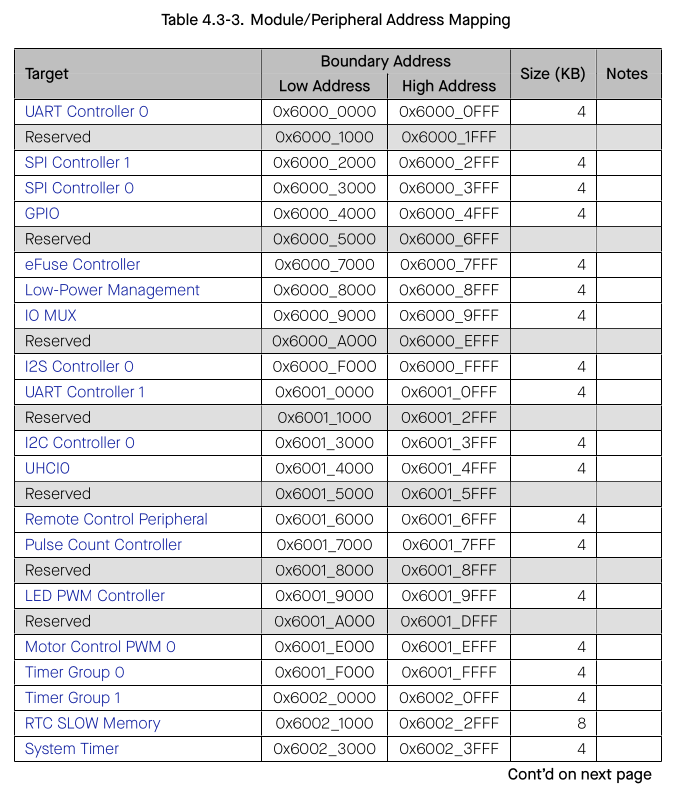
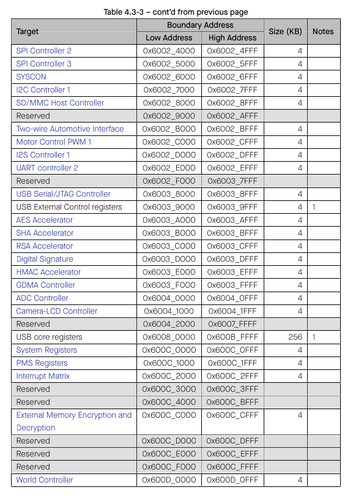

# Cornell Notes

## Topic: Modules / Peripherals

## Date: 06/06/2026

---

### Cue Column (Questions, Keywords, or Prompts)

- [Insert question or keyword]
- [Insert question or keyword]
- [Insert question or keyword]

---

### Notes Section (Main Notes)

#### Modules / Peripherals

The CPU can access modules/peripherals via 0x6000_0000 ~ 0x600D_0FFF shared by the data/instruction bus.

#### Module/Peripheral Address Mapping

Table 4.3-3 lists all the modules/peripherals and their respective address ranges. Note that the address space of specific modules/peripherals is defined by “Boundary Address” (including both Low Address and High Address)

**Note:**
- The address space in this module / peripheral is not continuous.
- The CPU needs to obtain the access permission to a certain module/peripheral when initiating a request to access it, otherwise it may fail. For more information of permission control, please see section Permission Control (PMS).

---

### Summary Section (Summary of Notes)

[Insert a brief summary of the key ideas and takeaways]