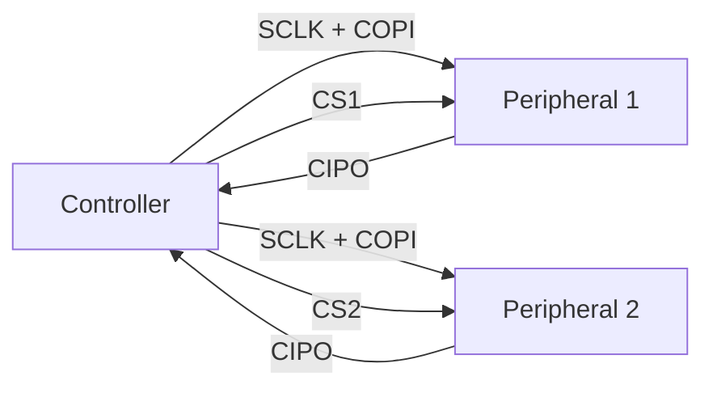
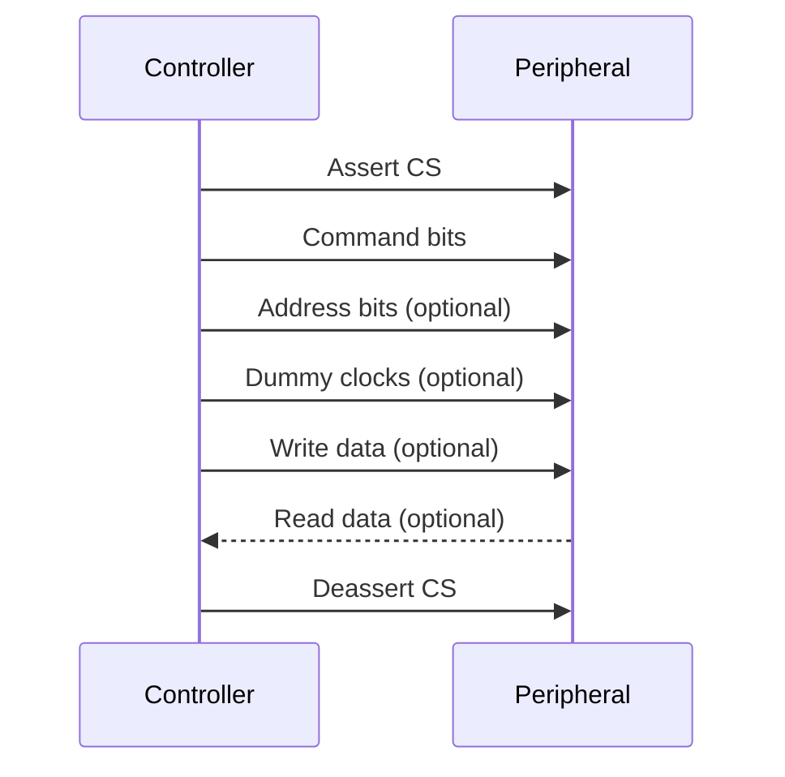
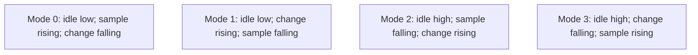

# Cornell Notes

## Topic: Serial Peripheral Interface (SPI) — General Theory

## Date: 28/08/2026

---

### Cue Column (Questions, Keywords, or Prompts)

- What does SPI standardize, and what remains device-specific?
- What roles do SCLK, CS, COPI/MOSI, and CIPO/MISO play?
- How are peripherals connected without addresses?
- What happens during one SPI transaction?
- How do full-duplex, half-duplex, and 3-wire transfers differ?
- How do CPOL and CPHA define the four clock modes?
- How are bit order, byte order, word size, and framing related?
- Which timing constraints limit clock frequency?
- How do Dual, Quad, QPI, and Octal SPI extend basic SPI?
- How should an SPI link be designed, brought up, and debugged?

---

### Notes Section (Main Notes)

#### 1. Definition, protocol model, and limits

**SPI stands for Serial Peripheral Interface.** It is a synchronous serial communication interface used to exchange data between one **controller** and one or more **peripherals**, usually over short PCB-level connections. The controller generates the clock and selects the active peripheral. Older datasheets call these roles **master** and **slave**.

- **Serial:** bits travel sequentially over data lines.
- **Peripheral:** commonly connects a processor to sensors, displays, memories, converters, or another processor.
- **Interface:** defines signal roles and clocked transfer behavior, not a complete universal device protocol.
- **Synchronous:** both endpoints coordinate transfers using the controller-generated serial clock.

Unlike I²C, basic SPI does not define addressing, discovery, acknowledgment, arbitration, retries, error detection, a fixed word size, or a universal packet format.

SPI therefore describes electrical signal roles and clocked bit exchange, not a complete device protocol. Each peripheral datasheet must define:

- supported clock modes and maximum frequency;
- command, address, dummy, and data fields;
- CS timing and transaction boundaries;
- word length, bit order, byte order, and read/write semantics;
- startup delays, busy behavior, and error checking.

A useful mental model is two shift registers connected in a ring. Every active clock shifts one bit from the controller to the peripheral and one bit back. Even a logical “read” normally transmits filler bits; even a logical “write” receives bits that software may ignore.

#### 2. Signals and naming

| Signal | Inclusive name | Traditional name | Direction | Purpose |
|---|---|---|---|---|
| SCLK/SCK | Serial clock | SCLK/SCK | Controller → peripheral | Defines shift and sample instants |
| CS/SS | Chip select | CS/SS | Controller → peripheral | Selects one peripheral; usually active-low |
| COPI | Controller Out, Peripheral In | MOSI | Controller → peripheral | Carries controller-transmitted bits |
| CIPO | Controller In, Peripheral Out | MISO | Peripheral → controller | Carries peripheral-transmitted bits |

Names describe roles, not fixed pin capabilities. Datasheets, schematics, and SDKs commonly retain MOSI/MISO terminology.

SPI signals are commonly push-pull, unlike open-drain I²C. Pull resistors cannot resolve two active drivers. A deselected peripheral sharing CIPO/MISO must place that output in high impedance; otherwise bus contention can corrupt data or damage drivers.

#### 3. Bus topology and selection

Basic SPI has no in-band device address. A conventional shared bus uses common SCLK, COPI/MOSI, and CIPO/MISO lines plus one CS per peripheral.

Only one CS should normally be active. Shared peripherals may require different clock modes, frequencies, bit orders, and CS timing, so the controller must reconfigure before selecting each one.

A **daisy chain** is different: one device's serial output feeds the next device's input, and all devices share one CS. The chain behaves like one long shift register. Daisy chaining works only when every device explicitly supports compatible framing; it is not a universal SPI feature.

#### 4. Transaction structure and CS framing

A **transaction** is usually the interval for which CS remains asserted. A device may reset its command parser when CS rises, require CS to remain low across several fields, or require a minimum inactive time before the next transaction.

Command, address, dummy, and data phases are common device-protocol conventions, not mandatory SPI fields. A dummy cycle creates time for a peripheral or signal path to prepare read data. It still consumes clock cycles.

CS can be controlled by hardware or GPIO. Software-controlled CS offers flexibility but may add jitter or accidentally split an atomic transaction. Never assume toggling CS between bytes is equivalent to holding it low.

#### 5. Duplex and wire arrangements

| Arrangement | Data behavior | Typical use |
|---|---|---|
| 4-wire full duplex | COPI and CIPO transfer simultaneously | Streaming, peer processors, transceivers |
| 4-wire half duplex | Output and input phases occur at different times | Command followed by response |
| Transmit-only / receive-only | One direction is meaningful; opposite bits ignored | Displays, ADC streams |
| 3-wire half duplex | One bidirectional data line changes direction | Pin-limited sensors and registers |

“4-wire” commonly counts SCLK, CS, COPI, and CIPO. “3-wire SPI” is ambiguous: it may mean SCLK + CS + one bidirectional data line, or SCLK + two data lines with CS omitted. Verify the datasheet.

For a bidirectional data line, controller and peripheral must switch direction without overlap. Turnaround clocks may be required to avoid contention.

#### 6. Clock polarity and phase

**CPOL** selects the idle clock level. **CPHA** selects whether data is sampled on the first or second active edge. Use **leading edge** for the first transition away from idle and **trailing edge** for the transition back toward idle.

| Mode | CPOL | CPHA | SCLK idle | Sample edge | Change/launch edge |
|---|---:|---:|---|---|---|
| 0 | 0 | 0 | Low | Leading, rising | Trailing, falling |
| 1 | 0 | 1 | Low | Trailing, falling | Leading, rising |
| 2 | 1 | 0 | High | Leading, falling | Trailing, rising |
| 3 | 1 | 1 | High | Trailing, rising | Leading, falling |

With CPHA = 0, the first data bit must already be valid before the first leading edge. With CPHA = 1, the first leading edge launches the first bit and the trailing edge samples it. Both endpoints must use the same mode. A wrong mode often produces shifted, duplicated, intermittent, or all-zero/all-one data.

Mode numbers do not define bit order, byte order, word size, CS polarity, or transaction format.

#### 7. Bit order, byte order, words, and framing

These independent concepts are often confused:

- **Bit order:** most-significant bit first or least-significant bit first within a transmitted word.
- **Byte order:** order of bytes in a multi-byte value on the wire.
- **CPU endianness:** representation of that value in memory.
- **Word size:** number of clocks treated as one unit, commonly 8 but sometimes 9, 12, 16, 24, or 32.
- **Framing:** how CS and protocol fields delimit a meaningful operation.

For example, a little-endian CPU can transmit a 16-bit register address most-significant byte first and each byte most-significant bit first. Drivers may serialize integer fields differently from byte buffers; verify the API rather than inferring wire order from memory layout.

#### 8. Timing budget and maximum frequency

A receiver samples correctly only if data arrives and remains stable around its sample edge. Important constraints include:

- transmitter clock-to-output delay $t_{CO}$;
- interconnect and level-shifter propagation delay $t_{PD}$;
- receiver setup time $t_{SU}$ and hold time $t_H$;
- controller input delay and sampling uncertainty $t_J$;
- CS setup, hold, and inactive-high times;
- clock duty cycle, line-to-line skew, rise/fall time, and ringing.

For a simple opposite-edge launch/sample link, a conservative half-cycle requirement is:

$$
\frac{T_{SCLK}}{2} \ge t_{CO,\max} + t_{PD,\max} + t_{SU} + t_J
$$

Therefore:

$$
f_{SCLK,\max} \le \frac{1}{2\left(t_{CO,\max}+t_{PD,\max}+t_{SU}+t_J\right)}
$$

This is a design estimate, not a replacement for both datasheets' timing diagrams. Round-trip read delay is often the limiting path: clock travels to the peripheral, data returns, then the controller samples it. Longer traces, connectors, GPIO routing, isolation, and level shifters reduce margin.

Ideal payload rate with $w$ data lines is:

$$
R_{ideal}=w f_{SCLK}
$$

For $N_P$ payload bits and $N_O$ command, address, dummy, and other overhead bits:

$$
\eta=\frac{N_P}{N_P+N_O}, \qquad R_{payload}=w f_{SCLK}\eta
$$

CS gaps, software latency, and direction turnaround reduce real throughput further.

#### 9. Electrical and PCB considerations

SPI has no universal voltage level. Confirm both endpoints' absolute maximum ratings and logic thresholds. Use a level shifter designed for push-pull, potentially bidirectional signals and the required speed; slow auto-direction shifters often fail on fast SPI.

At higher edge rates, treat traces as transmission lines:

- keep SCLK short and avoid stubs;
- provide a continuous return path and local decoupling;
- limit capacitive fan-out;
- consider a small source-series resistor near the driver to reduce ringing;
- avoid unnecessary pull resistors on high-speed data lines;
- verify rise/fall time and overshoot with an oscilloscope, not only a logic analyzer.

Clock frequency alone does not determine signal-integrity difficulty. A low-frequency clock with very fast edges can still ring severely.

#### 10. Dual, Quad, QPI, and Octal extensions

Multi-I/O SPI reuses or adds data pins to transfer several bits per clock:

| Name | Data lines per active phase | Important distinction |
|---|---:|---|
| Single SPI | 1 output and/or 1 input | Conventional COPI/CIPO |
| Dual SPI | 2 | Usually bidirectional IO0–IO1 |
| Quad SPI | 4 | Usually bidirectional IO0–IO3 |
| QPI | 4 | Commonly command, address, and data all use four lines |
| Octal SPI / OPI | 8 | Device-specific SDR or DDR conventions |

Notation such as **1-1-4** commonly means one command line, one address line, and four data lines. **4-4-4** commonly denotes QPI-like operation. Exact notation and mode-entry commands remain device-specific.

“Quad SPI” may widen only the data phase; QPI normally widens all applicable phases. Octal interfaces may use a data strobe and double-data-rate sampling. These are related ecosystem extensions, not one universally interoperable protocol.

#### 11. Configuration and bring-up workflow

1. Read the peripheral datasheet's serial-interface and timing sections.
2. Confirm voltage, pin direction, CS polarity, required idle states, and power-up delay.
3. Choose CPOL/CPHA, bit order, word size, duplex mode, and phase format explicitly.
4. Start at a low clock frequency using short transactions.
5. Hold CS exactly as the command requires.
6. Read a fixed identification or status register before attempting complex transfers.
7. Capture CS, SCLK, and every data line with a logic analyzer.
8. Increase frequency gradually; test voltage, temperature, cable, and production-layout margins.
9. Add protocol-level timeout, status checking, CRC, or retries when the device supports them. SPI itself provides none.

A loopback test verifies controller transmit/receive paths and basic timing, but it does not verify peripheral protocol, CS interpretation, turnaround, or the peripheral's clock-to-output delay.

#### 12. Common failures and evidence

| Symptom | Likely cause | First check |
|---|---|---|
| No clocks | peripheral not selected, controller not started, wrong pin routing | CS and SCLK at controller pin |
| Clocks but constant read value | CIPO disconnected, peripheral deselected/unpowered, line not released | voltage, CS, CIPO activity |
| One-bit shift or alternating corruption | CPHA mismatch or inadequate setup/hold margin | sample versus change edges |
| Correct bytes in reverse order | byte-order mismatch | datasheet field order and buffer bytes |
| Correct at low speed only | propagation delay, loading, ringing, weak level shifter | reduce clock; inspect analog waveform |
| First transaction fails | power-up delay, wake command, CS initialization | startup sequence and first CS edge |
| Shared bus fails after adding device | CIPO contention or excess loading | deselect all devices; check high impedance |
| Random long-transfer errors | no integrity check, marginal timing, buffer lifetime problem | capture failing frame; check status/CRC |

Decode tools are hypotheses, not proof. Confirm the configured mode, bit order, and CS framing before trusting decoded values. Use an oscilloscope when voltage thresholds or timing margin matter.

#### 13. Acronym and abbreviation glossary

| Acronym / abbreviation | Expansion | Meaning in this document |
|---|---|---|
| ADC | Analog-to-Digital Converter | Peripheral that converts an analog signal into digital samples |
| API | Application Programming Interface | Software interface used to configure or operate SPI |
| CIPO | Controller In, Peripheral Out | Inclusive name for data traveling from peripheral to controller |
| COPI | Controller Out, Peripheral In | Inclusive name for data traveling from controller to peripheral |
| CPU | Central Processing Unit | Processor whose memory byte order may differ from wire order |
| CPHA | Clock Phase | Selects whether sampling occurs on the first or second active clock edge |
| CPOL | Clock Polarity | Selects the idle level of SCLK |
| CRC | Cyclic Redundancy Check | Optional protocol-level error-detection code; not provided by basic SPI |
| CS | Chip Select | Usually active-low signal selecting and framing one peripheral transaction |
| DDR | Double Data Rate | Transfers data on both clock edges |
| ESP | Espressif | Vendor prefix used by ESP32 and ESP-IDF |
| ESP-IDF | Espressif IoT Development Framework | Espressif software framework used by the linked implementation notes |
| GP-SPI | General-Purpose Serial Peripheral Interface | ESP32-S3 application-usable SPI controller family discussed by linked notes |
| GPIO | General-Purpose Input/Output | Programmable digital pin that may route SPI signals or control CS |
| I/O or IO | Input/Output | Generic term for data pins or signal direction |
| I²C | Inter-Integrated Circuit | Addressed, open-drain serial bus contrasted with SPI |
| IoT | Internet of Things | Network of connected embedded devices; part of the ESP-IDF name |
| MISO | Master In, Slave Out | Traditional name equivalent to CIPO |
| MOSI | Master Out, Slave In | Traditional name equivalent to COPI |
| OPI | Octal Peripheral Interface | Eight-line SPI-family command/address/data interface |
| PCB | Printed Circuit Board | Typical short-distance physical medium for SPI |
| QPI | Quad Peripheral Interface | Four-line interface commonly widening command, address, and data phases |
| SCK | Serial Clock | Alternate abbreviation for SCLK |
| SCLK | Serial Clock | Controller-generated clock defining transfer edges |
| SDK | Software Development Kit | Vendor-provided libraries, headers, tools, and documentation used to develop software for a platform |
| SDR | Single Data Rate | Transfers data on one clock edge per cycle |
| SPI | Serial Peripheral Interface | Synchronous serial interface between a controller and peripherals |
| SS | Slave Select | Traditional alternate name for CS |
| $f_{SCLK}$ | Serial-clock frequency | Number of SCLK cycles per second |
| $t_{CO}$ | Clock-to-output delay | Time from a launch clock edge until transmitter output becomes valid |
| $t_H$ | Hold time | Minimum interval data must remain stable after sampling |
| $t_J$ | Jitter / sampling uncertainty | Timing margin reserved for clock and sampling uncertainty |
| $t_{PD}$ | Propagation delay | Time for a signal to traverse interconnect or level shifting |
| $t_{SU}$ | Setup time | Minimum interval data must be stable before sampling |
| $T_{SCLK}$ | Serial-clock period | Duration of one SCLK cycle; $T_{SCLK}=1/f_{SCLK}$ |

#### 14. Relationship to the ESP32-S3 notes

This file defines platform-neutral SPI concepts. The following notes apply them to ESP32-S3 GP-SPI hardware and ESP-IDF:

- [ESP32-S3 GP-SPI overview and glossary](01_esp32-s3/01_technical_reference_manual/01_overview_glossary_and_features.md)
- [ESP32-S3 data modes and bus signals](01_esp32-s3/01_technical_reference_manual/03_data_modes_and_bus_signals.md)
- [ESP32-S3 bit order and transfer modes](01_esp32-s3/01_technical_reference_manual/04_bit_order_and_transfer_modes.md)
- [ESP32-S3 CS timing and clock control](01_esp32-s3/01_technical_reference_manual/10_cs_timing_and_clock_control.md)
- [ESP32-S3 timing compensation](01_esp32-s3/01_technical_reference_manual/11_timing_compensation_and_spi2_spi3_differences.md)
- [ESP-IDF debugging and common failures](01_esp32-s3/03_use_cases/14_debugging_and_common_failures.md)

#### 15. Authoritative references and further learning

SPI is a **de facto interface convention**, not a protocol maintained by one standards body. Consequently, no single official SPI specification defines every implementation. Learn the common bus behavior from authoritative engineering references, then treat the controller and peripheral datasheets as final requirements.

| Reference | Best use |
|---|---|
| [Linux kernel — Overview of Linux kernel SPI support](https://docs.kernel.org/spi/spi-summary.html) | Clear description of SPI's de facto status, signals, clock modes, framing, word sizes, and protocol variability |
| [Analog Devices — Introduction to SPI Interface](https://www.analog.com/en/resources/analog-dialogue/articles/introduction-to-spi-interface.html) | Beginner-friendly signals, full-duplex transfer, CPOL/CPHA diagrams, multi-peripheral buses, and daisy chains |
| [Analog Devices AN-1248 — SPI Interface](https://www.analog.com/media/en/technical-documentation/application-notes/AN-1248.pdf) | Practical application-note treatment of SPI operation and timing |
| [Microchip TB3331 — Serial Peripheral Interface](https://onlinedocs.microchip.com/oxy/GUID-AE49E526-B7D4-4303-9402-2DE31CF372AD-en-US-2/GUID-0DBC85EA-5ACE-4B2B-93C8-3055A4B2E730.html) | Official vendor guidance for debugging SPI signals and embedded-system failures |
| [Espressif — ESP32-S3 Technical Reference Manual](https://documentation.espressif.com/esp32-s3_technical_reference_manual_en.pdf) | Authoritative ESP32-S3 GP-SPI hardware behavior, registers, timing, DMA, and interrupts; see Chapter 30 |
| [Espressif — ESP-IDF SPI Master driver](https://docs.espressif.com/projects/esp-idf/en/v6.0.1/esp32s3/api-reference/peripherals/spi_master.html) | Official ESP32-S3 master-driver configuration, transactions, DMA, timing, and API rules |
| [Espressif — ESP-IDF SPI Slave driver](https://docs.espressif.com/projects/esp-idf/en/v6.0.1/esp32s3/api-reference/peripherals/spi_slave.html) | Official ESP32-S3 full-duplex slave-driver behavior and constraints |

For a real design, consult documents in this order:

1. Peripheral datasheet: command format, mode, bit order, CS and timing requirements.
2. Controller reference manual: pin routing, achievable clock, sampling, FIFO/DMA, and hardware limits.
3. SDK/driver guide: API semantics, ownership, buffers, concurrency, and errors.
4. Board-level evidence: schematic, oscilloscope traces, and logic-analyzer captures.

---

### Summary Section (Summary of Notes)

SPI exchanges bits on clock edges while CS frames a device-defined operation. Correct communication requires both endpoints to agree on clock mode, framing, direction, word/bit/byte order, and timing. SPI supplies no addressing, acknowledgment, retries, or universal command format. Start from the peripheral datasheet, bring the link up slowly, verify the waveform, then optimize routing and throughput with measured timing margin.