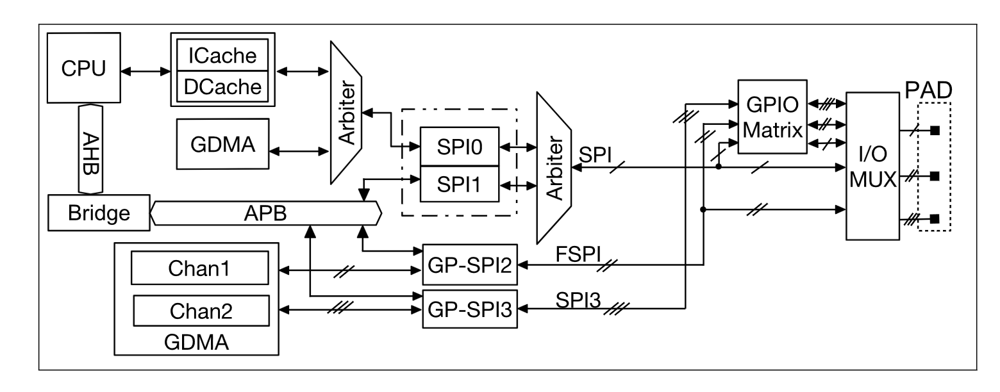
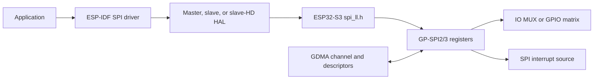

# Cornell Notes

## Topic: GP-SPI Architecture and Hardware Resources

## Date: 20/07/2026

---

### Cue Column (Questions, Keywords, or Prompts)

- Which blocks execute a transaction?
- How are clock, CS, data paths, FIFO, GDMA, and interrupts related?
- Which resources are owned exclusively by an ESP-IDF driver?

---

### Notes Section (Main Notes)

The GP-SPI block contains a transaction sequencer, clock generator, CS controller, command/address/dummy/data phase controls, a 64-byte CPU-visible data buffer, DMA handshake logic, and interrupt status/enable/clear registers. The same registers serve master and slave roles, but role selection changes who drives SCLK/CS and which state machine owns phase timing.

One master bus object owns a host, pins, interrupt, optional DMA channels, and a bus lock. Devices share that bus but each owns CS and timing configuration. A slave or slave-HD driver owns the host exclusively. GP-SPI2 and GP-SPI3 cannot simultaneously host master and slave drivers.

TRM source: §30.4 and Figure 30.4-1, page 1109.

#### Related notes

- [Common bus resources](../02_programming_guide/02_common_bus_resources_and_configuration.md)
- [Lifecycle and cleanup](../03_use_cases/02_lifecycle_ownership_and_cleanup.md)
- [Software-layer relationships](../03_use_cases/01_resource_and_software_layer_relationships.md)

---

### Summary Section (Summary of Notes)

The API hierarchy mirrors the hardware: host/bus selects a GP-SPI instance, device or slave configuration selects role and timing, HAL formats phases, and LL writes the shared register block.
