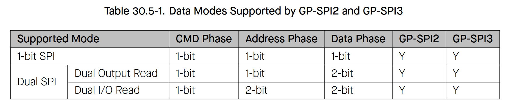
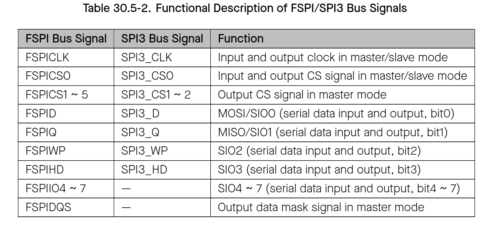
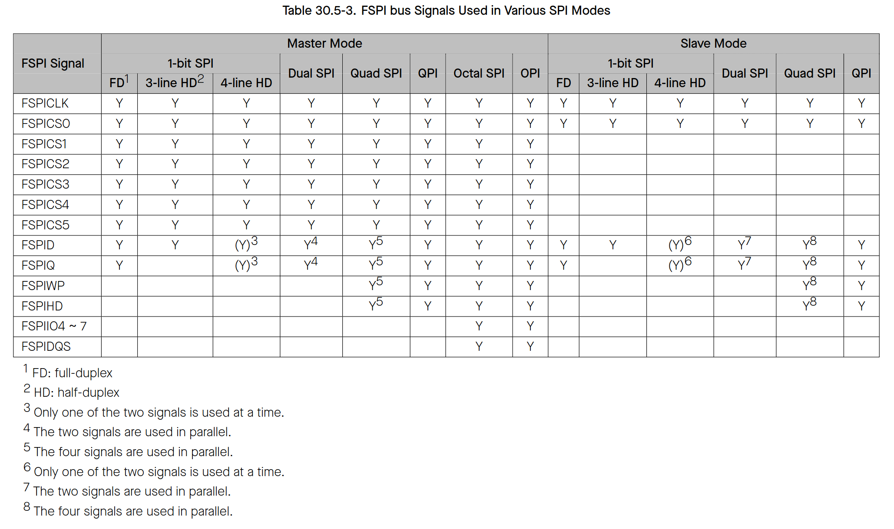
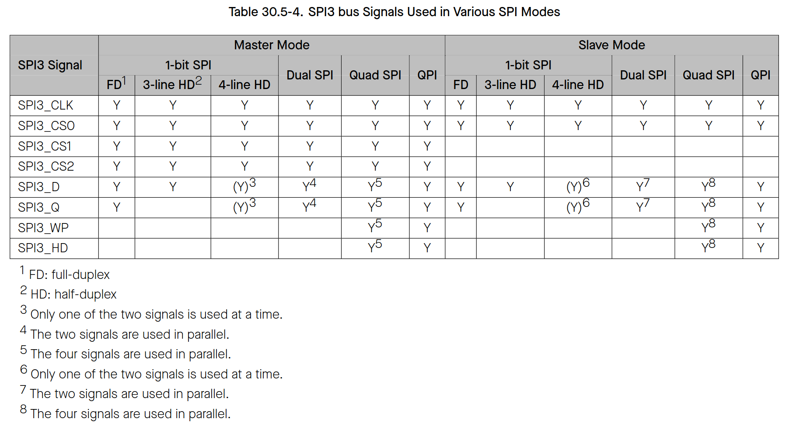

# Cornell Notes

## Topic: GP-SPI Data Modes and FSPI/SPI3 Bus Signals

## Date: 20/07/2026

---

### Cue Column (Questions, Keywords, or Prompts)

- How do single, dual, quad, and octal modes change phase width?
- Which signals belong to GP-SPI2 versus GP-SPI3?
- Why must bus pins and transaction flags agree?

---

### Notes Section (Main Notes)

Single SPI transfers one bit per clock. DIO/QIO/OCT data phases use 2/4/8 lines, while DIO/QIO address flags extend the wider bus to the address phase. Multiline command/address flags independently widen those phases. QPI and OPI mean all applicable phases use four or eight lines.

GP-SPI2 uses the FSPI signal family and can route dedicated IO-MUX pins or arbitrary GPIO-matrix pins. GP-SPI3 has SPI3 signals through the GPIO matrix and no octal data path. `spi_bus_config_t` declares which physical data lines exist; `spi_transaction_t.flags` declares which lines a particular transaction uses. Requesting a line mode without the required configured pins is invalid.

TRM source: §§30.5.1–30.5.2, pages 1109–1113.

#### Related notes

- [Line modes in the driver](../02_programming_guide/03_master_transaction_phases_and_line_modes.md)
- [Full/half-duplex and multiline use cases](../03_use_cases/07_duplex_and_multiline_modes.md)
- [Line-mode LL and register inventory](../03_use_cases/15_spi_apis.md#phase-line-mode-and-buffer-access)

---

### Summary Section (Summary of Notes)

Bus configuration proves that pins exist; transaction flags select how each phase consumes them. Octal operation is an FSPI/GP-SPI2 capability, not a GP-SPI3 capability.
