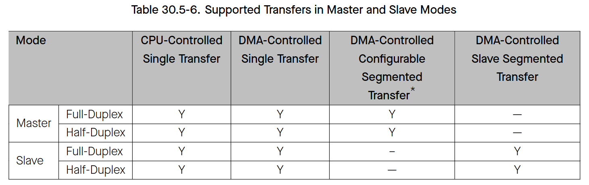

# Cornell Notes

## Topic: Bit Order and Transfer Modes

## Date: 20/07/2026

---

### Cue Column (Questions, Keywords, or Prompts)

- Where is TX/RX bit order configured?
- Which CPU/DMA combinations are legal?
- How do full- and half-duplex phases differ?

---

### Notes Section (Main Notes)

`SPI_WR_BIT_ORDER` and `SPI_RD_BIT_ORDER` independently select MSB-first or LSB-first serialization. ESP-IDF maps device/slave bit-order flags into these fields through `spi_hal_setup_device()` or `spi_slave_hal_setup_device()`. Byte order in RAM is separate from wire bit order.

The peripheral can use CPU buffers for both directions, GDMA for both directions, or a supported mixed path. `SPI_DMA_TX_ENA` and `SPI_DMA_RX_ENA` choose FIFO ownership independently. Full duplex overlaps DOUT and DIN. Half duplex completes command/address/dummy/output before input, allowing multi-line data but requiring explicit phase lengths.

Changing mode is not merely a pin change: the driver formats command/address/dummy/data enables, line-width fields, bit lengths, and DMA enables before setting `SPI_USR`.

TRM source: §§30.5.3–30.5.4, pages 1113–1115.

#### Related notes

- [Master transaction model](../03_use_cases/04_master_device_and_transaction_model.md)
- [DMA and GDMA](../03_use_cases/08_dma_buffers_descriptors_and_gdma.md)

---

### Summary Section (Summary of Notes)

Wire bit order, CPU byte order, duplex policy, line width, and data mover are independent configuration axes and must not be conflated.
