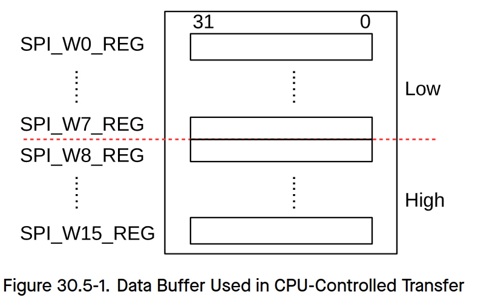
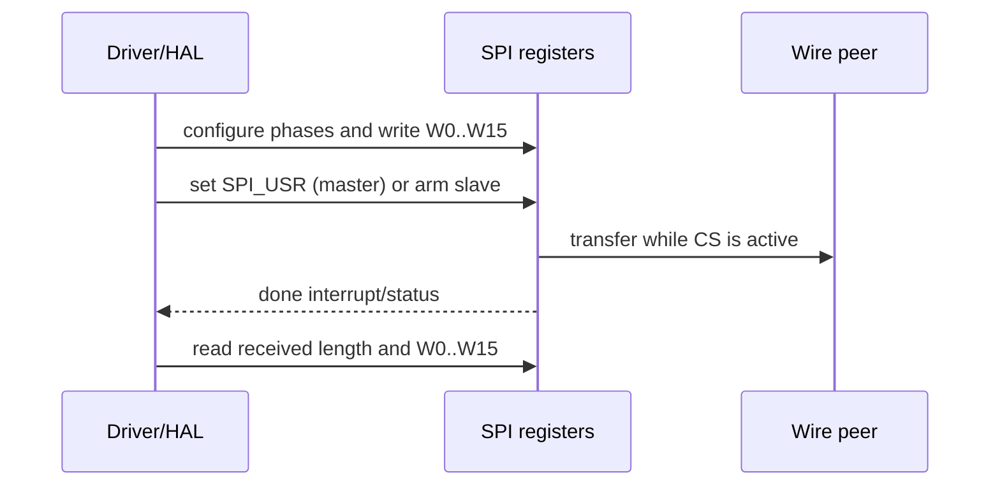

# Cornell Notes

## Topic: CPU-Controlled GP-SPI Transfers

## Date: 20/07/2026

---

### Cue Column (Questions, Keywords, or Prompts)

- How does the CPU buffer feed a transaction?
- What is the master start sequence?
- How does slave completion differ?

---

### Notes Section (Main Notes)

With DMA disabled, software writes TX bytes into `SPI_W0_REG`…`SPI_W15_REG`, programs phase lengths and mode, clears stale interrupt state, then starts a master transaction by setting `SPI_USR`. Hardware clears `SPI_USR` when the transaction ends; software then reads RX bytes from the same register bank.

In slave mode, software prepares TX data and maximum RX/TX bit lengths before the external master asserts CS. The slave state machine starts from external SCLK/CS, latches received length, raises completion, and software reads `SPI_SLV_DATA_BITLEN` plus the W registers. The configured buffer limit is 64 bytes in the CPU path.

TRM source: §30.5.5, pages 1115–1117.

#### Related notes

- [Polling master sequence](../03_use_cases/06_polling_and_exclusive_bus_sequence.md)
- [Full-duplex slave sequence](../03_use_cases/09_full_duplex_slave_sequences.md)
- [CPU buffer HAL/LL functions](../03_use_cases/15_spi_apis.md#phase-line-mode-and-buffer-access)

---

### Summary Section (Summary of Notes)

The CPU path is descriptor-free and efficient for small transfers, but it is bounded by the 64-byte W-register bank and occupies CPU time for copying or polling.
