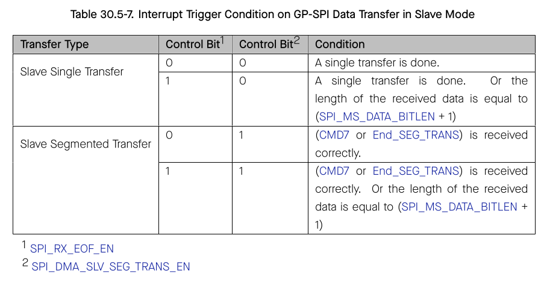

# Cornell Notes

## Topic: GDMA-Controlled GP-SPI Transfers

## Date: 20/07/2026

---

### Cue Column (Questions, Keywords, or Prompts)

- How is GP-SPI connected to GDMA?
- What do descriptor ownership and EOF mean?
- What failures result from buffer-length mismatch?

---

### Notes Section (Main Notes)

When `SPI_DMA_TX_ENA`/`SPI_DMA_RX_ENA` are set, the SPI FIFO exchanges data with GDMA instead of the W-register bank. ESP-IDF allocates GDMA channels, connects their trigger to the selected SPI host, builds descriptor chains, resets both FIFO/DMA sides, starts RX before TX, and finally starts the SPI user transaction.

TX descriptors describe bytes made available to SPI; RX descriptors describe writable capacity. A short TX chain can trigger `SPI_OUTFIFO_EMPTY_ERR_INT`; a short RX chain can trigger `SPI_INFIFO_FULL_ERR_INT` and lose data. A longer RX chain is not evidence that all bytes were received—the returned transaction length remains authoritative.

Master completion normally uses `SPI_TRANS_DONE_INT`, while RX memory visibility is confirmed by GDMA successful EOF. Slave mode requires special handling because CS/SCLK, not the driver, determine the actual transfer length. Segmented transfers recycle or append descriptors without imposing a total transfer limit.

TRM source: §30.5.6, pages 1117–1118. GDMA details belong to the separate GDMA chapter; this note covers only the SPI handshake boundary.

#### Related notes

- [Driver DMA constraints](../02_programming_guide/06_master_dma_gpio_timing_and_performance.md)
- [Descriptor sequence](../03_use_cases/08_dma_buffers_descriptors_and_gdma.md)
- [DMA internal-symbol inventory](../03_use_cases/15_spi_apis.md#dma-helper-functions)

---

### Summary Section (Summary of Notes)

GDMA removes the 64-byte CPU-buffer ceiling, but correct descriptor length, ownership, alignment, reset order, and EOF interpretation become part of transaction correctness.
