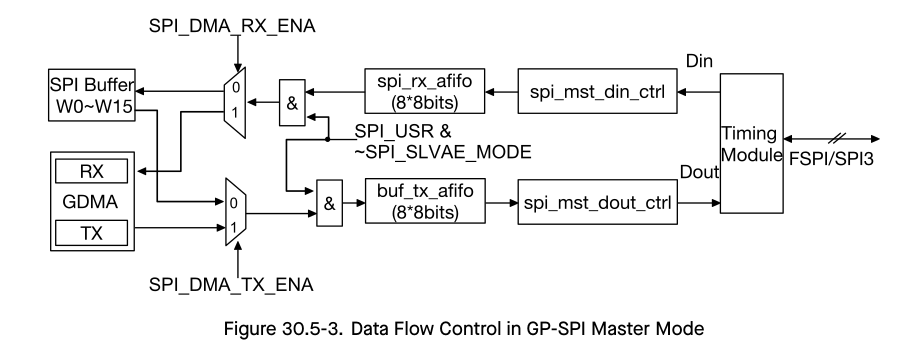

# Cornell Notes

## Topic: GP-SPI Master and Slave Data Flow

## Date: 20/07/2026

---

### Cue Column (Questions, Keywords, or Prompts)

- Which block controls phase sequencing?
- Where do CPU and GDMA paths join?
- Why are master and slave completion rules different?

---

### Notes Section (Main Notes)

Both roles share the phase registers, FIFO, and DMA handshake. In master mode, software-configured command/address/dummy/data lengths drive the internally generated SCLK and CS. In slave mode, the external master determines the clock count and CS duration, so software programs capacity and later reads the actual received bit length.

The driver/HAL boundary follows this data flow: format a transaction, choose FIFO or GDMA, prepare RX before TX, clear stale status, start/arm hardware, and collect the result. The master ISR may immediately start the next queued transaction. The slave ISR returns the completed descriptor and arms the next queued descriptor only when one is available.

TRM source: §30.5.7, pages 1118–1121.

#### Related notes

- [Queued master ISR flow](../03_use_cases/05_interrupt_queued_master_sequence.md)
- [Slave transaction flow](../03_use_cases/09_full_duplex_slave_sequences.md)

---

### Summary Section (Summary of Notes)

Master owns timing and knows requested lengths in advance; slave reacts to externally bounded timing and must report the actual transferred length.
