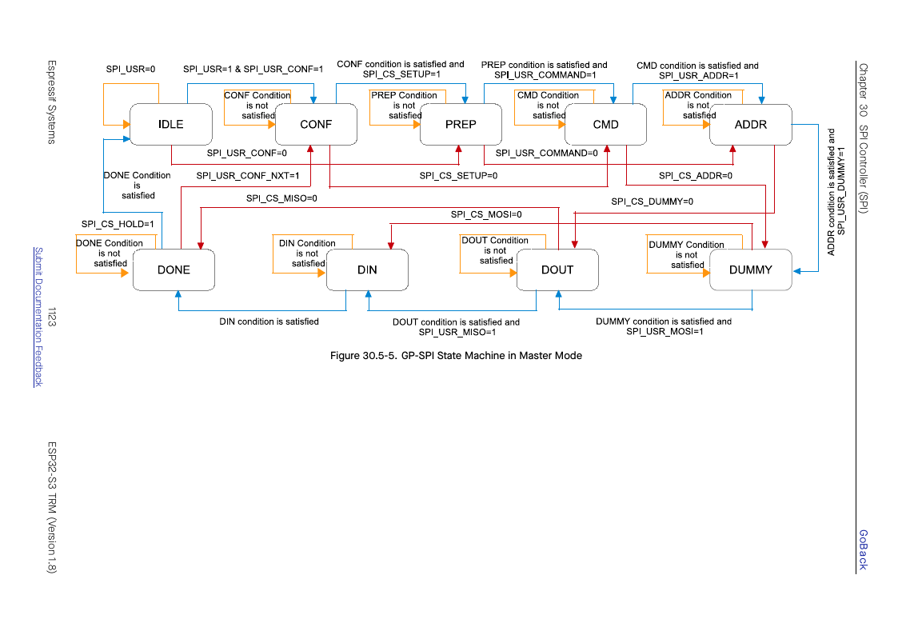
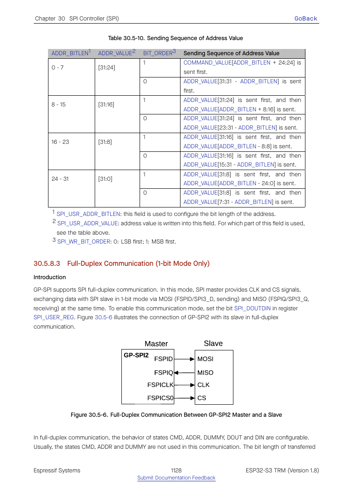
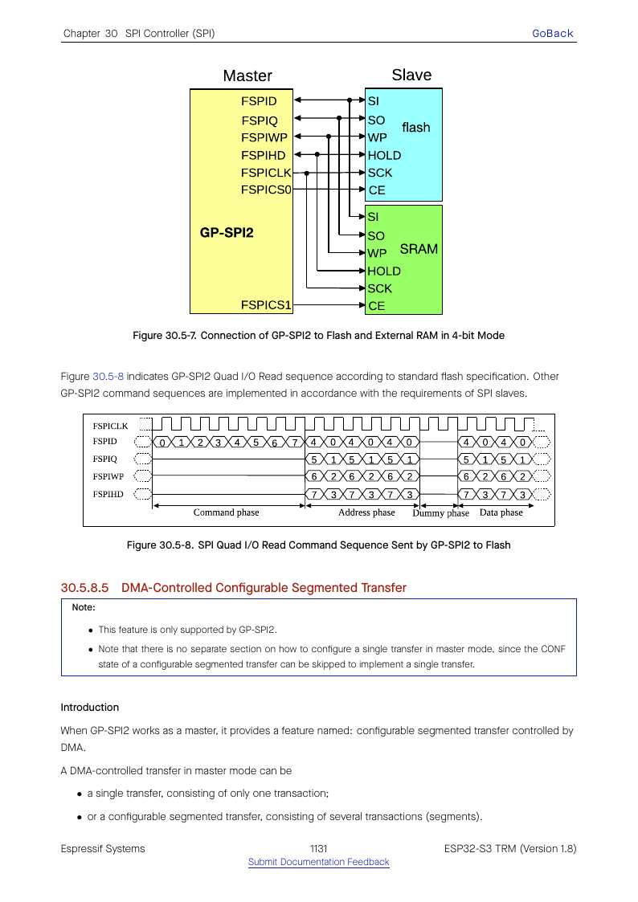
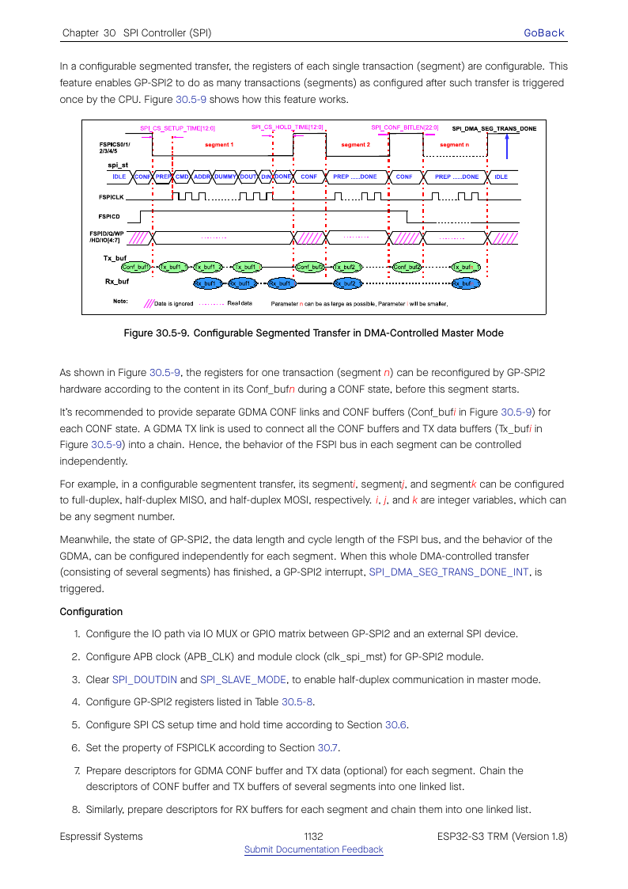

# Cornell Notes

## Topic: GP-SPI Master State Machine and Transaction Sequences

## Date: 20/07/2026

---

### Cue Column (Questions, Keywords, or Prompts)

- In what order do master phases execute?
- Which registers enable and size each phase?
- How do full-duplex and segmented transfers alter the sequence?

---

### Notes Section (Main Notes)

The master begins when software sets `SPI_USR`. Enabled phases execute in the fixed order command → address → dummy → DOUT/DIN → done. `SPI_USER_REG` enables phases; `SPI_USER1_REG` and `SPI_USER2_REG` set bit lengths and command value; `SPI_MS_DLEN_REG` controls data bit lengths; `SPI_CTRL_REG` selects line width and bit order.

Full duplex overlaps DOUT/DIN and supports the one-line data path. Half duplex serializes output and input and enables dual/quad/octal data modes. CS setup/hold fields extend CS around the programmed phases. Configurable segmented transfer feeds per-segment configuration and descriptor streams while holding the logical transfer together.

TRM source: §30.5.8, pages 1121–1135.

#### Related notes

- [Master transaction driver mapping](../02_programming_guide/03_master_transaction_phases_and_line_modes.md)
- [Master transaction model](../03_use_cases/04_master_device_and_transaction_model.md)
- [Master internal call sequence](../03_use_cases/15_spi_apis.md#master-call-sequences)

---

### Summary Section (Summary of Notes)

Every master transaction is a programmed state-machine run. ESP-IDF transaction structures are a software representation of the phase-enable, length, line-mode, timing, and buffer registers loaded before `SPI_USR`.
