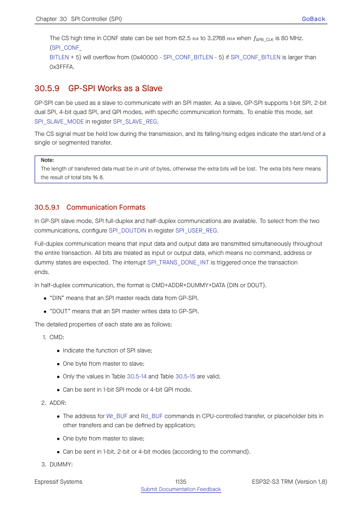
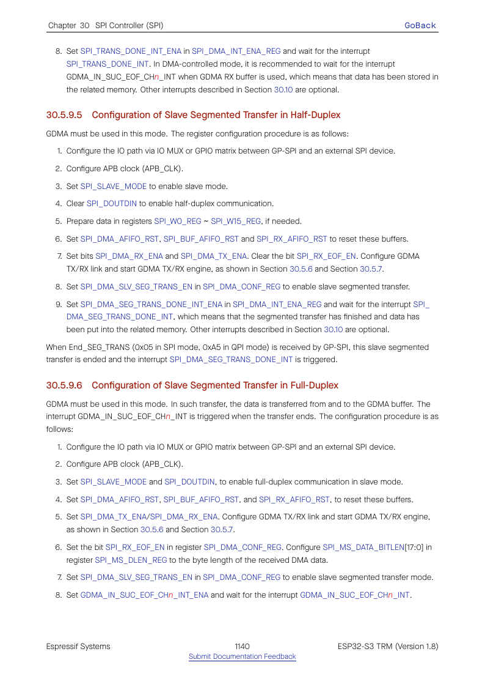

# Cornell Notes

## Topic: GP-SPI Slave Protocols and Segmented Transfers

## Date: 20/07/2026

---

### Cue Column (Questions, Keywords, or Prompts)

- How do full-duplex and slave-HD formats differ?
- Which command values drive half-duplex slave services?
- How are single and segmented transfers terminated?

---

### Notes Section (Main Notes)

Normal slave mode is a general full-duplex shift transaction bounded by external CS and SCLK. The driver queues a maximum bit length and buffers, then returns `trans_len` after completion.

Slave-HD is a hardware-defined command protocol. Command fields select shared-register access, DMA read/write, or general-purpose events. In single-transfer mode, descriptor completion or the configured length terminates the DMA service. In segmented mode, the peer issues protocol termination commands while the driver can append buffers and recycle descriptor chains.

The two slave APIs are therefore not interchangeable: `spi_slave_*` exposes ordinary full-duplex transactions, while `spi_slave_hd_*` exposes the fixed half-duplex service protocol, separate RX/TX channels, callbacks, and shared registers.

TRM source: §30.5.9, pages 1135–1141.

#### Related notes

- [Full-duplex slave guide](../02_programming_guide/07_full_duplex_slave_lifecycle_and_transactions.md)
- [Slave-HD programming guide](../02_programming_guide/09_slave_hd_protocol_and_lifecycle.md)
- [Slave-HD use cases](../03_use_cases/10_slave_hd_and_segmented_transfers.md)
- [Slave internal-symbol inventory](../03_use_cases/15_spi_apis.md#slave-hd-private-functions)

---

### Summary Section (Summary of Notes)

Choose normal slave for generic full-duplex framing and slave-HD only when both peers implement Espressif's command-driven half-duplex protocol.
