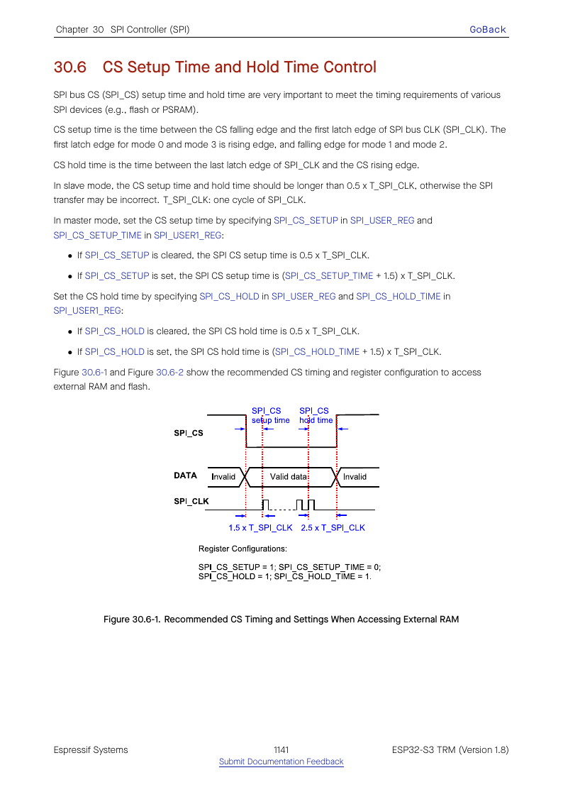
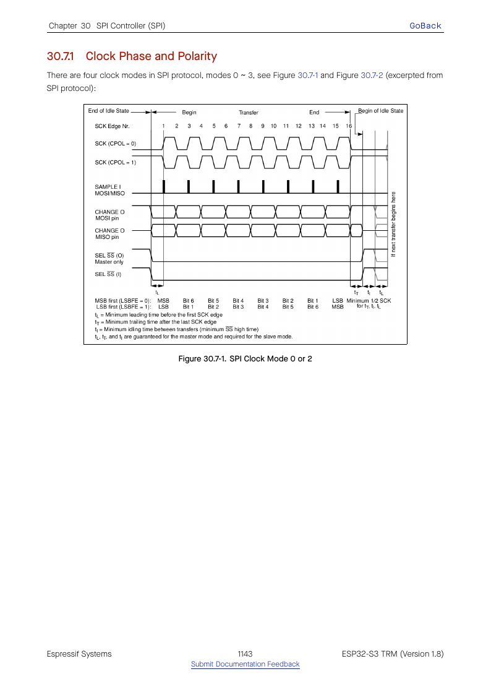
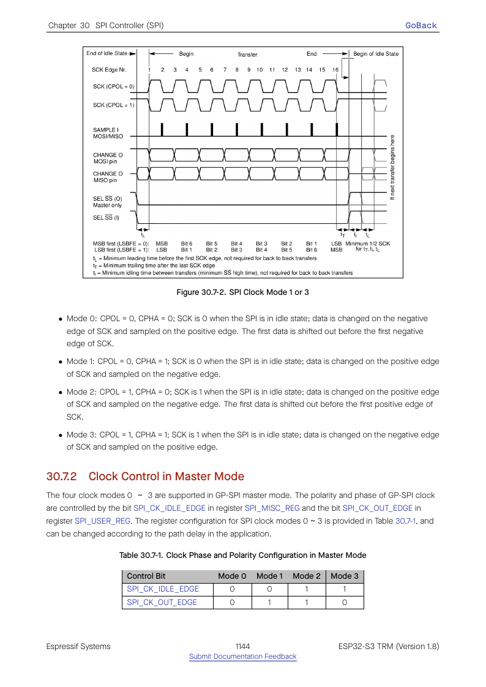

# Cornell Notes

## Topic: CS Timing and GP-SPI Clock Control

## Date: 20/07/2026

---

### Cue Column (Questions, Keywords, or Prompts)

- How are CS setup and hold generated?
- How do CPOL and CPHA map to SPI modes 0–3?
- How is master SCLK derived?

---

### Notes Section (Main Notes)

`SPI_CS_SETUP`/`SPI_CS_HOLD` enable programmable delays before the first and after the last clock edge. Their cycle-count fields are based on SPI clock timing. `SPI_CK_IDLE_EDGE` selects idle polarity; `SPI_CK_OUT_EDGE` selects which edge launches/samples, forming modes 0–3.

The master clock divider uses pre-divider and N/H/L counts. ESP-IDF searches legal integer values no faster than the request and reports the realized frequency through `spi_device_get_actual_freq()` in kHz. In slave mode SCLK is external; the peripheral instead configures input/output edge timing and delay compensation.

TRM source: §§30.6–30.7, pages 1141–1145.

#### Related notes

- [Clock source and routing](../03_use_cases/03_clock_selection_iomux_and_gpio_matrix.md)
- [Timing and performance](../03_use_cases/12_timing_compensation_and_performance.md)

---

### Summary Section (Summary of Notes)

SPI mode selects edges, the divider selects achievable master frequency, and CS setup/hold extends framing. All three must match the peer's timing specification.
