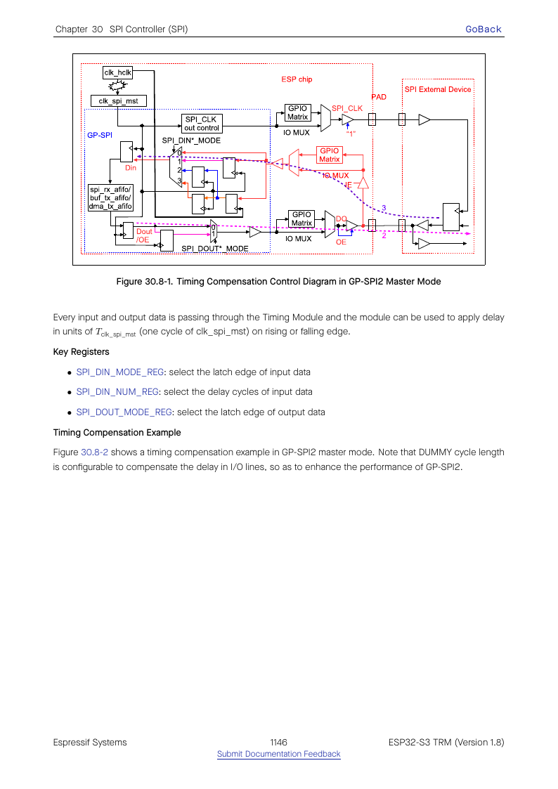
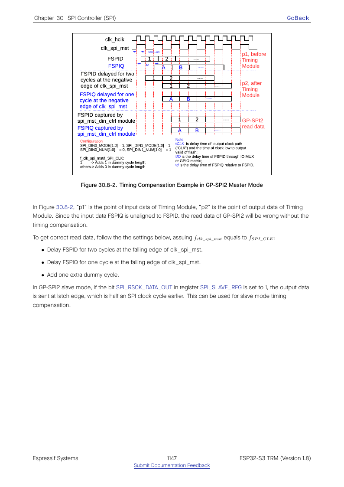

# Cornell Notes

## Topic: Timing Compensation and GP-SPI2/GP-SPI3 Differences

## Date: 20/07/2026

---

### Cue Column (Questions, Keywords, or Prompts)

- Why does MISO timing limit frequency?
- What do input-delay and dummy compensation change?
- Which registers and modes are unavailable on GP-SPI3?

---

### Notes Section (Main Notes)

Input delay consists of the external device's clock-to-output delay plus board and GPIO-matrix delay. The master can shift the sampling point or add dummy cycles. In ESP-IDF v6.0.1 the master driver uses `spi_hal_cal_timing()` internally on ESP32-S3. The public compatibility helpers `spi_get_timing()` and `spi_get_freq_limit()` are present but explicitly unsupported for this target in this release.

GP-SPI2 supports FSPI IO-MUX routing, octal data pins, and the full register feature set. GP-SPI3 is matrix-routed, supports fewer CS/data lines, and has fields marked invalid by TRM Table 30.9-1. Code must use SoC capability macros and the target `spi_periph_signal` table rather than assuming both hosts are identical.

TRM source: §§30.8–30.9, pages 1145–1149.

#### Related notes

- [Master performance guide](../02_programming_guide/06_master_dma_gpio_timing_and_performance.md)
- [Timing/performance use case](../03_use_cases/12_timing_compensation_and_performance.md)
- [Debugging timing failures](../03_use_cases/14_debugging_and_common_failures.md)
- [Timing API/HAL inventory](../03_use_cases/15_spi_apis.md#clocktiming-helpers)

---

### Summary Section (Summary of Notes)

High-frequency reliability is a path-delay problem. GP-SPI2 offers the fastest/richest routing; GP-SPI3 must be treated as a distinct capability set.
